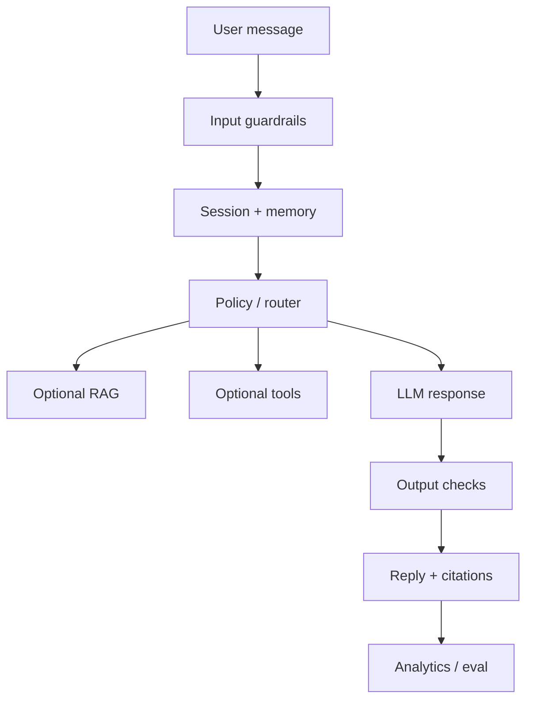
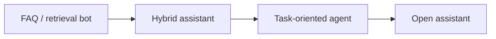

# Chatbot Fundamentals

> Types of chatbots and the components every serious chat product needs — chat is a UX layered on routing, memory, generation, integrations, and analytics.

## Table of Contents

- [Definition](#definition)
- [Why It Matters](#why-it-matters)
- [Common Uses](#common-uses)
- [How It Works](#how-it-works)
- [Core Components](#core-components)
- [Chat vs Forms vs Agents](#chat-vs-forms-vs-agents)
- [Python Examples](#python-examples)
- [Production Considerations](#production-considerations)
- [Cost Considerations](#cost-considerations)
- [Security Considerations](#security-considerations)
- [Best Practices](#best-practices)
- [Common Mistakes](#common-mistakes)
- [Navigation](#navigation)

---

## Definition

A **chatbot** is a conversational interface that maintains a dialogue with a user to answer questions, complete tasks, or guide workflows. Modern production bots are usually LLM-backed, optionally grounded with RAG/tools, and constrained by persona, policy, and memory design.

Chatbots range from FAQ trees to open-domain assistants to task-oriented agents. The spectrum is product choice, not a maturity ladder — pick the narrowest system that hits the job.

| Term | Meaning |
|------|---------|
| **Turn** | One user message + one bot response (plus tool calls) |
| **Session** | Contiguous dialogue with shared short-term state |
| **Dialogue state** | Slots, goals, and flags that drive the next action |
| **Handoff** | Transfer to a human or another system |
| **Grounding** | Answering from retrieved/approved evidence |

---

## Why It Matters

Chat is a **UX**, not an architecture. Many products should be forms-with-AI, wizards, or search — not endless chat. When chat *is* right, users expect continuity, honesty about limits, and a path to a human.

Engineering stakes:

- Unscoped bots burn tokens and invent policy
- Missing handoff destroys trust faster than a wrong FAQ
- Success is **resolution and containment**, not witty replies

---

## Common Uses

| Application | Description | Typical grounding |
|-------------|-------------|-------------------|
| Customer support | Deflect FAQs, triage tickets | RAG + CRM tools |
| Internal helpdesk | IT / HR / policy Q&A | Permissioned KB + tools |
| Onboarding | Guided setup workflows | State machine + LLM |
| Sales / product Q&A | Approved collateral only | Grounded retrieval |
| Personal assistant | Preferences + tasks | Memory + calendars |

---

## How It Works



End-to-end loop:

1. **Ingress** — channel adapter normalizes the message
2. **Guards** — PII, injection, abuse, rate limits
3. **State** — load session history, summary, user profile
4. **Route** — FAQ, RAG, tool, escalate, or chitchat-refuse
5. **Generate** — grounded or constrained response
6. **Egress** — format for channel, log, update memory



---

## Core Components

| Component | Responsibility |
|-----------|----------------|
| **Channel adapters** | Web, Slack, WhatsApp, voice — same core, different UX constraints |
| **NLU / routing** | Intent, topic, or LLM classifier → skill |
| **Dialogue state** | Goals, slots, confirmation flags |
| **Response generation** | Templates, retrieval, or LLM |
| **Integrations** | Tickets, CRM, payments, identity |
| **Analytics** | Containment, CSAT, cost/turn, failure taxonomy |

### Minimal production checklist

1. Scoped job description in the system prompt
2. Explicit refuse / escalate paths
3. Session ID + retention policy
4. Eval set from real conversations
5. Cost and latency budgets per turn

---

## Chat vs Forms vs Agents

| Pattern | Best when | Avoid when |
|---------|-----------|------------|
| **Form / wizard** | Fixed fields, compliance | Open exploration |
| **Chatbot** | Ambiguous questions, guidance | Pure data entry |
| **Agent** | Multi-step tools + autonomy | Simple FAQ deflection |

Rule of thumb: if the happy path is a checklist, ship a form. If users ask unpredictable questions over a knowledge base, ship a grounded bot. If the bot must *do* multi-step work without micromanagement, graduate to [AI Agents](../../ai-agents/README.md).

---

## Python Examples

### Session turn envelope

```python
from dataclasses import dataclass, field
from typing import Any
from datetime import datetime, timezone

@dataclass
class Turn:
    role: str  # user | assistant | system | tool
    content: str
    meta: dict[str, Any] = field(default_factory=dict)
    ts: str = field(default_factory=lambda: datetime.now(timezone.utc).isoformat())

@dataclass
class Session:
    session_id: str
    user_id: str
    turns: list[Turn] = field(default_factory=list)
    slots: dict[str, Any] = field(default_factory=dict)
    summary: str = ""

    def add(self, role: str, content: str, **meta: Any) -> None:
        self.turns.append(Turn(role=role, content=content, meta=meta))

    def recent(self, n: int = 12) -> list[dict[str, str]]:
        return [{"role": t.role, "content": t.content} for t in self.turns[-n:]]
```

### Tiny router before the LLM

```python
def route(message: str, slots: dict) -> str:
    text = message.lower()
    if any(w in text for w in ("human", "agent", "representative")):
        return "escalate"
    if "refund" in text or slots.get("intent") == "billing":
        return "billing_flow"
    if len(text) < 4:
        return "clarify"
    return "grounded_qa"
```

---

## Production Considerations

- **Scope the job** — Support deflection ≠ general AGI chat
- **Design escape hatches** — Always offer human handoff
- **Measure outcomes** — Resolution and containment, not fluff CSAT alone
- **Version prompts and policies** — Treat them like application code
- **Channel constraints** — Slack threads ≠ WhatsApp 1600-char bursts ≠ voice

Observability per turn: `session_id`, route, model, tokens, latency, retrieval hits, guardrail hits, handoff flag.

---

## Cost Considerations

| Lever | Effect |
|-------|--------|
| Summarize history | Cuts prompt tokens on long sessions |
| Cache system prompt | Provider prompt caching where available |
| Route FAQ → templates | Skip LLM for known intents |
| Smaller model for classify | Reserve frontier model for hard turns |
| Cap max turns / tokens | Prevent runaway sessions |

Budget formula: `cost ≈ sessions × turns × (prompt_tokens + completion_tokens) × price`.

---

## Security Considerations

- Treat every user message as untrusted (prompt injection)
- Separate instructions from user/KB content with delimiters
- Never put secrets in the prompt or logs
- Gate action tools behind authz + confirmation
- Redact PII before long-term storage or eval datasets

---

## Best Practices

1. Write a one-paragraph product brief before any prompt
2. Prefer hybrid: retrieve → generate → cite → escalate
3. Keep dialogue state structured; do not rely on the model as memory
4. Ship with a failure taxonomy from day one
5. Run shadow mode on live traffic before full cutover

---

## Common Mistakes

- No handoff path when the bot fails
- Unbounded chit-chat that burns tokens
- Treating chat as a substitute for search, forms, or docs
- Launching without an eval set of real tickets/chats
- Logging full transcripts forever with no retention policy

---

## Navigation

| | |
|--|--|
| **Previous** | [Chatbots hub](../README.md) |
| **Next** | [Bot Types and Use Cases](02-bot-types-and-use-cases.md) |
| **Section** | [Fundamentals](README.md) |
| **Handbook** | [Chatbots](../README.md) |
