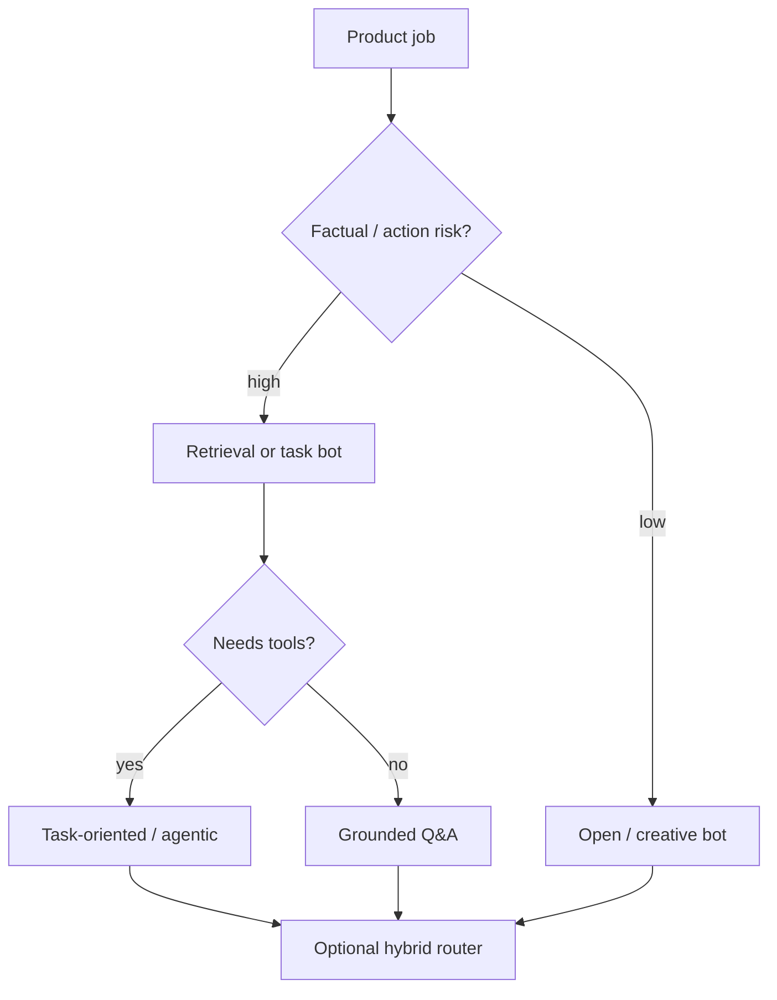

# Bot Types and Use Cases

> Choose the narrowest bot type that achieves the outcome — architecture follows the job, not the hype cycle.

## Table of Contents

- [Definition](#definition)
- [Why It Matters](#why-it-matters)
- [Common Uses](#common-uses)
- [How It Works](#how-it-works)
- [Type Catalog](#type-catalog)
- [Decision Framework](#decision-framework)
- [Python Examples](#python-examples)
- [Production Considerations](#production-considerations)
- [Cost Considerations](#cost-considerations)
- [Security Considerations](#security-considerations)
- [Best Practices](#best-practices)
- [Common Mistakes](#common-mistakes)
- [Navigation](#navigation)

---

## Definition

**Bot types** classify conversational systems by how they understand input, maintain state, and produce actions. The main families:

| Type | Understanding | State | Generation |
|------|---------------|-------|------------|
| FAQ / tree | Buttons, keywords | Shallow | Templates |
| Retrieval | Embeddings / search | Light | Snippets + LLM |
| Task-oriented | Intents + slots | Rich | Forms / tools |
| Open-domain | LLM | Soft | Freeform LLM |
| Hybrid | Router + skills | Mixed | Best of each |

---

## Why It Matters

Wrong type → wrong metrics, wrong risk, wrong cost. An open-domain LLM wrapped as "support" will invent refund policy. A rigid FAQ tree will frustrate users who phrase questions naturally.

Picking type early constrains:

- Eval design (exact match vs grounded faithfulness)
- Memory needs
- Tooling and authz surface
- Channel fit (menus on WhatsApp vs free text on web)

---

## Common Uses

| Job | Prefer | Why |
|-----|--------|-----|
| Password reset status | Task-oriented + tools | Needs identity and deterministic APIs |
| "What's your return policy?" | Retrieval / grounded | Policy must be cited |
| Brainstorm names | Open-domain | Creativity, low factual risk |
| IT runbooks | Hybrid | Retrieve + execute approved actions |
| Lead capture | Tree / form | Structured fields beat chat |

---

## How It Works



Hybrid production pattern: **classify → skill**. Skills are independently versioned (FAQ pack, RAG skill, billing flow, escalate).

---

## Type Catalog

### FAQ / decision-tree

Pros: predictable, cheap, auditable. Cons: brittle phrasing, hard to maintain large trees.

### Retrieval / grounded support

Pros: scalable knowledge, citations. Cons: retrieval quality dominates; needs KB ops.

### Task-oriented

Pros: clear slots and confirmations. Cons: intent taxonomies rot; needs careful repair prompts.

### Open-domain

Pros: flexible UX. Cons: hallucination, cost, safety surface.

### Hybrid assistant

Pros: best practical default for products. Cons: routing errors cascade; needs skill-level eval.

---

## Decision Framework

Ask five questions:

1. Must every factual claim be sourced?
2. Does the bot change external state (refund, ship, delete)?
3. Is the dialogue multi-slot with confirmations?
4. What's the acceptable wrong-answer cost?
5. Which channels and languages matter?

If (1) or (2) is yes → not open-domain. If (3) is yes → explicit dialogue state. If (4) is high → human handoff SLO.

---

## Python Examples

### Skill registry

```python
from typing import Callable

Skill = Callable[[dict], dict]

SKILLS: dict[str, Skill] = {}

def skill(name: str):
    def deco(fn: Skill) -> Skill:
        SKILLS[name] = fn
        return fn
    return deco

@skill("faq")
def faq_skill(ctx: dict) -> dict:
    return {"type": "template", "key": ctx.get("faq_id", "default")}

@skill("grounded_qa")
def grounded_qa(ctx: dict) -> dict:
    return {"type": "rag", "query": ctx["message"]}

@skill("escalate")
def escalate(ctx: dict) -> dict:
    return {"type": "handoff", "reason": ctx.get("reason", "user_request")}

def dispatch(route: str, ctx: dict) -> dict:
    if route not in SKILLS:
        return SKILLS["escalate"]({**ctx, "reason": "unknown_route"})
    return SKILLS[route](ctx)
```

### Lightweight type selector

```python
def choose_bot_type(*, needs_citations: bool, mutates_state: bool, creative: bool) -> str:
    if mutates_state:
        return "task_oriented"
    if needs_citations:
        return "retrieval"
    if creative:
        return "open_domain"
    return "hybrid"
```

---

## Production Considerations

- Version each skill independently; ship routers with canaries
- Keep open-domain behind a clear product boundary ("creative mode")
- Document which type owns each KPI
- Prefer progressive disclosure: start retrieval, add tools later

---

## Cost Considerations

Trees ≈ near-zero LLM cost. Retrieval adds embedding + generation. Task bots add tool latency. Open-domain maximizes tokens per turn. Hybrids save money when FAQ/template short-circuits fire often — measure short-circuit rate.

---

## Security Considerations

- Task bots: least privilege on tools; confirm destructive actions
- Retrieval: ACL-aware indexes so tenants cannot see each other's docs
- Open-domain: stronger content policy and abuse detection
- Hybrid: do not let the LLM freely re-route to privileged skills

---

## Best Practices

1. Name the bot type in the PRD
2. One primary job per bot surface
3. Hybrid router with explicit escalate skill
4. Separate creative and factual modes in UX
5. Revisit type quarterly against failure taxonomy

---

## Common Mistakes

- Marketing "AI assistant" when you needed FAQ deflection
- One mega-prompt that mixes refunds, jokes, and medical advice
- No skill boundaries → impossible to eval or secure
- Copying consumer ChatGPT UX into regulated support

---

## Navigation

| | |
|--|--|
| **Previous** | [Chatbot Fundamentals](01-chatbot-fundamentals.md) |
| **Next** | [Success Metrics](03-success-metrics.md) |
| **Section** | [Fundamentals](README.md) |
| **Handbook** | [Chatbots](../README.md) |
