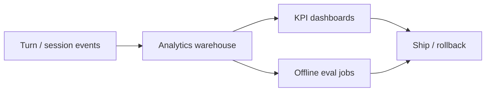

# Success Metrics

> If you only track thumbs-up, you will optimize for agreeable fluff. Instrument outcomes, cost, safety, and handoff quality.

## Table of Contents

- [Definition](#definition)
- [Why It Matters](#why-it-matters)
- [Common Uses](#common-uses)
- [How It Works](#how-it-works)
- [Metric Catalog](#metric-catalog)
- [Instrumentation](#instrumentation)
- [Python Examples](#python-examples)
- [Production Considerations](#production-considerations)
- [Cost Considerations](#cost-considerations)
- [Security Considerations](#security-considerations)
- [Best Practices](#best-practices)
- [Common Mistakes](#common-mistakes)
- [Navigation](#navigation)

---

## Definition

**Success metrics** for chatbots quantify whether conversations achieve the product job at acceptable cost, latency, and risk. Core families: outcome, experience, efficiency, safety, and quality/eval.

| Family | Examples |
|--------|----------|
| Outcome | Resolution, containment, task completion |
| Experience | CSAT, CES, thumbs, repeat contact |
| Efficiency | Cost/turn, tokens, time-to-resolution |
| Safety | Policy violations, PII leaks, jailbreaks |
| Quality | Groundedness, citation precision, rubric scores |

---

## Why It Matters

Vanity metrics (session count, message volume) rise when the bot is confusing. Good metrics force trade-off visibility: higher containment with rising reopens is a regression.

Leadership needs a **single scorecard**; engineering needs **segmented** metrics (intent, channel, language, model version).

---

## Common Uses

| Use | Metrics that matter |
|-----|---------------------|
| Support deflection | Containment, reopen rate, AHT vs baseline |
| Sales Q&A | Qualified leads, grounded accuracy |
| Internal IT | Time-to-resolution, ticket deflection |
| Prompt A/B | Resolution delta, cost delta, safety delta |

---

## How It Works



Define events first: `session_start`, `route_selected`, `retrieval_hit`, `tool_call`, `handoff`, `resolution_label`, `feedback`.

---

## Metric Catalog

### Containment rate

Sessions resolved without human agent. **Pair with reopen within 72h** or you reward false containment.

### Resolution rate

Human- or model-labeled "user goal achieved." Prefer sampled human labels + LLM-as-judge with adjudication.

### CSAT / thumbs

Useful directional signal; noisy and culturally biased. Never sole launch gate.

### Cost per resolved session

`(LLM + retrieval + tooling cost) / resolved sessions` — better than cost per message.

### Latency

p50/p95 time-to-first-token and time-to-final. Voice and WhatsApp have tighter UX budgets.

### Safety rate

Violations per 1k turns; break down by category.

---

## Instrumentation

Minimum schema fields: `session_id`, `user_id_hash`, `channel`, `bot_version`, `prompt_version`, `model`, `route`, `tokens_in`, `tokens_out`, `latency_ms`, `handoff`, `citation_count`, `guardrail_flags`.

Label resolution asynchronously — do not block the reply path.

---

## Python Examples

### Event logger

```python
from dataclasses import asdict, dataclass
from typing import Optional
import json, time

@dataclass
class TurnEvent:
    session_id: str
    route: str
    model: str
    tokens_in: int
    tokens_out: int
    latency_ms: int
    handoff: bool = False
    grounded: Optional[bool] = None
    prompt_version: str = "v0"

def emit(event: TurnEvent) -> str:
    payload = asdict(event)
    payload["ts"] = int(time.time())
    return json.dumps(payload, separators=(",", ":"))
```

### Containment with reopen penalty

```python
def adjusted_containment(contained: int, reopened: int, total: int) -> float:
    if total <= 0:
        return 0.0
    # Penalize false wins
    return max(0.0, (contained - reopened) / total)
```

---

## Production Considerations

- Publish definitions in a metrics dictionary
- Segment by channel and intent
- Gate releases on a scorecard, not a single number
- Sample conversations weekly for label drift
- Tie prompt/model versions to KPI time series

---

## Cost Considerations

Tracking itself is cheap; **over-logging full transcripts** is not. Store hashes + redacted snippets by default; full text in a restricted store with TTL.

Optimize for cost per **resolved** session, not cheapest model in isolation.

---

## Security Considerations

- Hash or tokenize user IDs in analytics
- Strip secrets and PII before warehouse export
- Restrict who can replay full sessions
- Do not put API keys in client-side analytics SDKs

---

## Best Practices

1. Start with 5 KPIs max on the exec scorecard
2. Always pair containment with reopen / repeat contact
3. Report cost and safety beside quality
4. Version metrics definitions like code
5. Review failure examples, not only charts

---

## Common Mistakes

- Optimizing thumbs while resolution falls
- Counting "bot replied" as success
- Ignoring channel mix shifts (mobile vs desktop)
- No baseline from human-only support
- Gaming containment by refusing to escalate

---

## Navigation

| | |
|--|--|
| **Previous** | [Bot Types and Use Cases](02-bot-types-and-use-cases.md) |
| **Next** | [Dialogue and Memory](../dialogue-and-memory/01-dialogue-and-memory.md) |
| **Section** | [Fundamentals](README.md) |
| **Handbook** | [Chatbots](../README.md) |
