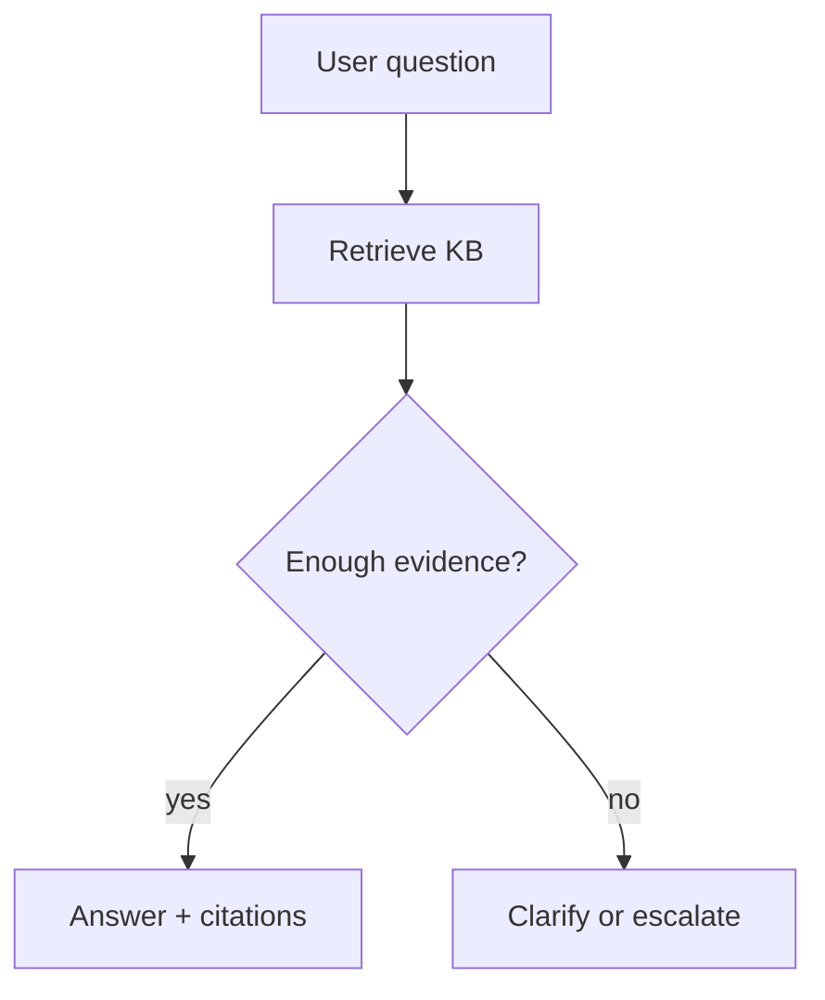

# Grounded Support Bots

> Support chatbots that answer from approved knowledge — with citations and escalation.

## Definition

A grounded support bot retrieves from a trusted knowledge base (RAG), answers with citations, refuses when evidence is missing, and escalates to humans for account actions or low confidence.

## Why it matters

Ungrounded support bots invent policy. Grounding is the product.

## How it works

## Key principles

1. **Citations required** — No source → no claim.
2. **Action tools gated** — Refunds/password resets need authz + confirmation.
3. **Eval on real tickets** — Not just marketing FAQs.

## Common applications

| Application | Description |
|-------------|-------------|
| Help centers | Deflection |
| IT bots | Runbooks + tools |
| Sales assistants | Approved collateral only |

## Common mistakes

- Letting the model improvise refund policy
- No feedback loop from failed tickets into the KB

## Further reading

- [RAG](../rag/README.md)
- [AI Security & Guardrails](../ai-security-guardrails/README.md)
