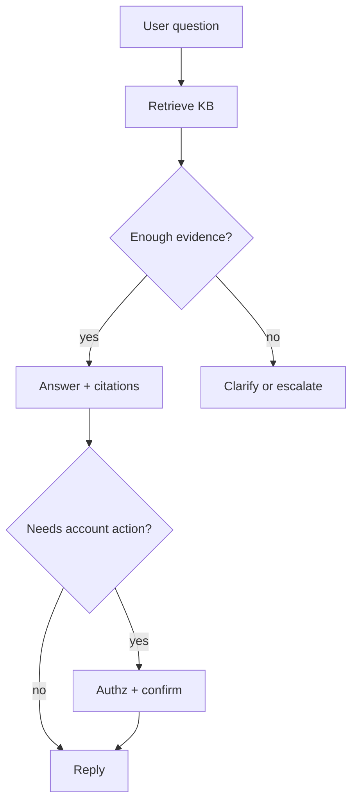

# Grounded Support Bots

> Support chatbots that answer from approved knowledge — with citations and escalation. Ungrounded support bots invent policy; grounding is the product.

## Table of Contents

- [Definition](#definition)
- [Why It Matters](#why-it-matters)
- [Common Uses](#common-uses)
- [How It Works](#how-it-works)
- [Policy Loop](#policy-loop)
- [Python Examples](#python-examples)
- [Production Considerations](#production-considerations)
- [Cost Considerations](#cost-considerations)
- [Security Considerations](#security-considerations)
- [Best Practices](#best-practices)
- [Common Mistakes](#common-mistakes)
- [Navigation](#navigation)

---

## Definition

A **grounded support bot** retrieves from a trusted knowledge base (RAG), answers with citations, refuses when evidence is missing, and escalates to humans for account actions or low confidence.

| Pillar | Requirement |
|--------|-------------|
| Retrieval | Approved, fresh, ACL-aware KB |
| Generation | Answer only from evidence |
| Citations | User-visible sources |
| Escalation | Clear path to humans / tools with authz |

---

## Why It Matters

Customer trust collapses when bots invent refund windows or security advice. Regulated industries treat ungrounded answers as compliance risk. Grounding turns chat into a controllable interface over docs and systems.

---

## Common Uses

| Application | Description |
|-------------|-------------|
| Help centers | Deflection with article citations |
| IT bots | Runbooks + gated tools |
| Sales assistants | Approved collateral only |
| Policy Q&A | HR / legal FAQs with provenance |

---

## How It Works



Confidence is not a vibe — combine retrieval scores, coverage checks (“do chunks answer the question?”), and optional NLI/faithfulness judges.

---

## Policy Loop

1. Retrieve top-k chunks with filters (product, locale, plan)
2. Rank / rerank for answerability
3. If insufficient → clarify or escalate (never invent)
4. Generate answer constrained to evidence
5. Attach citations; run output guards
6. Log failures into KB backlog

---

## Python Examples

### Evidence gate

```python
def enough_evidence(hits: list[dict], min_score: float = 0.55, min_hits: int = 1) -> bool:
    good = [h for h in hits if h.get("score", 0) >= min_score]
    return len(good) >= min_hits
```

### Grounded system prompt fragment

```python
GROUNDED = """You are a support assistant.
Use ONLY the Evidence block. If evidence is insufficient, say you do not know
and offer escalation. Cite sources as [n]. Never invent policy."""
```

### Ticket-shaped reply

```python
def format_reply(answer: str, citations: list[str]) -> dict:
    return {
        "text": answer,
        "citations": [{"title": c} for c in citations],
        "actions": [{"type": "escalate", "label": "Talk to a human"}],
    }
```

---

## Production Considerations

- Eval on **real tickets**, not marketing FAQs alone
- Separate KB ops: owners, SLAs for stale docs
- Shadow mode: bot suggests, human sends
- Track “ungrounded attempt” rate as a safety KPI
- Version retrieval configs with prompts

---

## Cost Considerations

Support volume is bursty — cache frequent FAQ embeddings and answers for exact/near-exact matches. Use smaller models for classification; larger for hard grounded generation. Cap k and chunk size.

---

## Security Considerations

- ACL every retrieval (role, tenant, region)
- Tool calls for refunds/password resets need authz + step-up
- Prompt-injection via malicious KB pages — sanitize and isolate
- Do not echo secrets found in tickets into public chat

---

## Best Practices

1. Citations required — no source → no claim
2. Action tools gated — confirmations mandatory
3. Eval on real tickets with groundedness rubrics
4. Feed failed chats back into KB coverage
5. Offer human handoff without friction theater

---

## Common Mistakes

- Letting the model improvise refund policy
- No feedback loop from failed tickets into the KB
- Citations that point to irrelevant docs (theater)
- Unlimited chitchat mode in a support persona
- Tools callable without identity binding

---

## Navigation

| | |
|--|--|
| **Previous** | [Long-Term Memory](../dialogue-and-memory/04-long-term-memory.md) |
| **Next** | [RAG in Chat](02-rag-in-chat.md) |
| **Section** | [Grounding](README.md) |
| **Handbook** | [Chatbots](../README.md) |
