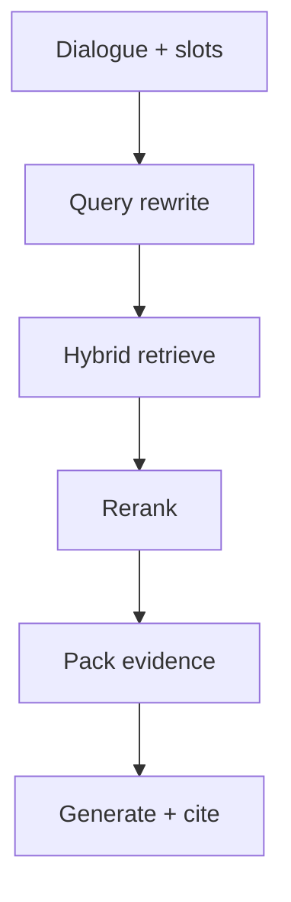

# RAG in Chat

> Multi-turn RAG is not “paste last message into the vector DB” — rewrite queries, respect filters, and pack evidence without drowning the model.

## Table of Contents

- [Definition](#definition)
- [Why It Matters](#why-it-matters)
- [Common Uses](#common-uses)
- [How It Works](#how-it-works)
- [Query Rewriting](#query-rewriting)
- [Python Examples](#python-examples)
- [Production Considerations](#production-considerations)
- [Cost Considerations](#cost-considerations)
- [Security Considerations](#security-considerations)
- [Best Practices](#best-practices)
- [Common Mistakes](#common-mistakes)
- [Navigation](#navigation)

---

## Definition

**RAG in chat** retrieves knowledge conditioned on the full dialogue context, then generates a reply grounded in that evidence. It extends single-shot RAG with query rewriting, follow-up resolution (“that one”), and session-aware filters.

---

## Why It Matters

Users ask follow-ups: “What about enterprise?” / “And refunds?” Lexical/embedding search on the raw follow-up fails. Conversational query rewriting restores recall; bad rewriting pollutes retrieval with wrong entities.

---

## Common Uses

| Pattern | Example |
|---------|---------|
| Follow-up resolution | “Does it work on iOS?” after discussing an app |
| Constrained browse | Filter by product SKU already in slots |
| Hybrid search | BM25 + dense + rerank for support |
| Tool+RAG | Retrieve runbook, then call approved API |

---

## How It Works



Packing tips: diversify sources, truncate with headings, label chunks `[1]`, `[2]`, keep total evidence tokens within budget.

---

## Query Rewriting

Rewrite to a **standalone search query**:

- Resolve pronouns and ellipsis
- Include product / version from slots
- Strip chitchat and politeness
- Optionally produce multiple queries (fan-out)

Do **not** let the rewriter invent entities not present in history.

---

## Python Examples

### Rewrite prompt (sketch)

```python
REWRITE = """Given the dialogue, write a standalone search query.
Dialogue:
{dialogue}
Standalone query:"""
```

### Pack evidence

```python
def pack_evidence(chunks: list[dict], max_chars: int = 6000) -> str:
    parts, used = [], 0
    for i, c in enumerate(chunks, 1):
        block = f"[{i}] {c['title']}\n{c['text']}\n"
        if used + len(block) > max_chars:
            break
        parts.append(block)
        used += len(block)
    return "\n".join(parts)
```

### Skip retrieval for small talk

```python
def needs_retrieval(route: str) -> bool:
    return route in {"grounded_qa", "policy", "howto"}
```

---

## Production Considerations

- Log rewritten queries for debugging
- A/B rewrite prompts separately from answer prompts
- Freshness filters (updated_at) for policy docs
- Locale-aware indexes
- Fallback: keyword search if dense fails

---

## Cost Considerations

Rewriting adds a model call — use a small model. Cache embeddings for popular rewritten queries. Limit fan-out. Skip RAG when router says FAQ template hit.

---

## Security Considerations

- Apply ACL filters **before** returning chunks to the model
- Isolate untrusted web-browsed content from first-party KB
- Watch for jailbreaks that try to exfiltrate retrieved docs
- Redact secrets in chunks at index time when possible

---

## Best Practices

1. Always rewrite follow-ups to standalone queries
2. Bind retrieval filters to authenticated context
3. Budget evidence tokens explicitly
4. Eval retrieval and generation separately
5. Keep a “no evidence” path first-class

---

## Common Mistakes

- Searching only the last user utterance
- Stuffing 20 chunks into the prompt
- No reranker on noisy corpora
- Mixing tenant documents in one shared index without filters
- Treating chat history as more authoritative than the KB

---

## Conversational Retrieval Checklist

| Step | Check |
|------|-------|
| Rewrite | Standalone query includes entities from slots/history |
| Filter | Tenant, locale, product applied before search |
| Hybrid | Keyword + dense when proper nouns matter |
| Rerank | Cross-encoder or LLM rerank on top-n |
| Pack | Evidence labeled `[n]` within token budget |
| Generate | Instruct “answer only from evidence” |
| Cite | Validate citation IDs before UI render |
| Fallback | Clarify / escalate when empty or low score |

### Follow-up failure modes

- **Topic switch** — rewriter keeps old product; detect abrupt topic change and reset filters
- **Negation** — “not the enterprise plan” ignored by bag-of-words retrieval
- **Temporal** — “current pricing” needs freshness filters
- **Multi-hop** — may need two retrieves (entity resolve → detail)

When multi-hop is common, prefer an explicit planner skill over stuffing more history into one query.

---

## Navigation

| | |
|--|--|
| **Previous** | [Grounded Support Bots](01-grounded-support-bots.md) |
| **Next** | [Citations UX](03-citations-ux.md) |
| **Section** | [Grounding](README.md) |
| **Handbook** | [Chatbots](../README.md) |
