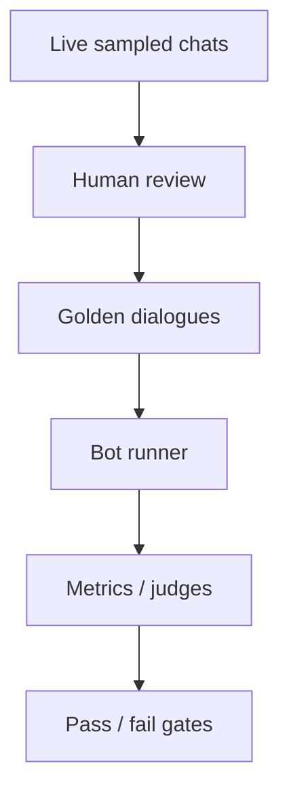

# Chatbot Evaluation

> Single-turn benchmarks are not enough — evaluate dialogues, tools, citations, and handoffs as a system.

## Table of Contents

- [Definition](#definition)
- [Why It Matters](#why-it-matters)
- [Common Uses](#common-uses)
- [How It Works](#how-it-works)
- [Eval Suites](#eval-suites)
- [Python Examples](#python-examples)
- [Production Considerations](#production-considerations)
- [Cost Considerations](#cost-considerations)
- [Security Considerations](#security-considerations)
- [Best Practices](#best-practices)
- [Common Mistakes](#common-mistakes)
- [Navigation](#navigation)

---

## Definition

**Chatbot evaluation** measures whether conversational systems achieve user goals safely and efficiently across turns. It combines offline golden dialogues, automated judges, human review, and online KPIs.

---

## Why It Matters

Prompt tweaks can fix one FAQ and break billing flows. Without regression suites, teams ship vibes. Multi-turn failures (lost slots, bad escalations) only appear in dialogue evals.

---

## Common Uses

| Gate | Suite |
|------|-------|
| PR check | Smoke dialogues + safety |
| Release | Full golden + groundedness |
| Incident | Targeted failure cluster |
| Vendor model swap | Side-by-side parity |

---

## How It Works



Separate **capability** (can it?) from **policy** (should it?) from **ops** (is it fast/cheap enough?).

---

## Eval Suites

| Suite | What it catches |
|-------|-----------------|
| Task success | Slots filled, resolution |
| Groundedness | Unsupported claims |
| Citation | Bad or missing sources |
| Safety | Jailbreaks, PII leaks |
| Handoff | Timing and packet quality |
| Regression | Previously fixed bugs |

Use LLM-as-judge carefully: calibrate against humans; fix rubrics; adjudicate disagreements.

---

## Python Examples

### Dialogue case

```python
from dataclasses import dataclass

@dataclass
class TurnCase:
    user: str
    expect_route: str | None = None
    must_include: tuple[str, ...] = ()
    must_not_include: tuple[str, ...] = ()

@dataclass
class DialogueCase:
    id: str
    turns: list[TurnCase]
```

### Simple assertions

```python
def check_turn(reply: str, case: TurnCase) -> list[str]:
    errs = []
    for s in case.must_include:
        if s.lower() not in reply.lower():
            errs.append(f"missing:{s}")
    for s in case.must_not_include:
        if s.lower() in reply.lower():
            errs.append(f"forbidden:{s}")
    return errs
```

---

## Production Considerations

- Freeze golden sets; add cases from production failures weekly
- Version bots under test (prompt, model, retriever)
- Segment scores by intent and language
- Shadow eval new prompts on logged traffic (privacy-safe)
- Tie release gates to [Success Metrics](../fundamentals/03-success-metrics.md)

---

## Cost Considerations

Full multi-turn suites are expensive — tier smoke vs nightly full. Use smaller models for draft scoring; humans for adjudication samples. Deduplicate near-identical dialogues.

---

## Security Considerations

- Redact PII in golden sets derived from prod
- Secure storage for jailbreak prompts
- Avoid leaking customer data into vendor eval tools without DPA

---

## Best Practices

1. Multi-turn cases with explicit success criteria
2. Independent retrieval vs generation scoring for RAG bots
3. Track flaky cases; fix nondeterminism (temp=0 where possible)
4. Include handoff and refusal paths
5. Review failure transcripts in weekly quality meetings

---

## Common Mistakes

- Only testing happy-path single turns
- Using thumbs as the sole quality signal
- Changing five prompt things at once
- No safety suite
- Ignoring non-English traffic

---

## Navigation

| | |
|--|--|
| **Previous** | [Voice Handoff](../channels/04-voice-handoff.md) |
| **Next** | [A/B Testing Prompts](02-ab-testing-prompts.md) |
| **Section** | [Ops](README.md) |
| **Handbook** | [Chatbots](../README.md) |
