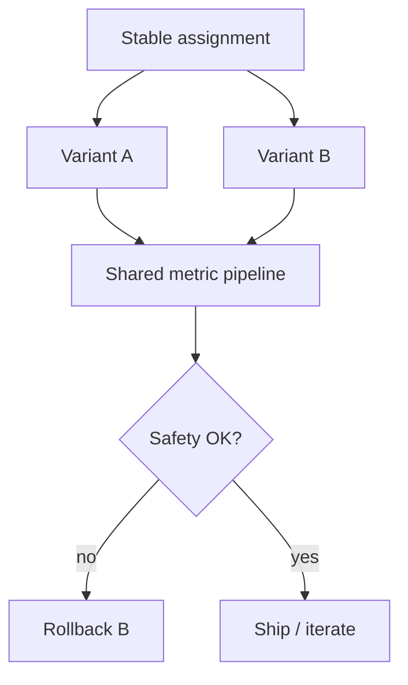

# A/B Testing Prompts

> Experiment on one change at a time, with safety guardrails and pre-registered metrics — or you will storytell noise.

## Table of Contents

- [Definition](#definition)
- [Why It Matters](#why-it-matters)
- [Common Uses](#common-uses)
- [How It Works](#how-it-works)
- [Experiment Design](#experiment-design)
- [Python Examples](#python-examples)
- [Production Considerations](#production-considerations)
- [Cost Considerations](#cost-considerations)
- [Security Considerations](#security-considerations)
- [Best Practices](#best-practices)
- [Common Mistakes](#common-mistakes)
- [Navigation](#navigation)

---

## Definition

**A/B testing prompts** assigns users or sessions to prompt/model/retriever variants and compares outcome metrics under controlled conditions. Includes canaries, layered holdouts, and automatic rollback on safety regressions.

---

## Why It Matters

Playground wins often fail in production mix. Without experiments, teams flip prompts based on anecdotes. With bad experiments (confounded changes, peeking), teams also ship noise — just with charts.

---

## Common Uses

| Experiment | Primary metric |
|------------|----------------|
| System prompt tone | CSAT + resolution |
| Grounding instruction | Groundedness / reopen |
| Model upgrade | Quality vs cost |
| Retriever k / rerank | Citation precision |

---

## How It Works



Assignment unit: prefer **session** or **user** sticky hashing so a dialogue does not flip mid-stream.

---

## Experiment Design

1. One primary metric + few secondaries
2. Minimum sample size / runtime estimate
3. Safety metrics as hard gates (not optimizers)
4. Log `prompt_version` on every turn
5. Freeze other release changes during the test

---

## Python Examples

### Sticky bucketing

```python
import hashlib

def bucket(user_id: str, salt: str, variants: list[str]) -> str:
    h = hashlib.sha256(f"{salt}:{user_id}".encode()).hexdigest()
    idx = int(h[:8], 16) % len(variants)
    return variants[idx]
```

### Gate on safety

```python
def should_rollback(safety_rate_b: float, baseline: float, max_lift: float = 0.002) -> bool:
    return safety_rate_b > baseline + max_lift
```

---

## Production Considerations

- Feature-flag prompts; avoid code deploys for copy tweaks
- Exclude staff traffic or segment it
- Watch mix shifts (channel, language) that confound results
- Pair online A/B with offline golden regression before ramp
- Document decision in a short experiment note

---

## Cost Considerations

Frontier variants can spike spend — cap traffic %. Track cost per resolved session as a secondary. End tests early only on pre-specified safety rules, not on shiny interim wins.

---

## Security Considerations

- Do not experiment with weaker authz “to see”
- Keep PII out of experiment dashboards where possible
- Restrict who can push prompt variants to prod

---

## Best Practices

1. Pre-register metrics and stop rules
2. Sticky assignment at user/session level
3. Canary → 10% → 50% → 100% ramps
4. Separate prompt version IDs from model IDs
5. Archive losing variants for learning

---

## Common Mistakes

- Changing model + prompt + retriever together
- Non-sticky assignment mid-conversation
- Optimizing thumbs while reopens rise
- Ignoring novelty effects in week one
- No automatic rollback on safety

---

## Ramp Plan Template

| Stage | Traffic | Exit criteria |
|-------|---------|---------------|
| Canary | 1–5% | No safety regression; latency OK |
| Early | 10–20% | Primary metric not worse on leading indicators |
| Broad | 50% | Stable for full business cycle (weekday+weekend) |
| Ship | 100% | Document decision; archive loser |

### What not to A/B in production

- Authz / permission checks
- PII redaction strength
- Refusal of clearly disallowed categories
- Encryption and retention controls

Test those offline and in staging only.

---

## Navigation

| | |
|--|--|
| **Previous** | [Chatbot Evaluation](01-chatbot-evaluation.md) |
| **Next** | [Human Handoff](03-human-handoff.md) |
| **Section** | [Ops](README.md) |
| **Handbook** | [Chatbots](../README.md) |
