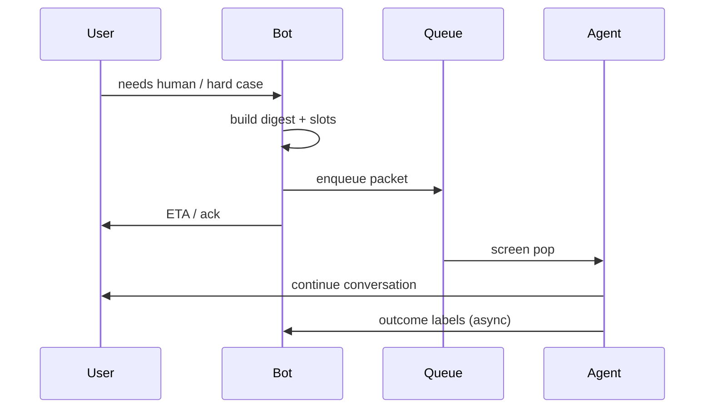

# Human Handoff

> Handoff is part of the happy path for hard cases — design it like a product feature, not a stack trace.

## Table of Contents

- [Definition](#definition)
- [Why It Matters](#why-it-matters)
- [Common Uses](#common-uses)
- [How It Works](#how-it-works)
- [Transfer Packet](#transfer-packet)
- [Python Examples](#python-examples)
- [Production Considerations](#production-considerations)
- [Cost Considerations](#cost-considerations)
- [Security Considerations](#security-considerations)
- [Best Practices](#best-practices)
- [Common Mistakes](#common-mistakes)
- [Navigation](#navigation)

---

## Definition

**Human handoff** transfers a conversation from bot to agent (or bot+agent assist) with enough context to continue without re-interrogating the user. Modes: cold transfer, warm transfer, async ticket, and agent-assist (bot drafts, human sends).

---

## Why It Matters

Users judge the whole company by the handoff. Context loss, long queues without expectation setting, and “bot refuses to let go” drive repeat contacts and public complaints.

---

## Common Uses

| Trigger | Mode |
|---------|------|
| User asks for human | Immediate queue |
| Low confidence / no evidence | Offer handoff |
| Privileged action | Authenticated agent flow |
| Abuse / fraud | Priority specialized queue |
| VIP accounts | Dedicated routing |

---

## How It Works



---

## Transfer Packet

Minimum fields:

- `reason_code`, priority
- conversation summary + last N turns
- slots / verified identity flags
- citations already shown
- customer language + channel
- sentiment / risk flags
- deep link to CRM record

---

## Python Examples

### Build packet

```python
def build_handoff(session: dict, reason: str) -> dict:
    return {
        "session_id": session["id"],
        "reason_code": reason,
        "summary": session.get("summary", ""),
        "recent": session.get("recent_turns", [])[-10:],
        "slots": session.get("slots", {}),
        "auth": session.get("auth_level", "unknown"),
        "channel": session.get("channel", "web"),
    }
```

### Expectation copy

```python
def queue_message(eta_minutes: int | None) -> str:
    if eta_minutes is None:
        return "I'm connecting you to a human agent. Please stay in this chat."
    return f"I'm connecting you to a human agent. Typical wait: ~{eta_minutes} minutes."
```

---

## Production Considerations

- SLA dashboards by reason code
- Allow agents to correct slots; feed back to memory carefully
- Shadow mode / agent-assist before full autonomy cuts
- After-hours: ticket creation with acknowledgment
- Train agents on bot capabilities to avoid contradictory promises

---

## Cost Considerations

Optimize **blended cost per resolution**. Sometimes earlier handoff is cheaper than 20 LLM turns. Measure deflection that stays deflected (no reopen).

---

## Security Considerations

- Re-auth for sensitive actions after transfer when policy requires
- Agents see only permitted fields (need-to-know)
- Audit access to full transcripts
- Beware social engineering via “agent” impersonation in chat

---

## Best Practices

1. One-click user-initiated handoff
2. Warm packets with summaries + slots
3. Set wait-time expectations
4. Label outcomes for bot learning
5. Keep bot silent or assist-only after transfer (clear ownership)

---

## Common Mistakes

- Making users repeat account numbers
- Hiding the human option behind maze prompts
- Bot and agent both talking (collision)
- No reason taxonomy
- Never reviewing handoff transcripts for bot gaps

---

## Agent Assist Mode

Before full autonomous resolution, run **agent assist**:

- Bot drafts reply + citations
- Agent edits/sends
- Labels: accepted / edited / rejected

This yields training signal and safer rollout. Measure edit distance and rejection reasons; promote patterns that agents accept into prompts/KB.

### Ownership after transfer

Define clearly: after handoff, either mute the bot or restrict it to whisper suggestions to the agent UI — never dual-speak to the user.

---

## Navigation

| | |
|--|--|
| **Previous** | [A/B Testing Prompts](02-ab-testing-prompts.md) |
| **Next** | [Chatbots hub](../README.md) |
| **Section** | [Ops](README.md) |
| **Handbook** | [Chatbots](../README.md) |
