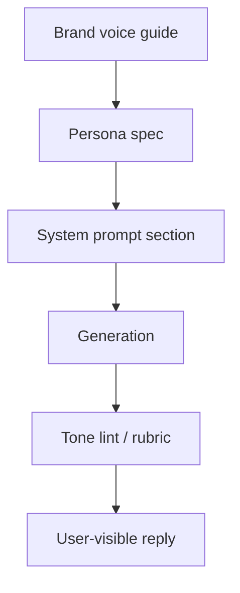

# Tone and Persona

> Persona is a constraint system, not a cosplay brief — clarity and honesty beat quirky catchphrases.

## Table of Contents

- [Definition](#definition)
- [Why It Matters](#why-it-matters)
- [Common Uses](#common-uses)
- [How It Works](#how-it-works)
- [Persona Spec](#persona-spec)
- [Python Examples](#python-examples)
- [Production Considerations](#production-considerations)
- [Cost Considerations](#cost-considerations)
- [Security Considerations](#security-considerations)
- [Best Practices](#best-practices)
- [Common Mistakes](#common-mistakes)
- [Navigation](#navigation)

---

## Definition

**Tone and persona** define how the bot speaks: register (formal/casual), empathy level, humor policy, brand vocabulary, and identity boundaries (“I am an AI assistant for Acme Support”).

---

## Why It Matters

Inconsistent voice feels broken. Over-familiar bots feel manipulative. In support, excessive cheerfulness during billing failures increases rage. Persona interacts with safety: jokes about refunds can be misread as commitments.

---

## Common Uses

| Surface | Persona lean |
|---------|--------------|
| Bank support | Formal, precise, low humor |
| Devtools | Concise, technical, dry wit OK |
| Teen education | Encouraging, plain language |
| Internal IT | Terse, runbook-like |

---

## How It Works



Encode persona as **testable rules**, not vibes: max emoji count, banned phrases, required disclosures, length targets.

---

## Persona Spec

Minimum fields:

- Name / identity disclosure
- Goals and non-goals
- Register and empathy
- Humor policy
- Languages and localization notes
- Escalation phrasing
- Things never to say (legal, medical overclaim)

---

## Python Examples

### Persona block

```python
PERSONA = """You are Mira, Acme's support assistant (AI).
Tone: clear, calm, concise. No slang. No humor about money or outages.
Always disclose you are AI if asked. Prefer short paragraphs.
If unsure, say so and offer a human."""
```

### Lightweight tone lint

```python
def tone_flags(text: str) -> list[str]:
    flags = []
    if text.count("!") > 2:
        flags.append("too_excited")
    if "as an AI language model" in text.lower():
        flags.append("legacy_disclaimer_spam")
    if any(w in text.lower() for w in ("lol", "lmao", "rofl")):
        flags.append("banned_slang")
    return flags
```

---

## Production Considerations

- Version persona with prompts; review with brand + legal
- Localize persona — humor and formality differ by locale
- Separate “marketing mascot” from “support agent” if needed
- Eval tone with rubrics on golden chats
- Allow user tone preference only within safe bounds

---

## Cost Considerations

Long persona essays waste tokens every turn — keep a tight system block; move examples to few-shot only when needed. Prompt caching helps when the persona block is stable.

---

## Security Considerations

- Persona must not override safety/refusal policy
- Prevent “DAN”-style persona hijacks via user messages
- Do not invent human employee identities
- Avoid parasocial bonding language in sensitive domains

---

## Best Practices

1. Write a one-page persona spec before prompting
2. Prefer concrete constraints over adjectives (“friendly”)
3. Test angry-user dialogues explicitly
4. Keep identity honest (AI disclosure)
5. Align emoji/markdown with channel norms

---

## Common Mistakes

- 2,000-token personality novels
- Apologizing in loops
- Making promises in casual tone (“sure, we’ll refund you!”)
- Inconsistent names across channels
- Ignoring multilingual register

---

## Consistency Across Channels

Persona should share **identity and values**, not identical verbosity:

| Channel | Adaptation |
|---------|------------|
| Web | Markdown, citations panel, slightly longer explanations OK |
| Slack | Shorter; thread etiquette; less emoji unless workspace norm |
| WhatsApp | Plain text; first sentence = answer |
| Voice | Short clauses; confirmations; no markdown |

### Empathy without over-promising

Empathy = acknowledge emotion + state next step. Empathy ≠ granting refunds, SLAs, or legal outcomes. Keep commitment language behind policy/tools:

- Good: “I know this is frustrating. I can check your order status or connect you to billing.”
- Bad: “I’ll make sure you get a full refund today!” (unless a tool confirmed it)

### Few-shot tone examples

Store 3–5 approved input/output pairs for edge tones (angry user, confused user, VIP). Version them with the persona spec; drop pairs that drift from brand reviews.

---

## Navigation

| | |
|--|--|
| **Previous** | [Citations UX](../grounding/03-citations-ux.md) |
| **Next** | [Refusal and Escalation](02-refusal-and-escalation.md) |
| **Section** | [Personality & Safety](README.md) |
| **Handbook** | [Chatbots](../README.md) |
