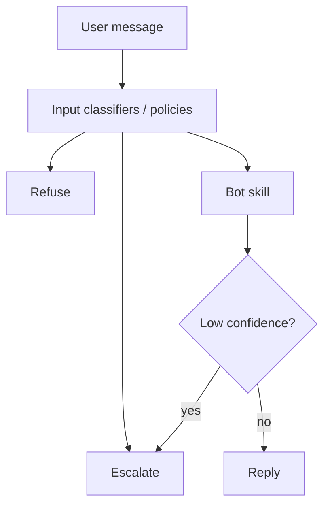

# Refusal and Escalation

> A good refusal is helpful and firm; a good escalation preserves context and dignity.

## Table of Contents

- [Definition](#definition)
- [Why It Matters](#why-it-matters)
- [Common Uses](#common-uses)
- [How It Works](#how-it-works)
- [Policy Categories](#policy-categories)
- [Python Examples](#python-examples)
- [Production Considerations](#production-considerations)
- [Cost Considerations](#cost-considerations)
- [Security Considerations](#security-considerations)
- [Best Practices](#best-practices)
- [Common Mistakes](#common-mistakes)
- [Navigation](#navigation)

---

## Definition

**Refusal** declines to comply with a disallowed or impossible request. **Escalation** transfers the conversation to a human or privileged workflow when the bot should not decide alone. Both are first-class product paths, not error afterthoughts.

---

## Why It Matters

Over-refusal frustrates users; under-refusal creates harm and liability. Escalation without context forces users to repeat themselves — a classic support failure.

---

## Common Uses

| Trigger | Response |
|---------|----------|
| Disallowed content | Refuse + safe alternative |
| Missing evidence | Partial answer or escalate |
| Account mutation | Escalate / authenticated tool flow |
| User requests human | Escalate immediately |
| Abuse / self-harm signals | Specialized policy + resources |

---

## How It Works



Distinguish **hard refuse** (never do) from **soft defer** (need human / more auth).

---

## Policy Categories

1. Illegal / violent wrongdoing
2. Jailbreak / prompt injection attempts
3. Medical/legal/financial advice beyond scope
4. Competitor disparagement / brand risk
5. Insufficient grounding for factual claims
6. Privileged actions without authz

Each category needs UX copy and logging codes.

---

## Python Examples

### Escalation packet

```python
def escalation_packet(session_id: str, reason: str, summary: str, slots: dict) -> dict:
    return {
        "session_id": session_id,
        "reason_code": reason,
        "summary": summary,
        "slots": slots,
        "priority": "high" if reason in {"abuse", "fraud", "self_harm"} else "normal",
    }
```

### Refuse template

```python
REFUSE = (
    "I can’t help with that request. "
    "I can help with product support questions, or connect you to a human."
)
```

### User-initiated handoff

```python
def wants_human(text: str) -> bool:
    t = text.lower()
    return any(p in t for p in ("human", "real person", "agent", "representative"))
```

---

## Production Considerations

- Measure refusal rate and false refusals via sampled review
- Queue SLAs by reason code
- Preserve transcript + summary for agents
- Allow “try again with rephrasing” only when safe
- Align with [Human Handoff](../ops/03-human-handoff.md) ops

---

## Cost Considerations

Early escalation can be cheaper than 15 confused LLM turns — but unnecessary escalations burn human time. Optimize **combined** bot+human cost per resolution.

---

## Security Considerations

- Do not reveal internal policy details that help attackers
- Escalation channels must authenticate the user again for sensitive actions
- Log jailbreak attempts for abuse analytics
- Careful handling of self-harm: follow jurisdictional guidance; prefer established resources

---

## Best Practices

1. Catalog refusal reasons with sample utterances
2. Escalate on user request without debate
3. Partial answers when some parts are safe
4. Keep refusal tone consistent with persona
5. Close the loop: agent outcome → bot learning

---

## Common Mistakes

- Lecturing users during refusal
- Soft-refusing forever instead of escalating
- Losing slot state on handoff
- Refusing grounded policy questions due to clumsy filters
- Hiding the human option

---

## Navigation

| | |
|--|--|
| **Previous** | [Tone and Persona](01-tone-and-persona.md) |
| **Next** | [PII and Privacy](03-pii-and-privacy.md) |
| **Section** | [Personality & Safety](README.md) |
| **Handbook** | [Chatbots](../README.md) |
