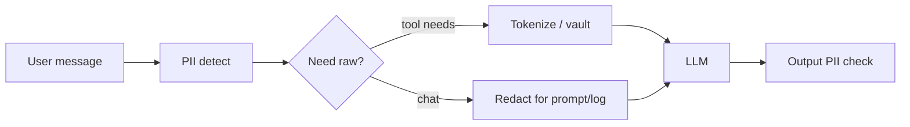

# PII and Privacy

> Chat transcripts are sensitive databases that happen to look like conversations — design retention and redaction first.

## Table of Contents

- [Definition](#definition)
- [Why It Matters](#why-it-matters)
- [Common Uses](#common-uses)
- [How It Works](#how-it-works)
- [Data Classes](#data-classes)
- [Python Examples](#python-examples)
- [Production Considerations](#production-considerations)
- [Cost Considerations](#cost-considerations)
- [Security Considerations](#security-considerations)
- [Best Practices](#best-practices)
- [Common Mistakes](#common-mistakes)
- [Navigation](#navigation)

---

## Definition

**PII and privacy engineering** for chatbots covers identifying personal data in messages, minimizing collection, redacting for logs/evals, enforcing retention, honoring deletion, and preventing leakage via prompts, tools, or citations.

---

## Why It Matters

Users paste IDs, addresses, health notes, and screenshots. Vendors, logs, eval sets, and long-term memory can proliferate copies. Breaches and regulatory fines follow weak transcript hygiene.

---

## Common Uses

| Control | Where applied |
|---------|----------------|
| Input detection | Before LLM / storage |
| Redacted logs | Observability pipelines |
| Minimized prompts | Drop unnecessary history fields |
| Retention TTL | Session stores, warehouses |
| DSAR delete | All stores including vectors |

---

## How It Works



---

## Data Classes

| Class | Examples | Handling |
|-------|----------|----------|
| Public | Help article text | Normal |
| Personal | Email, phone, name | Minimize, ACL |
| Sensitive | Health, biometrics | High bar / avoid |
| Secrets | Passwords, OTP, keys | Never store; purge |

---

## Python Examples

### Simple redaction

```python
import re

PATTERNS = [
    (re.compile(r"[A-Za-z0-9._%+-]+@[A-Za-z0-9.-]+\.[A-Za-z]{2,}"), "[EMAIL]"),
    (re.compile(r"\b\d{3}-\d{2}-\d{4}\b"), "[SSN]"),
    (re.compile(r"\b(?:\d[ -]*?){13,19}\b"), "[CARD]"),
]

def redact(text: str) -> str:
    out = text
    for cre, repl in PATTERNS:
        out = cre.sub(repl, out)
    return out
```

### Retention marker

```python
from datetime import datetime, timedelta, timezone

def expires_at(days: int = 30) -> str:
    return (datetime.now(timezone.utc) + timedelta(days=days)).isoformat()
```

---

## Production Considerations

- Separate stores: raw (restricted) vs redacted (analytics)
- Vendor DPAs for LLM providers; prefer zero-retention APIs when available
- Screen share / image PII needs OCR/ sensitized pipelines
- Document lawful basis and notices in product copy
- Test deletion end-to-end quarterly

---

## Cost Considerations

PII classifiers add latency/cost — cache per session risk score. Redaction before long-context prompts can **save** tokens. Avoid keeping duplicate full transcripts in multiple tools.

---

## Security Considerations

- Encrypt transcripts at rest
- Role-based access for replay tools
- Prevent prompt leakage of other users’ data via tools/RAG
- Mask PII in tickets mirrored to third parties
- Careful with training on chat logs — default deny

---

## Best Practices

1. Collect the minimum to resolve the task
2. Tokenize identifiers for tools instead of pasting raw secrets
3. Default short retention; justify longer
4. Redact eval datasets
5. Provide user-visible privacy controls

---

## Common Mistakes

- Logging prompts+completions forever in plaintext
- Shipping raw chats to model fine-tuning by default
- Vector DBs with unredacted episodes and no delete
- Pasting OTP codes into durable memory
- Assuming “internal only” means low risk

---

## Prompt and Vendor Hygiene

| Practice | Detail |
|----------|--------|
| Zero-retention APIs | Prefer provider settings that disable training/retention where offered |
| Region pinning | Keep EU user traffic in EU processing when required |
| Eval isolation | Separate prod PII from CI fixtures |
| Screenshot risk | Users upload IDs — run image scanning / block sensitive uploads |
| Tool args | Pass tokens/IDs, not full raw messages, when possible |

### Deletion map

Maintain a checklist of stores that may hold chat PII:

1. Session Redis / DB
2. Object storage for attachments
3. Analytics warehouse
4. Vector memory
5. Ticketing mirrors
6. Model provider logs (contractual)

DSAR automation should fan out to each with proof of deletion.

---

## Navigation

| | |
|--|--|
| **Previous** | [Refusal and Escalation](02-refusal-and-escalation.md) |
| **Next** | [Web Chat](../channels/01-web-chat.md) |
| **Section** | [Personality & Safety](README.md) |
| **Handbook** | [Chatbots](../README.md) |
