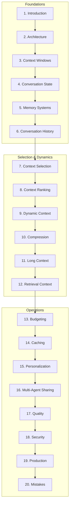

# Context Engineering

> Comprehensive handbook for designing systems that determine what the model sees, when, how much, and how context evolves.
> **Prerequisites:** [Prompt Engineering](../prompt-engineering/README.md) · [LLM Engineering](../llm-engineering/README.md)

---

## Module Overview

Context engineering is a **dedicated engineering discipline** — not an extension of prompt engineering. It governs information flow from user input through memory, retrieval, ranking, compression, and prompt assembly.

**Unlocks:** [RAG](../rag/README.md) · [AI Agents](../ai-agents/README.md) · [MCP](../mcp/README.md) · [AI Workflows](../ai-workflows/README.md)

---

## Documents (20 Sections)

| # | Topic | Document |
|---|-------|----------|
| 1 | Introduction | [introduction-to-context-engineering.md](introduction-to-context-engineering.md) |
| 2 | Context Architecture | [context-architecture.md](context-architecture.md) |
| 3 | Context Windows | [context-windows.md](context-windows.md) |
| 4 | Conversation State | [conversation-state.md](conversation-state.md) |
| 5 | Memory Systems | [memory-systems.md](memory-systems.md) |
| 6 | Conversation History | [conversation-history.md](conversation-history.md) |
| 7 | Context Selection | [context-selection.md](context-selection.md) |
| 8 | Context Ranking | [context-ranking.md](context-ranking.md) |
| 9 | Dynamic Context | [dynamic-context.md](dynamic-context.md) |
| 10 | Context Compression | [context-compression.md](context-compression.md) |
| 11 | Long Context Strategies | [long-context-strategies.md](long-context-strategies.md) |
| 12 | Retrieval Context | [retrieval-context.md](retrieval-context.md) |
| 13 | Context Budgeting | [context-budgeting.md](context-budgeting.md) |
| 14 | Context Caching | [context-caching.md](context-caching.md) |
| 15 | Personalization | [context-personalization.md](context-personalization.md) |
| 16 | Multi-Agent Sharing | [multi-agent-context-sharing.md](multi-agent-context-sharing.md) |
| 17 | Context Quality | [context-quality.md](context-quality.md) |
| 18 | Context Security | [context-security.md](context-security.md) |
| 19 | Production | [production-context-engineering.md](production-context-engineering.md) |
| 20 | Common Mistakes | [context-engineering-mistakes.md](context-engineering-mistakes.md) |

**Comparisons:** [context-comparison-guides.md](context-comparison-guides.md)

---

## Code Examples

11 Python examples in [`examples/context-engineering/`](../../examples/context-engineering/):

Memory · Sessions · Assembly · Ranking · Summarization · Compression · Dynamic assembly · Budgeting · Caching · Personalization · Pruning

---

## Cheat Sheets

- [Context Engineering Workflow](../../cheat-sheets/context-engineering-workflow-cheat-sheet.md)
- [Memory Types](../../cheat-sheets/memory-types-cheat-sheet.md)
- [Context Budgeting](../../cheat-sheets/context-budgeting-cheat-sheet.md)
- [Ranking Checklist](../../cheat-sheets/context-ranking-checklist.md)
- [Compression Checklist](../../cheat-sheets/context-compression-checklist.md)
- [Personalization Checklist](../../cheat-sheets/context-personalization-checklist.md)
- [Debugging Checklist](../../cheat-sheets/context-debugging-checklist.md)

---

## Learning Path

1. **Foundations** — Introduction → Architecture → Windows → State → Memory → History
2. **Curation** — Selection → Ranking → Dynamic → Compression → Long Context → Retrieval
3. **Operations** — Budgeting → Caching → Personalization → Quality → Security
4. **Production** — Production practices → Mistakes review

**Milestone:** Context engine with layered budgets, traced assembly, retrieval + memory integration, and compression under overflow.

---

## Completion Checklist

- [ ] Read all 20 sections
- [ ] Implement `ContextEngine` with parallel source fetch
- [ ] Define token budgets per layer in config
- [ ] Log context trace (included IDs, token counts, policy version)
- [ ] Run ranking eval with labeled query-doc pairs
- [ ] Test overflow compression with faithfulness checks
- [ ] Review [context engineering mistakes](context-engineering-mistakes.md) against your system

---

## See Also

- [Prompt Engineering](../prompt-engineering/README.md) prerequisite
- [LLM Context Windows](../llm-engineering/context-windows.md) — model-level limits
- [Master Index](../../meta/indexes/MASTER-INDEX.md)
