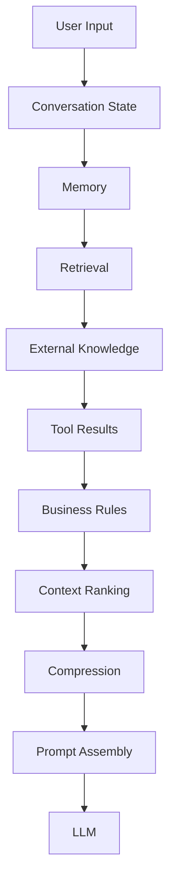
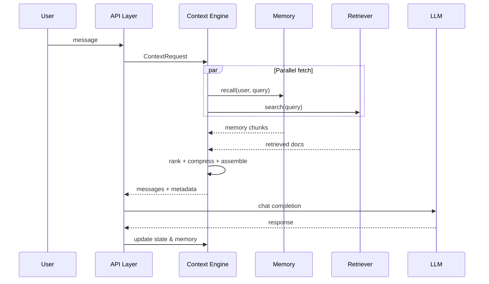
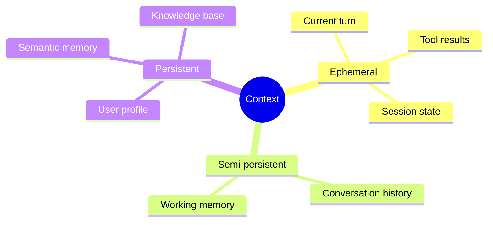

# Context Architecture

> How production AI systems structure the flow from raw inputs to assembled model context — a layered architecture that separates ingestion, enrichment, selection, and assembly.

## Table of Contents

- [Overview](#overview)
- [Architecture Layers](#architecture-layers)
- [End-to-End Pipeline](#end-to-end-pipeline)
- [Component Responsibilities](#component-responsibilities)
- [Context Sources](#context-sources)
- [Assembly Layer](#assembly-layer)
- [Clean Architecture Mapping](#clean-architecture-mapping)
- [Production Considerations](#production-considerations)
- [Performance Considerations](#performance-considerations)
- [Cost Considerations](#cost-considerations)
- [Security Considerations](#security-considerations)
- [Best Practices](#best-practices)
- [Anti-Patterns](#anti-patterns)
- [Python Examples](#python-examples)
- [Interview Preparation](#interview-preparation)
- [Navigation](#navigation)

---

## Overview

Context architecture defines **where each type of information lives**, **how it flows**, and **who owns each transformation**. Without explicit architecture, context logic spreads across API handlers, agent loops, and prompt strings — becoming impossible to test, observe, or secure.

This document is **Section 2** of Phase 6.



---

## Architecture Layers

| Layer | Function | Typical Storage |
|-------|----------|-----------------|
| **Ingestion** | Accept user input, session IDs | API gateway |
| **State** | Track conversation and agent state | Redis, PostgreSQL |
| **Memory** | Short/long-term user knowledge | Vector DB + KV store |
| **Retrieval** | Fetch relevant documents | Vector index, search |
| **Enrichment** | Tools, APIs, live data | Tool executors |
| **Policy** | Business rules, permissions | Config service |
| **Selection** | Filter candidates | In-process / worker |
| **Ranking** | Score and order | Ranker service |
| **Compression** | Fit token budget | LLM or extractive |
| **Assembly** | Build message list | Context engine |
| **Inference** | LLM call | Provider API |

---

## End-to-End Pipeline



---

## Component Responsibilities

### User Input
Raw message plus metadata (locale, channel, attachments). Never trusted as instructions.

### Conversation State
Session-scoped turn history, active intent, pending tool calls. See [Conversation State](conversation-state.md).

### Memory
Durable user knowledge across sessions. See [Memory Systems](memory-systems.md).

### Retrieval
External knowledge injection — documents, tickets, code. See [Retrieval Context](retrieval-context.md).

### External Knowledge
Live APIs, databases, MCP resources — freshness-critical data.

### Tool Results
Structured observations from agent tool execution — appended as tool messages.

### Business Rules
Tenant policies, compliance text, feature flags — often cached in system prefix.

### Context Ranking
Scores candidates before budget enforcement. See [Context Ranking](context-ranking.md).

### Compression
Summarization, extraction, deduplication. See [Context Compression](context-compression.md).

### Prompt Assembly
Final message list: system + context blocks + user message. Delegates wording to [Prompt Engineering](../prompt-engineering/README.md) templates.

---

## Context Sources



---

## Assembly Layer

The assembly layer produces a **ContextPackage**:

```python
@dataclass
class ContextPackage:
    system_blocks: list[str]      # policies, role, format
    context_blocks: list[ContextBlock]  # ranked, attributed chunks
    user_message: str
    tool_messages: list[dict]
    token_budget: TokenBudget
    trace: ContextTrace           # observability
```

Separation allows unit testing without calling the LLM.

---

## Clean Architecture Mapping

| Clean Architecture | Context Component |
|--------------------|-------------------|
| Domain | Context policies, ranking weights, budget rules |
| Application | ContextEngine orchestration use cases |
| Infrastructure | Redis, vector DB, LLM compression calls |
| Interface | FastAPI routes invoking ContextEngine |

Context logic belongs in the **application/domain layer**, not in HTTP handlers.

---

## Production Considerations

- Idempotent context assembly for retries
- Circuit breakers on retrieval and memory services
- Graceful degradation: serve with reduced context vs fail open

---

## Performance Considerations

- Parallel I/O for memory + retrieval (biggest latency win)
- Pre-warm caches for system prefix
- Async compression only when over budget

---

## Cost Considerations

- Rank before compress — don't summarize irrelevant chunks
- Cache stable system + policy blocks with provider prompt caching

---

## Security Considerations

- Tenant ID filter at retrieval and memory layers (defense in depth)
- PII scrubbing before logging context snapshots

---

## Best Practices

1. One `ContextEngine` entry point per product surface
2. Immutable `ContextPackage` passed to inference
3. Structured trace for every assembly decision
4. Version context policies independently of prompts

---

## Anti-Patterns

| Anti-Pattern | Fix |
|--------------|-----|
| God function `build_prompt()` | Split into ranker, compressor, assembler |
| Retrieval inside prompt template | Retrieval is context layer |
| No attribution on chunks | Required for debugging and citations |

---

## Python Examples

```python
from abc import ABC, abstractmethod
from dataclasses import dataclass


@dataclass
class ContextBlock:
    id: str
    content: str
    source: str  # memory | retrieval | tool | state
    score: float
    tokens: int


class ContextSource(ABC):
    @abstractmethod
    async def fetch(self, req: "ContextRequest") -> list[ContextBlock]:
        ...


class ContextEngine:
    def __init__(self, sources: list[ContextSource], ranker, compressor, assembler):
        self.sources = sources
        self.ranker = ranker
        self.compressor = compressor
        self.assembler = assembler

    async def assemble(self, req: "ContextRequest") -> list[dict]:
        blocks: list[ContextBlock] = []
        for source in self.sources:
            blocks.extend(await source.fetch(req))
        ranked = self.ranker.rank(blocks, req.message)
        fitted = self.compressor.fit(ranked, req.max_tokens)
        return self.assembler.to_messages(fitted, req)
```

---

## Interview Preparation

**Q: Draw the context architecture for a RAG chatbot.**

> User input → session state → query rewrite → vector retrieval + memory → rank → budget → assemble with citations → LLM → update history.

**Q: Where does prompt engineering fit?**

> Assembly layer applies prompt templates to format ranked context; prompts don't fetch or rank.

---

## Navigation

### Prerequisites

- [Introduction to Context Engineering](introduction-to-context-engineering.md)
- [Software Engineering for AI](../foundations/software-engineering-for-ai.md)

### Related Topics

- [Context Selection](context-selection.md) — Section 7
- [Dynamic Context](dynamic-context.md) — Section 9
- [Production Context Engineering](production-context-engineering.md) — Section 19

### Next

- [Context Windows](context-windows.md)

---

## Changelog

| Version | Date | Changes |
|---------|------|---------|
| 1.0 | 2026-07-13 | Initial publication — Phase 6 Section 2 |
