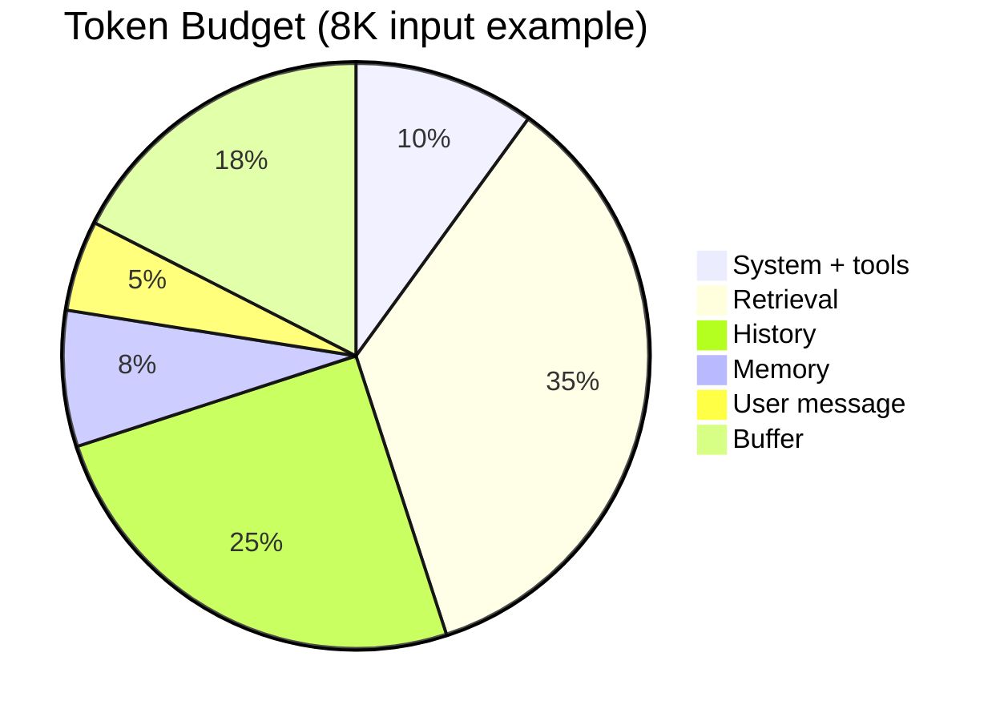

# Context Budgeting

> Explicit allocation of finite context resources across competing layers — the control plane for cost and quality.

## Table of Contents

- [Overview](#overview)
- [Token Budgets](#token-budgets)
- [Cost Budgeting](#cost-budgeting)
- [Latency Budgeting](#latency-budgeting)
- [Context Allocation](#context-allocation)
- [Balancing History vs Retrieval](#balancing-history-vs-retrieval)
- [Balancing Memory vs User Input](#balancing-memory-vs-user-input)
- [Practical Strategies](#practical-strategies)
- [Production Considerations](#production-considerations)
- [Python Examples](#python-examples)
- [Interview Preparation](#interview-preparation)
- [Navigation](#navigation)

---

## Overview

Without budgets, history consumes the window before retrieval loads, or oversized retrieval crowds out the user's question. **Context budgeting** assigns caps per layer and enforces them before the API call.

Section **13** of Phase 6.



---

## Token Budgets

```python
@dataclass
class LayerBudget:
    system: int = 800
    retrieval: int = 3000
    history: int = 2000
    memory: int = 500
    user: int = 500
    reserved_output: int = 2000

    def input_cap(self, window: int) -> int:
        return window - self.reserved_output
```

Enforce in compressor — never exceed `input_cap`.

---

## Cost Budgeting

```
request_cost ≈ (input_tokens * input_price) + (output_tokens * output_price)
```

Cap input tokens per user tier. Track daily spend per feature with context size attribution.

---

## Latency Budgeting

| Stage | Target |
|-------|--------|
| Memory + retrieval fetch | &lt;150ms p95 |
| Ranking + compression | &lt;50ms p95 |
| LLM prefill | scales with input tokens |

Reduce retrieval `top_k` or skip memory under latency pressure.

---

## Context Allocation

**Waterfill algorithm:** Fill P0 layers first (system, user), then P1 (retrieval), then P2 (history), then P3 (memory).

---

## Balancing History vs Retrieval

| Task type | Favor |
|-----------|-------|
| Follow-up clarifications | History |
| Factual KB questions | Retrieval |
| Account-specific | Memory + history |

Dynamic weights via intent classifier — see [Dynamic Context](dynamic-context.md).

---

## Balancing Memory vs User Input

Never truncate current user message. Shrink memory recall `top_k` before touching user input.

---

## Practical Strategies

1. Define budgets per product surface in config
2. Alert when actual usage consistently hits caps (budget too tight)
3. A/B test budget profiles on eval metrics
4. Use prompt caching for fixed system portion

---

## Production Considerations

- Expose budget metadata in traces
- Per-tenant overrides for enterprise contracts
- CI test with max-fill scenarios

---

## Python Examples

```python
def enforce_budget(layers: dict[str, list[ContextBlock]], budget: LayerBudget) -> dict:
    result = {}
    caps = {
        "system": budget.system,
        "retrieval": budget.retrieval,
        "history": budget.history,
        "memory": budget.memory,
    }
    for name, cap in caps.items():
        blocks = layers.get(name, [])
        result[name] = trim_blocks_to_tokens(blocks, cap)
    return result
```

---

## Interview Preparation

**Q: How allocate 8K context for support bot?**

> Reserve 2K output, 800 system, 500 user, ~3K retrieval, ~2K history/memory split by intent; compress overflow.

---

## Navigation

### Prerequisites

- [Context Windows](context-windows.md)

### Related Topics

- [Context Caching](context-caching.md) — Section 14
- [LLM Cost Optimization](../llm-engineering/llm-cost-optimization.md)

### Next

- [Context Caching](context-caching.md)

---

## Changelog

| Version | Date | Changes |
|---------|------|---------|
| 1.0 | 2026-07-13 | Initial publication — Phase 6 Section 13 |
