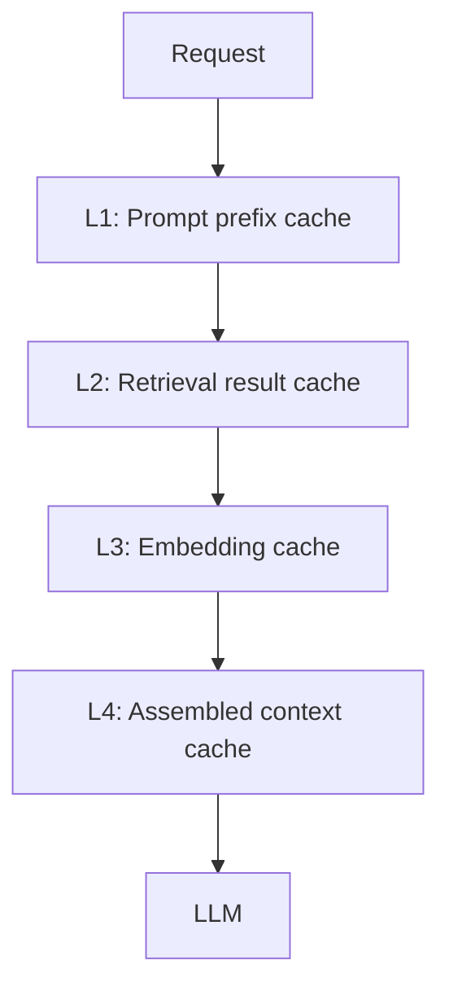

# Context Caching

> Cache layers that reduce latency and cost for context assembly and LLM prefill.

## Table of Contents

- [Overview](#overview)
- [Prompt Caching](#prompt-caching)
- [Retrieval Caching](#retrieval-caching)
- [Embedding Caching](#embedding-caching)
- [Conversation Caching](#conversation-caching)
- [Memory Caching](#memory-caching)
- [Cache Invalidation](#cache-invalidation)
- [Latency and Cost Impact](#latency-and-cost-impact)
- [Production Considerations](#production-considerations)
- [Python Examples](#python-examples)
- [Interview Preparation](#interview-preparation)
- [Navigation](#navigation)

---

## Overview

Context assembly repeats work across turns — same policies, same embeddings, similar queries. **Caching** at multiple layers cuts latency and provider costs.

Section **14** of Phase 6.



---

## Prompt Caching

Provider features (OpenAI, Anthropic) cache identical long prefixes — place **stable content first**:

1. System instructions
2. Tool definitions
3. Policy docs
4. Variable content last

Cache hit → discounted input tokens on repeated prefix.

---

## Retrieval Caching

Key: `hash(normalized_query + tenant_id + index_version)`

TTL: 5–60 minutes depending on freshness needs. Bust on index update.

---

## Embedding Caching

Cache `hash(text) → embedding` for:

- Frequent queries
- Static document chunks (precomputed at index time)
- User message after normalization

Redis or in-process LRU for hot paths.

---

## Conversation Caching

Cache rolling summary + token count per `session_id`. Invalidate on new turn.

---

## Memory Caching

Cache recall results per `(user_id, query_hash)` with short TTL — memory updates invalidate.

---

## Cache Invalidation

| Event | Invalidate |
|-------|------------|
| Policy publish | Prompt prefix + retrieval |
| Document update | Embedding + retrieval for doc |
| User preference change | Memory cache for user |
| New conversation turn | Conversation summary cache |

Use version keys in cache names: `retrieval:v{index_version}:{query_hash}`.

---

## Latency and Cost Impact

| Cache | Typical savings |
|-------|-----------------|
| Prompt prefix | 30–50% input cost on multi-turn |
| Embedding | 20–100ms per query |
| Retrieval | 50–200ms per repeated query |

---

## Production Considerations

- Never cache across tenants without tenant in key
- Monitor hit rates
- Stale cache worse than miss for compliance content

---

## Python Examples

```python
import hashlib
import json


def retrieval_cache_key(query: str, tenant_id: str, index_version: int) -> str:
    normalized = query.strip().lower()
    payload = json.dumps({"q": normalized, "t": tenant_id, "v": index_version}, sort_keys=True)
    return f"ret:{hashlib.sha256(payload.encode()).hexdigest()[:16]}"


async def cached_retrieve(redis, key: str, fetch_fn, ttl: int = 300):
    hit = await redis.get(key)
    if hit:
        return json.loads(hit)
    result = await fetch_fn()
    await redis.setex(key, ttl, json.dumps(result))
    return result
```

---

## Interview Preparation

**Q: What to cache in a RAG chatbot?**

> Embeddings (docs precomputed), retrieval results (query+version key), prompt prefix (provider cache), session summary — with tenant-scoped keys and invalidation on index update.

---

## Navigation

### Prerequisites

- [Redis for AI](../backend-engineering/redis-for-ai-applications.md)
- [Context Budgeting](context-budgeting.md)

### Related Topics

- [Production Context Engineering](production-context-engineering.md) — Section 19

### Next

- [Context Personalization](context-personalization.md)

---

## Changelog

| Version | Date | Changes |
|---------|------|---------|
| 1.0 | 2026-07-13 | Initial publication — Phase 6 Section 14 |
