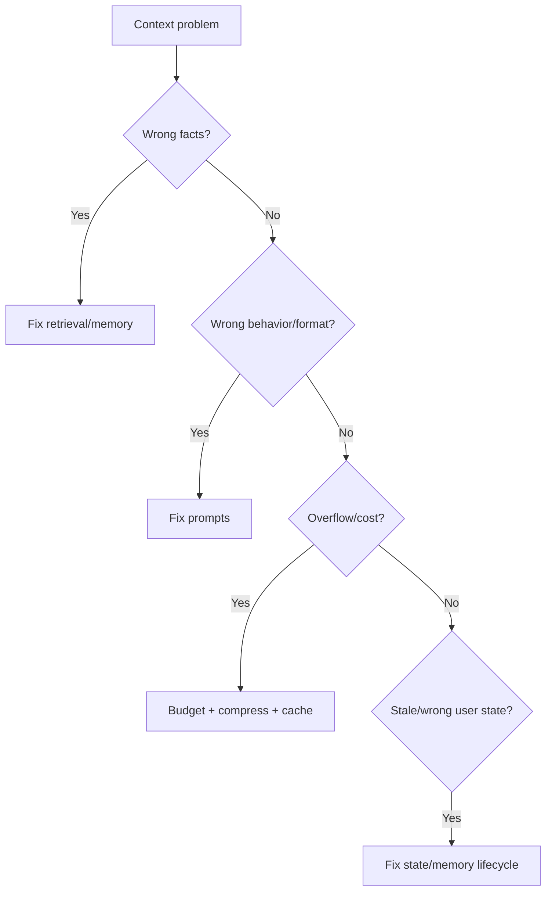

# Context Comparison Guides

> supplementary guide — decision tables for context engineering tradeoffs.

## Table of Contents

- [Prompt vs Context](#prompt-vs-context)
- [Short-Term vs Long-Term Memory](#short-term-vs-long-term-memory)
- [Static vs Dynamic Context](#static-vs-dynamic-context)
- [Compression Techniques](#compression-techniques)
- [Ranking Strategies](#ranking-strategies)
- [Personalization Strategies](#personalization-strategies)
- [Long-Context Approaches](#long-context-approaches)
- [Decision Flowchart](#decision-flowchart)
- [Interview Preparation](#interview-preparation)
- [Navigation](#navigation)

---

## Prompt vs Context

| Dimension | Prompt Engineering | Context Engineering |
|-----------|-------------------|---------------------|
| Primary artifact | Templates, instructions | Pipelines, stores, policies |
| Changes | Wording, format | What data is included |
| Failure | Wrong behavior | Wrong/missing facts |
| Testing | Output eval | Retrieval recall, budget compliance |
| Owner | Often ML/prompt engineer | Backend/platform engineer |

**Choose prompt focus** when behavior/format is wrong with good context.
**Choose context focus** when facts, state, or knowledge are wrong.

---

## Short-Term vs Long-Term Memory

| | Short-Term | Long-Term |
|---|------------|-----------|
| Scope | Session | Cross-session |
| Storage | Redis | DB + vector |
| TTL | Hours | Months+ |
| Content | Active task, recent facts | Preferences, episodic events |
| Recall | Load session blob | Semantic search + user filter |
| GDPR | Expires with session | Requires deletion API |

---

## Static vs Dynamic Context

| | Static | Dynamic |
|---|--------|---------|
| Assembly | Fixed system prompt | Runtime resolver |
| Use case | Demos, single-tenant tools | Production multi-tenant |
| Personalization | None | Per user/intent |
| Testing | Simple | Policy matrix tests |
| Cost | Lower assembly | Higher; cache mitigates |

---

## Compression Techniques

| Technique | Speed | Fidelity | Best For |
|-----------|-------|----------|----------|
| Drop low-rank chunks | Fast | High if rank good | Retrieval overflow |
| Extractive | Fast | Medium-high | Structured logs |
| Abstractive LLM | Slow | Medium | Narrative history |
| Hierarchical | Medium | High | Long documents |
| Semantic sentence pick | Fast | Medium | Quick trim |

---

## Ranking Strategies

| Strategy | Strength | Weakness |
|----------|----------|----------|
| Vector only | Semantic match | Misses keywords |
| BM25 only | Exact terms | Misses paraphrase |
| RRF hybrid | Robust default | Tuning opaque |
| Cross-encoder rerank | Highest precision | Latency + cost |
| Business boosts | Policy compliance | Manual config |

---

## Personalization Strategies

| Strategy | Data | Risk |
|----------|------|------|
| Explicit preferences | User settings | Low |
| Profile attributes | Account metadata | Medium (staleness) |
| Semantic memory | Learned facts | Medium (pollution) |
| Behavioral inference | Usage patterns | High (privacy/fairness) |

---

## Long-Context Approaches

| Approach | When | Avoid When |
|----------|------|------------|
| Stuff full doc | Small doc, few queries | Cost-sensitive, >32K effective |
| RAG retrieval | Q&A over large corpus | Need full-doc reasoning |
| Map-reduce | Global summary questions | Low latency required |
| Hierarchical index | Structured long docs | Unstructured stream |
| Hybrid summary+RAG | Production default | — |

---

## Decision Flowchart

---

## Interview Preparation

**Q: When invest in context engineering vs better model?**

> Audit context traces first. If supporting docs were missing or wrong, fix context. If context was correct but reasoning failed, consider model upgrade.

---

## Navigation

### Prerequisites

- [Introduction to Context Engineering](introduction-to-context-engineering.md)

### Related Topics

- [Prompt Comparison Guides](../prompt-engineering/prompt-comparison-guides.md)
- [Context Engineering Mistakes](context-engineering-mistakes.md)

---

## Changelog

| Version | Date | Changes |
|---------|------|---------|
| 1.0 | 2026-07-13 | Initial publication comparisons |
