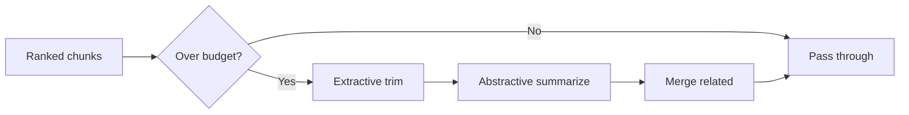

# Context Compression

> Techniques to fit essential information into token budgets without losing facts critical to correct reasoning.

## Table of Contents

- [Overview](#overview)
- [Compression Pipeline](#compression-pipeline)
- [Summarization](#summarization)
- [Extraction](#extraction)
- [Semantic Compression](#semantic-compression)
- [Hierarchical Summaries](#hierarchical-summaries)
- [Chunk Merging](#chunk-merging)
- [Redundancy Removal](#redundancy-removal)
- [Information Preservation](#information-preservation)
- [Tradeoffs](#tradeoffs)
- [Production Considerations](#production-considerations)
- [Python Examples](#python-examples)
- [Interview Preparation](#interview-preparation)
- [Navigation](#navigation)

---

## Overview

**Compression** runs when selected context exceeds budget. Goal: minimize tokens while preserving answer-critical information.

Section **10**.



---

## Compression Pipeline

1. Drop lowest-ranked chunks until close to budget
2. Extractive sentence selection per remaining chunk
3. Abstractive summarize groups of chunks
4. Validate preserved entities (numbers, dates, names)
5. Re-count tokens; iterate if needed

---

## Summarization

LLM or smaller model condenses text. Use [summarization template](../../prompts/templates/summarization.md) with strict faithfulness rules.

**When:** Narrative history, long docs
**Risk:** Lost numbers/names — validate

---

## Extraction

Pull structured fields only:

```json
{"issue": "SSO failure", "error_code": "SAML_418", "account": "ent-4421"}
```

**When:** Tool logs, tickets, forms
**Risk:** Drops nuance — good for structured tasks

---

## Semantic Compression

Embedding-based sentence selection: keep sentences maximally similar to query embedding without LLM call — fast, cheap.

---

## Hierarchical Summaries

```
Level 0: chunk summaries
Level 1: section summary of chunk summaries
Level 2: document executive summary
```

Retrieve at appropriate level based on query breadth.

---

## Chunk Merging

Combine adjacent chunks from same document with shared citation — reduces repeated headers and metadata overhead.

---

## Redundancy Removal

- Min-hash deduplication
- Merge overlapping retrieval windows
- Collapse repeated policy text

---

## Information Preservation

| Must preserve | Validation |
|---------------|------------|
| Numbers, dates | Regex diff vs source |
| Named entities | NER overlap check |
| Negations | Keyword presence |
| Citations | Source ID retained |

Fail compression if validation fails — drop chunk instead of corrupt summary.

---

## Tradeoffs

| More aggressive compression | Less compression |
|----------------------------|------------------|
| Lower cost/latency | Higher fidelity |
| Higher hallucination risk | May exceed window |

Tune per task with eval — support needs entity preservation; brainstorming may tolerate loss.

---

## Production Considerations

- Async pre-compression for known large sessions
- Cache compressed forms with source version key
- Don't compress P0 mandatory policy blocks

---

## Python Examples

```python
def compress_to_budget(chunks: list[ContextBlock], budget: int, tokenizer) -> list[ContextBlock]:
    total = sum(c.tokens for c in chunks)
    if total <= budget:
        return chunks

    # Step 1: drop lowest rank
    remaining = list(chunks)
    while sum(c.tokens for c in remaining) > budget and len(remaining) > 1:
        remaining.pop()

    # Step 2: summarize largest remaining if still over
    if sum(c.tokens for c in remaining) > budget:
        merged = summarize_chunks(remaining, max_tokens=budget)
        return [merged]
    return remaining
```

---

## Interview Preparation

**Q: How compress without losing critical facts?**

> Rank first, extractive trim, abstractive summarize with entity validation, hierarchical levels, never compress mandatory policy.

---

## Navigation

### Prerequisites

- [Context Ranking](context-ranking.md)
- [Conversation History](conversation-history.md)

### Related Topics

- [Long Context Strategies](long-context-strategies.md) — Section 11
- [Context Budgeting](context-budgeting.md) — Section 13

### Next

- [Long Context Strategies](long-context-strategies.md)

---

## Changelog

| Version | Date | Changes |
|---------|------|---------|
| 1.0 | 2026-07-13 | Initial publication |
