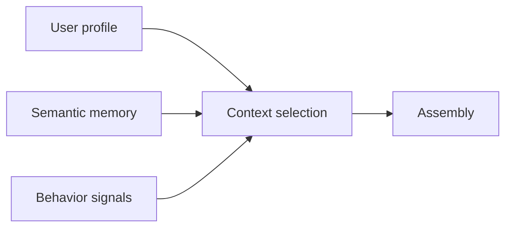

# Context Personalization

> Injecting user-specific context — profiles, preferences, and behavior — to improve relevance while respecting privacy boundaries.

## Table of Contents

- [Overview](#overview)
- [User Profiles](#user-profiles)
- [Preferences](#preferences)
- [Behavioral Context](#behavioral-context)
- [Long-Term Personalization](#long-term-personalization)
- [Adaptive Systems](#adaptive-systems)
- [Profile Evolution](#profile-evolution)
- [Privacy Considerations](#privacy-considerations)
- [Production Considerations](#production-considerations)
- [Best Practices](#best-practices)
- [Python Examples](#python-examples)
- [Interview Preparation](#interview-preparation)
- [Navigation](#navigation)

---

## Overview

**Personalization** tailors assembled context to the individual — expertise level, language, product usage, stated preferences — without conflating it with unconstrained memory.

Section **15** of Phase 6.



---

## User Profiles

Structured fields safe for context injection:

| Field | Example use |
|-------|-------------|
| `locale` | Language, date format |
| `tier` | Policy pack selection |
| `role` | Engineer vs executive tone |
| `industry` | Domain examples |

Store in PostgreSQL; cache in Redis with short TTL.

---

## Preferences

Explicit opt-in settings:

- Response length (concise vs detailed)
- Citation verbosity
- Topics to avoid
- Notification channels

Never infer sensitive attributes without consent.

---

## Behavioral Context

Implicit signals (with care):

- Frequently used features
- Typical query types
- Session time patterns

Use for ranking boosts, not discriminatory decisions. Document in privacy policy.

---

## Long-Term Personalization

Combine profile + [semantic memory](memory-systems.md). Consolidate episodic interactions into stable preferences over time with confidence scores.

---

## Adaptive Systems

Adjust retrieval index filters, example density, or explanation depth based on profile + recent satisfaction signals (thumbs up/down).

---

## Profile Evolution

Version profile schema. Audit changes. Allow user export/delete. Decay outdated behavioral weights.

---

## Privacy Considerations

- Minimize PII in prompts — use internal IDs
- Regional data residency for profile stores
- GDPR: right to erasure cascades to memory + caches
- No cross-user profile leakage in shared caches

See [Context Security](context-security.md).

---

## Production Considerations

- Feature-flag personalization rollout
- Fallback to generic context on profile miss
- Eval fairness across user segments

---

## Best Practices

1. Separate profile (structured) from memory (learned)
2. User-visible preference center
3. Log what personalized blocks were injected

---

## Python Examples

```python
@dataclass
class UserProfile:
    user_id: str
    locale: str
    tier: str
    response_style: str  # concise | detailed
    opt_out_personalization: bool = False


def personalization_blocks(profile: UserProfile) -> list[str]:
    if profile.opt_out_personalization:
        return []
    return [
        f"User prefers {profile.response_style} responses.",
        f"Account tier: {profile.tier}. Locale: {profile.locale}.",
    ]
```

---

## Interview Preparation

**Q: Personalization without privacy risk?**

> Explicit preferences, minimal PII in prompts, tenant isolation, opt-out, erasure cascade, no sensitive inference.

---

## Navigation

### Prerequisites

- [Memory Systems](memory-systems.md)
- [Dynamic Context](dynamic-context.md)

### Related Topics

- [Context Security](context-security.md) — Section 18
- [Multi-Agent Context Sharing](multi-agent-context-sharing.md)

### Next

- [Multi-Agent Context Sharing](multi-agent-context-sharing.md)

---

## Changelog

| Version | Date | Changes |
|---------|------|---------|
| 1.0 | 2026-07-13 | Initial publication — Phase 6 Section 15 |
