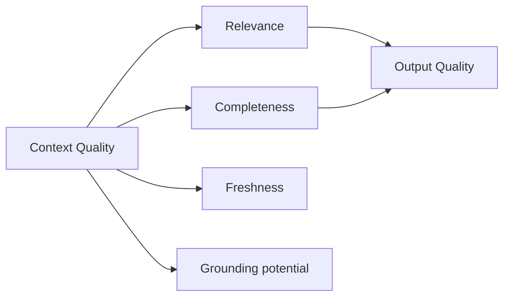

# Context Quality

> Engineering metrics for the context layer — evaluate what enters the model, not only what comes out.

## Table of Contents

- [Overview](#overview)
- [Quality Dimensions](#quality-dimensions)
- [Relevance](#relevance)
- [Completeness](#completeness)
- [Freshness](#freshness)
- [Consistency](#consistency)
- [Redundancy](#redundancy)
- [Grounding](#grounding)
- [Noise](#noise)
- [Engineering Metrics](#engineering-metrics)
- [Production Considerations](#production-considerations)
- [Interview Preparation](#interview-preparation)
- [Navigation](#navigation)

---

## Overview

Output eval asks "was the answer good?" **Context quality** asks "did the model see the right information?" — upstream debugging for RAG and memory failures.

Section **17** of Phase 6.

---

## Quality Dimensions

| Dimension | Question |
|-----------|----------|
| Relevance | Do chunks relate to the query? |
| Completeness | Is critical info present? |
| Freshness | Is information current? |
| Consistency | Any contradictions? |
| Redundancy | Duplicate waste of tokens? |
| Grounding | Can answer be supported? |
| Noise | Irrelevant or misleading content? |

---

## Relevance

Offline: labeled query-chunk pairs. Online: avg similarity score, reranker scores, human spot checks.

---

## Completeness

For golden questions, check if gold-supporting doc ID appears in retrieved set (recall@K).

---

## Freshness

Track age distribution of injected chunks. Alert if p50 age > SLA for time-sensitive products.

---

## Consistency

Detect contradictory statements across chunks before assembly — flag or drop lower-trust source.

---

## Redundancy

Measure unique information per token — high duplication lowers efficiency score.

---

## Grounding

`grounding_potential = |retrieved ∩ required_sources| / |required_sources|`

Low score predicts hallucination regardless of prompt quality.

---

## Noise

Low-score retrieval, OCR garbage, boilerplate headers — filter with min score and content classifiers.

---

## Engineering Metrics

| Metric | Target |
|--------|--------|
| Retrieval recall@5 | Domain-specific |
| Avg chunks per request | Stable |
| Context utilization | % tokens from top-3 chunks |
| Empty retrieval rate | &lt;5% for KB bots |
| Contradiction flags | Near zero |

Integrate with [AI Evaluation](../ai-evaluation/README.md) phase.

---

## Production Considerations

- Dashboard per dimension
- Correlate context metrics with user thumbs-down
- Sample and label 50 requests/week for human context audit

---

## Interview Preparation

**Q: Answer wrong but prompt is fine — what do you check?**

> Context quality: retrieval recall, stale docs, memory pollution, redundancy drowning signal, missing user state.

---

## Navigation

### Prerequisites

- [Context Selection](context-selection.md)
- [Prompt Evaluation](../prompt-engineering/prompt-evaluation.md)

### Related Topics

- [Context Engineering Mistakes](context-engineering-mistakes.md) — Section 20

### Next

- [Context Security](context-security.md)

---

## Changelog

| Version | Date | Changes |
|---------|------|---------|
| 1.0 | 2026-07-13 | Initial publication — Phase 6 Section 17 |
