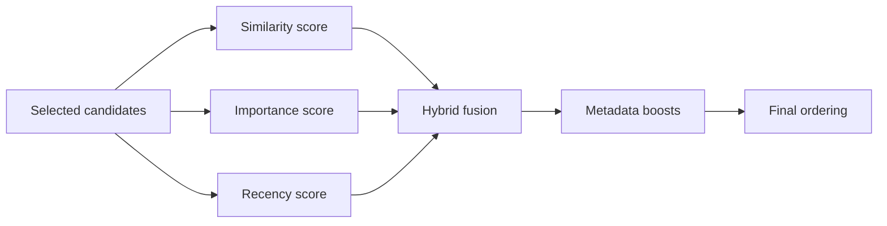

# Context Ranking

> How production systems order context candidates before compression and assembly — algorithms, hybrid strategies, and engineering tradeoffs.

## Table of Contents

- [Overview](#overview)
- [Ranking Workflow](#ranking-workflow)
- [Similarity Ranking](#similarity-ranking)
- [Importance Ranking](#importance-ranking)
- [Recency](#recency)
- [Hybrid Ranking](#hybrid-ranking)
- [Metadata Ranking](#metadata-ranking)
- [Business Priorities](#business-priorities)
- [Tradeoffs](#tradeoffs)
- [Production Considerations](#production-considerations)
- [Python Examples](#python-examples)
- [Interview Preparation](#interview-preparation)
- [Navigation](#navigation)

---

## Overview

After selection, **ranking** orders candidates so the most valuable information survives budget cuts and receives attention-favored positions in the prompt.

Section **8**.



---

## Ranking Workflow

1. Normalize scores per signal to [0, 1]
2. Weighted combination or RRF fusion
3. Apply business boosts (pinned docs, tier-specific)
4. Stable sort for reproducibility
5. Pass ordered list to compressor

---

## Similarity Ranking

Vector cosine similarity between query embedding and chunk embedding. Primary signal for retrieval context.

---

## Importance Ranking

| Source | Importance heuristic |
|--------|---------------------|
| Memory | confidence × access_count |
| History | turn importance score |
| Policy | fixed P0 priority |
| Tool result | recency of observation |

---

## Recency

Exponential decay on `created_at`. Critical for news, incident status, pricing — stale docs outrank fresh incorrectly without decay.

---

## Hybrid Ranking

**Reciprocal Rank Fusion (RRF):**

```
score(d) = Σ 1 / (k + rank_i(d))
```

Combine BM25 rank + vector rank without calibrating score scales. `k=60` common default.

| Approach | Pros | Cons |
|----------|------|------|
| Weighted sum | Tunable | Needs calibration |
| RRF | Robust fusion | Less interpretable |
| Learning-to-rank | Optimal with data | Needs training pipeline |

---

## Metadata Ranking

Boost/penalize by metadata:

- `doc_type: policy` +0.2
- `language != user.locale` exclude
- `product_line match` +0.15
- `verified: true` +0.1

---

## Business Priorities

Pinned content always at top (after system). Enterprise SLA doc before generic FAQ for enterprise users.

---

## Tradeoffs

| More similarity | More recency |
|-----------------|--------------|
| Better answer precision | Better timeliness |
| Risk stale best-match | Risk missing deep docs |

Tune weights per use case with offline eval — see [Context Quality](context-quality.md).

---

## Production Considerations

- Log top-10 ranked IDs and scores
- Feature-flag weight configs
- Reranker model (cross-encoder) as second stage — higher latency, better quality

---

## Python Examples

```python
def rrf_fuse(rankings: list[list[str]], k: int = 60) -> list[str]:
    scores: dict[str, float] = {}
    for ranking in rankings:
        for rank, doc_id in enumerate(ranking):
            scores[doc_id] = scores.get(doc_id, 0) + 1 / (k + rank + 1)
    return sorted(scores, key=scores.get, reverse=True)


def hybrid_score(sim: float, recency: float, importance: float, weights: tuple[float, float, float]) -> float:
    w_sim, w_rec, w_imp = weights
    return w_sim * sim + w_rec * recency + w_imp * importance
```

---

## Interview Preparation

**Q: BM25 vs vector vs hybrid?**

> BM25: exact terms. Vector: semantic. Hybrid via RRF or weighted fusion for production RAG context ranking.

---

## Navigation

### Prerequisites

- [Context Selection](context-selection.md)

### Related Topics

- [Retrieval Context](retrieval-context.md) — Section 12
- [Context Compression](context-compression.md) — Section 10

### Next

- [Dynamic Context](dynamic-context.md)

---

## Changelog

| Version | Date | Changes |
|---------|------|---------|
| 1.0 | 2026-07-13 | Initial publication |
