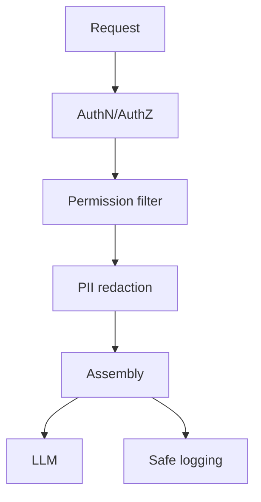

# Context Security

> Context assembly is a trust boundary — permissions, redaction, and isolation must be enforced before information reaches the model or logs.

## Table of Contents

- [Overview](#overview)
- [Sensitive Information](#sensitive-information)
- [PII Handling](#pii-handling)
- [Context Leakage](#context-leakage)
- [Permission-Aware Context](#permission-aware-context)
- [Confidential Data](#confidential-data)
- [Secure Memory](#secure-memory)
- [Tenant Isolation](#tenant-isolation)
- [Production Guidance](#production-guidance)
- [Best Practices](#best-practices)
- [Interview Preparation](#interview-preparation)
- [Navigation](#navigation)

---

## Overview

Security failures in context systems cause cross-tenant data leaks, PII in provider logs, and injection via retrieved content. Defense in depth at **retrieval, memory, assembly, and logging** layers.

Section **18**.



---

## Sensitive Information

Classify data: public, internal, confidential, restricted. Only confidential+ enters context after clearance check. Never send secrets (API keys, passwords) to LLM.

---

## PII Handling

- Detect and redact/mask before inference (names, SSN, cards)
- Tokenize PII with reversible vault if needed for support workflows
- Regional rules (GDPR, HIPAA) dictate retention and processing

---

## Context Leakage

| Vector | Mitigation |
|--------|------------|
| Cross-tenant retrieval | Mandatory tenant filter |
| Shared cache keys | Include tenant in key |
| Logs | Redact context snapshots |
| Prompt injection via docs | Delimit untrusted content |
| Memory recall | user_id filter always |

---

## Permission-Aware Context

```python
def authorized_chunks(user: User, chunks: list[Chunk]) -> list[Chunk]:
    return [c for c in chunks if user.can_read(c.acl)]
```

Check at retrieval source — not only at API gateway.

---

## Confidential Data

Separate vector indexes per classification level. Enterprise docs never in shared free-tier index.

---

## Secure Memory

Encrypt at rest. Access audit log. User deletion wipes all memory keys. No memory writes from untrusted tool output without validation.

---

## Tenant Isolation

- `tenant_id` on every row and cache key
- Integration tests that attempt cross-tenant access must fail
- Row-level security in PostgreSQL

---

## Production Guidance

1. Threat model context pipeline separately from API auth
2. Red-team with malicious retrieved documents
3. Incident playbooks for context leak detection

See also [Prompt Security](../prompt-engineering/prompt-security.md).

---

## Best Practices

- Fail closed: missing permission → exclude chunk
- Never log full prompts in production without scrubbing
- Periodic access reviews on knowledge bases

---

## Interview Preparation

**Q: Prevent User A seeing User B data in RAG?**

> Tenant/user filters at index query, row-level security, cache key isolation, integration tests, audit logs.

---

## Navigation

### Prerequisites

- [Prompt Security](../prompt-engineering/prompt-security.md)
- [Retrieval Context](retrieval-context.md)

### Related Topics

- [Production Context Engineering](production-context-engineering.md) — Section 19

### Next

- [Production Context Engineering](production-context-engineering.md)

---

## Changelog

| Version | Date | Changes |
|---------|------|---------|
| 1.0 | 2026-07-13 | Initial publication |
