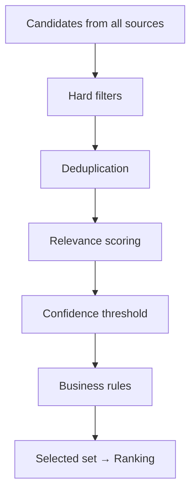

# Context Selection

> The decision layer that determines which candidate information blocks survive to enter the assembled context.

## Table of Contents

- [Overview](#overview)
- [Selection Pipeline](#selection-pipeline)
- [Relevance Scoring](#relevance-scoring)
- [Context Filtering](#context-filtering)
- [Prioritization](#prioritization)
- [Duplicate Removal](#duplicate-removal)
- [Freshness](#freshness)
- [Confidence Thresholds](#confidence-thresholds)
- [Semantic Relevance](#semantic-relevance)
- [Business Rules](#business-rules)
- [Production Considerations](#production-considerations)
- [Best Practices](#best-practices)
- [Python Examples](#python-examples)
- [Interview Preparation](#interview-preparation)
- [Navigation](#navigation)

---

## Overview

Context sources produce **candidates** — memory chunks, retrieved docs, tool outputs, policy snippets. **Selection** filters and prioritizes before ranking and compression.

Section **7**.



---

## Selection Pipeline

1. **Collect** candidates with metadata (source, timestamp, tenant, score)
2. **Filter** hard exclusions (permissions, stale, wrong language)
3. **Deduplicate** near-duplicate content
4. **Score** relevance to current query/intent
5. **Apply rules** tenant-specific inclusion requirements
6. **Pass** to [Context Ranking](context-ranking.md)

---

## Relevance Scoring

| Signal | Method |
|--------|--------|
| Semantic | Cosine similarity query ↔ chunk embedding |
| Lexical | BM25 keyword overlap |
| Metadata | Tag match, product area, locale |
| Behavioral | Past click/helpfulness signals |

Combine in hybrid score before thresholding.

---

## Context Filtering

**Hard filters** (binary exclude):

- Wrong `tenant_id` or `user_id`
- Document classification = confidential (user lacks clearance)
- Language mismatch
- Expired policy version
- Blocklist topics

Never score excluded items — filter first for security.

---

## Prioritization

Mandatory inclusions consume budget first:

| Priority | Example |
|----------|---------|
| P0 | Active compliance disclaimer |
| P1 | User-specific account status |
| P2 | Top retrieval results |
| P3 | Supplementary memory |
| P4 | Nice-to-have background |

---

## Duplicate Removal

| Type | Detection | Action |
|------|-----------|--------|
| Exact duplicate | Hash content | Keep highest score |
| Near duplicate | Embedding similarity > 0.95 | Merge citations |
| Cross-source | Same doc in memory + retrieval | Keep retrieval version |

---

## Freshness

Decay score by age:

```
freshness = exp(-λ * age_days)
final_score = relevance * freshness
```

Boost breaking policy updates with `effective_date` metadata.

---

## Confidence Thresholds

Drop retrieval below similarity threshold (e.g. 0.72). Low-confidence memory writes should not be recalled.

---

## Semantic Relevance

Use query rewriting from conversation state before embedding search — "it" → "SSO login error enterprise account".

---

## Business Rules

```yaml
context_policy:
  enterprise_tier:
    include: [sla_policy, dedicated_support_playbook]
  free_tier:
    exclude: [premium_features_doc]
  region_eu:
    include: [gdpr_notice]
```

Rules engine runs after scoring, before ranking.

---

## Production Considerations

- Log filtered items with reason codes
- A/B test thresholds on offline eval sets
- Alert when >50% candidates filtered (index issue)

---

## Best Practices

1. Filter for security before relevance
2. Mandatory blocks bypass score cutoff
3. Separate selection config per product surface

---

## Python Examples

```python
@dataclass
class Candidate:
    id: str
    content: str
    source: str
    score: float
    tenant_id: str
    created_at: float


def select(candidates: list[Candidate], user: UserContext, min_score: float) -> list[Candidate]:
    seen_hashes: set[str] = set()
    selected: list[Candidate] = []

    for c in sorted(candidates, key=lambda x: -x.score):
        if c.tenant_id != user.tenant_id:
            continue
        if c.score < min_score:
            continue
        h = content_hash(c.content)
        if h in seen_hashes:
            continue
        seen_hashes.add(h)
        selected.append(c)
    return apply_business_rules(selected, user)
```

---

## Interview Preparation

**Q: How decide what context to include?**

> Filter permissions → dedupe → score relevance + freshness → apply business rules → rank → compress to budget.

---

## Navigation

### Prerequisites

- [Context Architecture](context-architecture.md)
- [Retrieval Context](retrieval-context.md)

### Related Topics

- [Context Ranking](context-ranking.md) — Section 8
- [Context Quality](context-quality.md) — Section 17

### Next

- [Context Ranking](context-ranking.md)

---

## Changelog

| Version | Date | Changes |
|---------|------|---------|
| 1.0 | 2026-07-13 | Initial publication |
