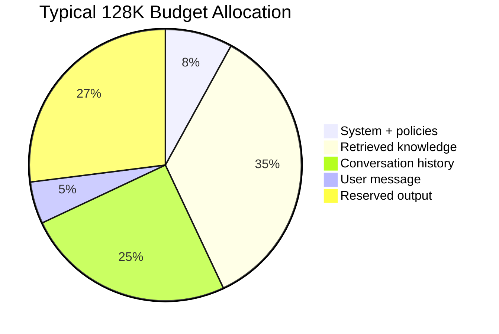
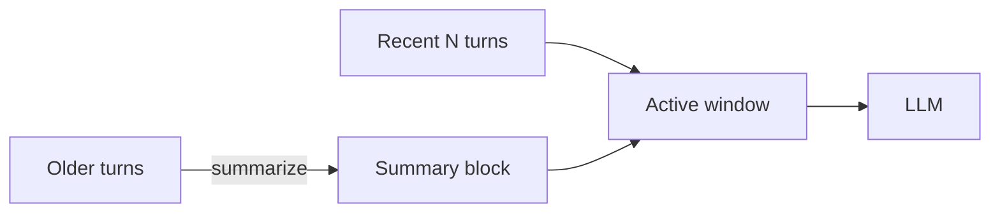

# Context Windows

> Application-level strategies for fitting the right information into a fixed token window — budgeting, truncation, sliding windows, and optimization beyond model limits.

## Table of Contents

- [Overview](#overview)
- [Context Window Fundamentals](#context-window-fundamentals)
- [Short vs Long Context](#short-vs-long-context)
- [Sliding Windows](#sliding-windows)
- [Context Overflow](#context-overflow)
- [Lost in the Middle](#lost-in-the-middle)
- [Context Budgeting](#context-budgeting)
- [Truncation Strategies](#truncation-strategies)
- [Window Optimization](#window-optimization)
- [Production Considerations](#production-considerations)
- [Cost Considerations](#cost-considerations)
- [Performance Considerations](#performance-considerations)
- [Best Practices](#best-practices)
- [Python Examples](#python-examples)
- [Interview Preparation](#interview-preparation)
- [Navigation](#navigation)

---

## Overview

Earlier modules covered **what** a context window is at the model level. This document covers **how applications engineer around** that limit — allocation, truncation, and placement strategies that maximize answer quality per token.

This document is **Section 3** of this handbook.

> **See also:** [Context Windows (LLM Engineering)](../llm-engineering/context-windows.md) for model mechanics, token counting, and provider limits.



---

## Context Window Fundamentals

```
available = context_limit - reserved_output - system_overhead
fill: ranked_context + history + user_message ≤ available
```

| Component | Typical Share | Notes |
|-----------|---------------|-------|
| System + tools | 5–15% | Cacheable |
| Retrieval | 30–50% | Highest impact on quality |
| History | 15–30% | Compress aggressively |
| User turn | 5–10% | Current question |
| Output reserve | 15–30% | Never steal from this |

---

## Short vs Long Context

| Approach | When | Tradeoff |
|----------|------|----------|
| **Short context** | Fast tasks, high volume | Requires aggressive selection |
| **Long context** | Whole-document reasoning | Higher cost, attention dilution |
| **Hybrid** | Production default | Retrieve + summarize long docs |

Long-context models do not eliminate context engineering — they raise the ceiling, not the need for curation.

---

## Sliding Windows

Keep the most recent N turns verbatim; drop or summarize older turns.



---

## Context Overflow

**Symptoms:** API 400 errors, silent truncation, missing system instructions.

**Prevention:**
1. Count tokens before API call
2. Enforce budgets per layer
3. Fail fast with telemetry when over budget
4. Never rely on provider-side truncation alone

---

## Lost in the Middle

Models attend less reliably to information in the **middle** of long contexts. Engineering mitigations:

| Strategy | Effect |
|----------|--------|
| Place critical info at start/end | High |
| Reduce total context size | High |
| Re-rank and keep top-K only | High |
| Re-query with focused sub-context | Medium |

---

## Context Budgeting

Dedicated section: [Context Budgeting](context-budgeting.md). At window level: define `TokenBudget` dataclass with reserved slots per layer.

---

## Truncation Strategies

| Strategy | Use When |
|----------|----------|
| Head truncation | Drop oldest history |
| Middle collapse | Keep system + recent + user |
| Importance-based | Score turns, drop low scores |
| Extractive | Keep sentences matching query |

---

## Window Optimization

1. **Deduplicate** — same doc in memory and retrieval
2. **Compress** summaries vs full text
3. **Cache** stable prefixes
4. **Right-size model** — smaller window model for routing

---

## Production Considerations

- Log pre-call token count and truncation actions
- Alert when >10% of requests trigger emergency compression
- Test with max-size inputs in CI

---

## Cost Considerations

Input tokens scale linearly with window size. Cutting 20% of context often cuts cost 20% with minimal quality loss if cut items were low-ranked.

---

## Performance Considerations

Smaller windows = faster prefill. Prefer retrieval over stuffing full documents.

---

## Best Practices

- Reserve output tokens explicitly
- Place citations and critical policies at attention-favored positions
- Measure quality vs window size with eval sets

---

## Python Examples

```python
from dataclasses import dataclass


@dataclass
class TokenBudget:
    total: int
    reserved_output: int
    system: int
    retrieval: int
    history: int
    user: int

    @property
    def available_input(self) -> int:
        return self.total - self.reserved_output


def allocate(budget: TokenBudget, layers: dict[str, int]) -> dict[str, int]:
    """Proportional cut when layers exceed available."""
    cap = budget.available_input - budget.system - budget.user
    total = sum(layers.values())
    if total <= cap:
        return layers
    ratio = cap / total
    return {k: int(v * ratio) for k, v in layers.items()}
```

---

## Interview Preparation

**Q: Long-context model — still need context engineering?**

> Yes. Attention dilution, cost, and latency remain. Curation improves quality even when everything "fits."

**Q: How do you handle overflow safely?**

> Pre-count tokens, layered budgets, prioritized truncation, never silent drop of system instructions.

---

## Navigation

### Prerequisites

- [LLM Context Windows](../llm-engineering/context-windows.md)
- [Context Architecture](context-architecture.md)

### Related Topics

- [Context Budgeting](context-budgeting.md) — Section 13
- [Long Context Strategies](long-context-strategies.md) — Section 11
- [Conversation History](conversation-history.md) — Section 6

### Next

- [Conversation State](conversation-state.md)

---

## Changelog

| Version | Date | Changes |
|---------|------|---------|
| 1.0 | 2026-07-13 | Initial publication |
