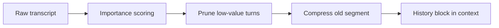
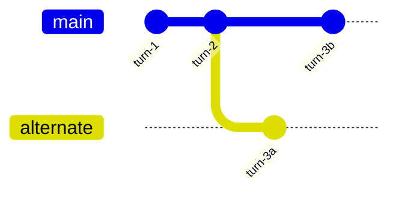

# Conversation History

> Engineering conversation history as a managed context source — not an unbounded message dump.

## Table of Contents

- [Overview](#overview)
- [History Management](#history-management)
- [Pruning](#pruning)
- [Summarization](#summarization)
- [History Compression](#history-compression)
- [Importance Scoring](#importance-scoring)
- [Conversation Replay](#conversation-replay)
- [Thread Management](#thread-management)
- [Branching Conversations](#branching-conversations)
- [Production Considerations](#production-considerations)
- [Best Practices](#best-practices)
- [Python Examples](#python-examples)
- [Interview Preparation](#interview-preparation)
- [Navigation](#navigation)

---

## Overview

**Conversation history** is the transcript of user and assistant turns. In production it is a **budgeted, curated** input — pruned, scored, and compressed like any other context source.

Section **6**.



---

## History Management

Store messages with metadata:

```python
@dataclass
class Message:
    role: str
    content: str
    turn_id: str
    tokens: int
    importance: float
    created_at: datetime
```

Load strategy: recent verbatim + summary of older + never exceed history budget.

---

## Pruning

| Method | Description |
|--------|-------------|
| **Count-based** | Keep last N turns |
| **Token-based** | Drop oldest until under budget |
| **Role-based** | Keep user questions, compress assistant verbosity |
| **Tool stripping** | Remove verbose tool payloads from old turns |

---

## Summarization

Replace segments older than K turns with a rolling summary block.

```
<conversation_summary>
User is troubleshooting SSO for enterprise account. Tried clearing cache.
Open issue: SAML metadata mismatch.
</conversation_summary>
```

Use a dedicated summarization prompt ([template](../../prompts/templates/summarization.md)); validate summary doesn't invent facts.

---

## History Compression

Combine pruning + summarization + extractive key-quote retention. Trigger when `history_tokens > budget.history`.

---

## Importance Scoring

Score each turn for retention:

| Signal | Weight |
|--------|--------|
| Contains user correction | High |
| Contains decision/commitment | High |
| Small talk / ack | Low |
| Embedding similarity to current query | Medium |
| Recency | Medium |

Keep high-importance turns even when old.

---

## Conversation Replay

Replay stored messages for debugging and eval — reconstruct exact context sent to model using logged `ContextPackage`.

---

## Thread Management

| Concept | Implementation |
|---------|----------------|
| Thread | `thread_id` groups related sessions |
| Fork | New `session_id` copies history snapshot |
| Archive | Read-only threads after resolution |
| List | Paginate threads per user |

---

## Branching Conversations

When user edits a prior message or explores alternate path:



Store as tree with `parent_turn_id`; context assembly walks active branch only.

---

## Production Considerations

- Don't send tool call JSON for ancient turns
- Redact PII in stored history
- Async summarization job after long sessions

---

## Best Practices

1. Separate storage (full log) from context (budgeted view)
2. Log which turns were included vs pruned
3. Test summarization with faithfulness evals

---

## Python Examples

```python
def build_history_context(messages: list[Message], budget: int) -> list[dict]:
    recent, older = split_recent(messages, keep_last=6)
    recent_tokens = sum(m.tokens for m in recent)
    remaining = budget - recent_tokens

    if remaining <= 0:
        return [{"role": m.role, "content": m.content} for m in recent[-4:]]

    summary = summarize_turns(older, max_tokens=remaining) if older else ""
    out = []
    if summary:
        out.append({"role": "system", "content": f"<history_summary>\n{summary}\n</history_summary>"})
    out.extend({"role": m.role, "content": m.content} for m in recent)
    return out
```

---

## Interview Preparation

**Q: How manage history in a 100-turn support conversation?**

> Rolling summary + last N verbatim + importance retention + tool payload stripping; never send full 100 turns.

---

## Navigation

### Prerequisites

- [Context Windows](context-windows.md)
- [Memory Systems](memory-systems.md)

### Related Topics

- [Context Compression](context-compression.md) — Section 10
- [Context Budgeting](context-budgeting.md) — Section 13

### Next

- [Context Selection](context-selection.md)

---

## Changelog

| Version | Date | Changes |
|---------|------|---------|
| 1.0 | 2026-07-13 | Initial publication |
