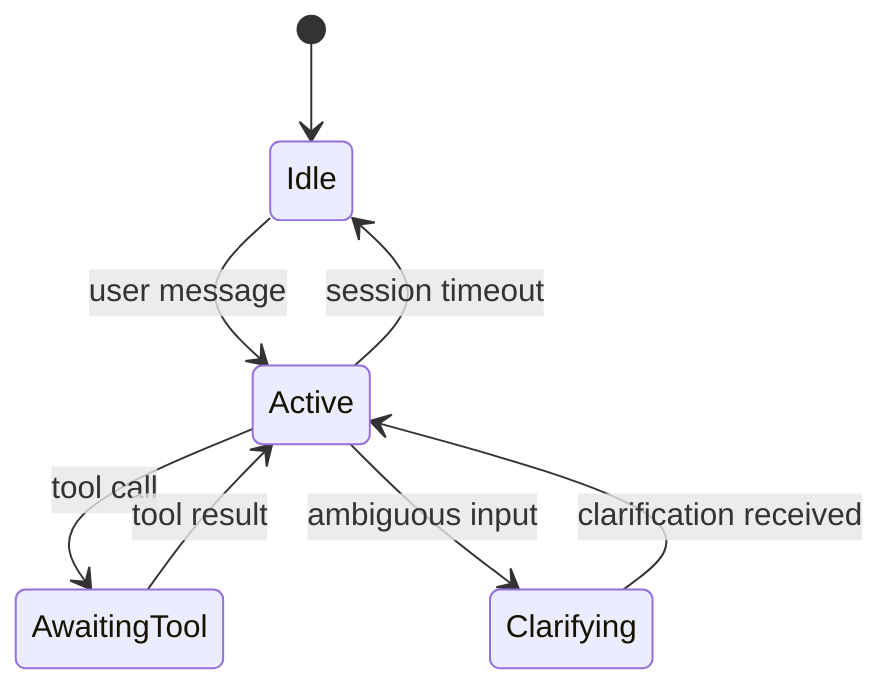
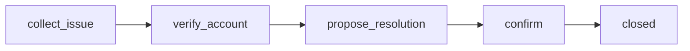

# Conversation State

> How production systems track and evolve conversation state across turns — sessions, agents, and users — as first-class context inputs.

## Table of Contents

- [Overview](#overview)
- [What Is Conversation State?](#what-is-conversation-state)
- [State Machines](#state-machines)
- [Session State](#session-state)
- [User State](#user-state)
- [Agent State](#agent-state)
- [Temporary vs Persistent State](#temporary-vs-persistent-state)
- [Multi-Turn Conversations](#multi-turn-conversations)
- [State Transitions](#state-transitions)
- [Production Considerations](#production-considerations)
- [Security Considerations](#security-considerations)
- [Best Practices](#best-practices)
- [Python Examples](#python-examples)
- [Interview Preparation](#interview-preparation)
- [Navigation](#navigation)

---

## Overview

**Conversation state** is structured data representing where a dialogue stands — active topic, pending clarifications, tool call artifacts, workflow step — beyond raw message text. State drives what context is fetched and how the model should behave on the next turn.

Section **4** of Phase 6.



---

## What Is Conversation State?

| State Type | Scope | Examples |
|------------|-------|----------|
| **Turn state** | Single request | Parsed intent, entities |
| **Session state** | One conversation | Step in wizard, cart items |
| **User state** | Cross-session | Preferences, subscription tier |
| **Agent state** | Agent runtime | Plan, scratchpad, tool queue |

---

## State Machines

Explicit state machines prevent ambiguous behavior in multi-step flows (onboarding, refunds, booking).



Store `current_state` + `state_payload` in session store. Context assembly injects state-specific instructions and retrieved content.

---

## Session State

- **Storage:** Redis with TTL (24–72h typical)
- **Key:** `session:{session_id}`
- **Contents:** messages metadata, state machine position, pending tools
- **Not:** full long-term memory (see [Memory Systems](memory-systems.md))

---

## User State

Profile fields influencing context: locale, plan, permissions, opt-outs. Fetched once per request, cached briefly.

---

## Agent State

For agents: current plan, sub-goals, observations, error counts. Often separate from user-visible history — injected as system or developer messages.

---

## Temporary vs Persistent State

| Temporary | Persistent |
|-----------|------------|
| Current tool batch | User preferences |
| Typing indicators | Semantic memory |
| In-flight plan | Audit log |
| TTL: minutes–hours | TTL: months–years |

Promotion rule: only persist state to long-term memory after explicit extraction and validation.

---

## Multi-Turn Conversations

Each turn: `load state → enrich context → infer → transition state → persist`.

State evolution must be **deterministic** given the same inputs — test state transitions without LLM calls.

---

## State Transitions

```python
@dataclass
class SessionState:
    session_id: str
    phase: str
    entities: dict[str, str]
    turn_count: int
    last_active: datetime

def transition(state: SessionState, event: str, payload: dict) -> SessionState:
    rules = TRANSITION_TABLE.get((state.phase, event))
    if not rules:
        raise InvalidTransition(state.phase, event)
    return rules.apply(state, payload)
```

---

## Production Considerations

- Version state schema; migrate with feature flags
- Idempotent state updates on webhook retries
- Session stickiness for WebSocket agents

---

## Security Considerations

- Bind session to authenticated user ID
- Reject session_id from client without server mapping
- Never store secrets in state blobs

---

## Best Practices

1. Separate message history from structured state
2. Document state machine diagrams per product flow
3. Log transitions with correlation IDs
4. Unit test transitions independently of LLM

---

## Python Examples

```python
from dataclasses import dataclass, field
from datetime import datetime, timezone
import json


@dataclass
class ConversationState:
    session_id: str
    user_id: str
    phase: str = "idle"
    slots: dict[str, str] = field(default_factory=dict)
    messages: list[dict] = field(default_factory=list)
    updated_at: datetime = field(default_factory=lambda: datetime.now(timezone.utc))

    def to_context_snippet(self) -> str:
        return json.dumps({"phase": self.phase, "slots": self.slots})
```

---

## Interview Preparation

**Q: Difference between conversation history and conversation state?**

> History is the transcript. State is structured control data (phase, slots, pending actions) that may not appear in user-visible messages.

**Q: How do you handle session timeout?**

> TTL on Redis, summarize session to long-term memory if valuable, clear ephemeral agent state.

---

## Navigation

### Prerequisites

- [Context Architecture](context-architecture.md)
- [Redis for AI](../databases/redis/redis-for-ai.md)

### Related Topics

- [Conversation History](conversation-history.md) — Section 6
- [Dynamic Context](dynamic-context.md) — Section 9

### Next

- [Memory Systems](memory-systems.md)

---

## Changelog

| Version | Date | Changes |
|---------|------|---------|
| 1.0 | 2026-07-13 | Initial publication — Phase 6 Section 4 |
