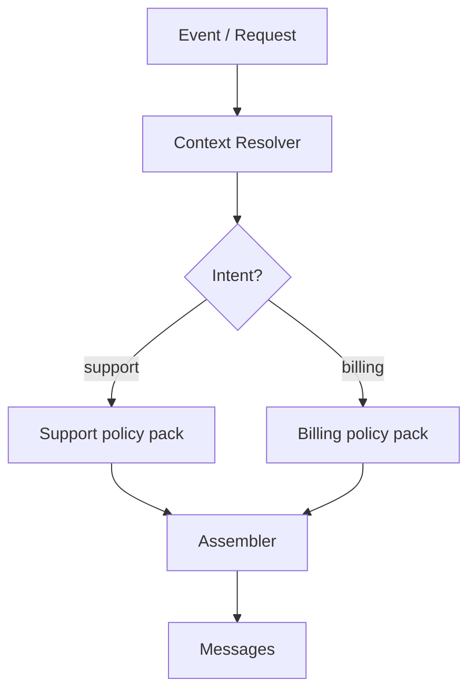
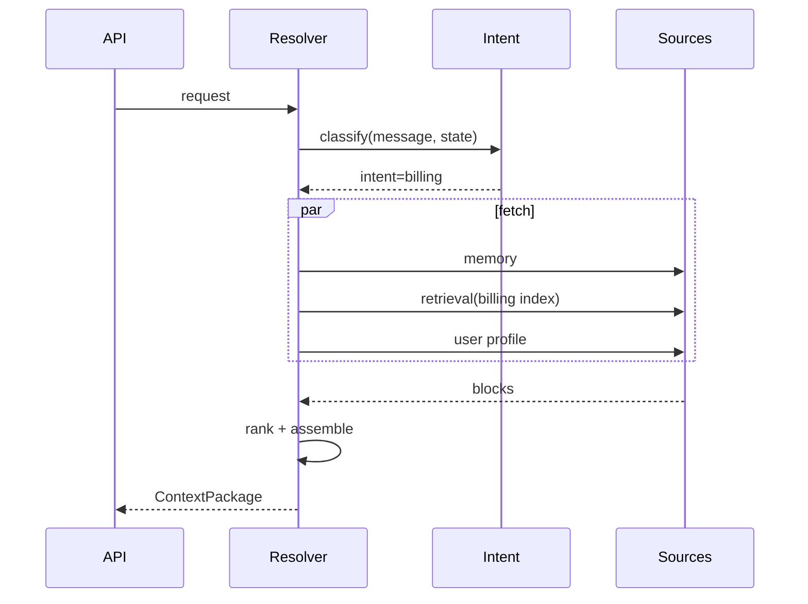

# Dynamic Context

> Context assembled at runtime based on user, session, intent, and events — not static prompt strings.

## Table of Contents

- [Overview](#overview)
- [Runtime Context Generation](#runtime-context-generation)
- [Dynamic Prompt Assembly](#dynamic-prompt-assembly)
- [Adaptive Context](#adaptive-context)
- [Conditional Context](#conditional-context)
- [User-Specific Context](#user-specific-context)
- [Session-Aware Context](#session-aware-context)
- [Event-Driven Context](#event-driven-context)
- [Workflow Diagrams](#workflow-diagrams)
- [Production Considerations](#production-considerations)
- [Best Practices](#best-practices)
- [Python Examples](#python-examples)
- [Interview Preparation](#interview-preparation)
- [Navigation](#navigation)

---

## Overview

**Static context** sends the same system prompt every request. **Dynamic context** composes blocks from policies, state, retrieval, and user profile at runtime — the production default for serious applications.

Section **9**.



---

## Runtime Context Generation

Every inference call executes a **context resolver** that:

1. Loads session + user profile
2. Classifies intent or task type
3. Selects context policy variant
4. Fetches source-specific data in parallel
5. Returns `ContextPackage`

---

## Dynamic Prompt Assembly

Prompt templates ([handbook](../prompt-engineering/prompt-templates-guide.md)) provide **slots**; dynamic context fills them:

```
System: {{base_role}}
{{#if enterprise}}
{{enterprise_sla_block}}
{{/if}}
<Context>
{{ranked_chunks}}
</Context>
```

Use a template engine or structured builder — not string concatenation in routes.

---

## Adaptive Context

Adjust depth based on signals:

| Signal | Adaptation |
|--------|------------|
| Query complexity | More retrieval chunks |
| User expertise | Less explanatory context |
| Latency SLO breach | Skip optional memory |
| Previous turn failure | Add repair context |

---

## Conditional Context

```python
def resolve_blocks(user: User, intent: str) -> list[ContextBlock]:
    blocks = [load_base_policy()]
    if user.tier == "enterprise":
        blocks.append(load_enterprise_playbook())
    if intent == "refund":
        blocks.append(load_refund_policy())
    if user.region == "EU":
        blocks.append(load_gdpr_notice())
    return blocks
```

---

## User-Specific Context

Profile fields, preferences, memory recall — see [Context Personalization](context-personalization.md).

---

## Session-Aware Context

Inject `phase`, `slots`, and rolling summary from [Conversation State](conversation-state.md). Query rewrite uses last N turns.

---

## Event-Driven Context

External events invalidate or pre-warm context:

- Policy published → bust policy cache
- User upgraded tier → refresh profile cache
- Incident declared → inject status page block globally

---

## Workflow Diagrams



---

## Production Considerations

- Cache per `(user_tier, intent, locale)` policy packs
- Test all conditional branches in CI
- Feature flags for new context blocks

---

## Best Practices

1. Explicit policy registry — no hidden if/else in handlers
2. Log which branches activated
3. Keep condition count manageable — refactor to policy tables

---

## Python Examples

```python
from typing import Callable

ContextPolicy = Callable[["ContextRequest"], list["ContextBlock"]]

POLICY_REGISTRY: dict[str, ContextPolicy] = {}

def register(intent: str):
    def decorator(fn: ContextPolicy):
        POLICY_REGISTRY[intent] = fn
        return fn
    return decorator

@register("support")
def support_policy(req: ContextRequest) -> list[ContextBlock]:
    return [load_kb_context(req), load_ticket_history(req)]
```

---

## Interview Preparation

**Q: Static vs dynamic context?**

> Static for demos. Production needs runtime resolution for tenant, intent, locale, state, and retrieval.

---

## Navigation

### Prerequisites

- [Context Architecture](context-architecture.md)
- [Production Prompt Engineering](../prompt-engineering/production-prompt-engineering.md)

### Related Topics

- [Context Personalization](context-personalization.md) — Section 15
- [Context Caching](context-caching.md) — Section 14

### Next

- [Context Compression](context-compression.md)

---

## Changelog

| Version | Date | Changes |
|---------|------|---------|
| 1.0 | 2026-07-13 | Initial publication |
