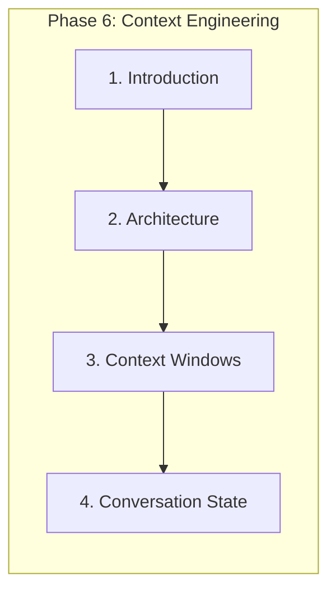
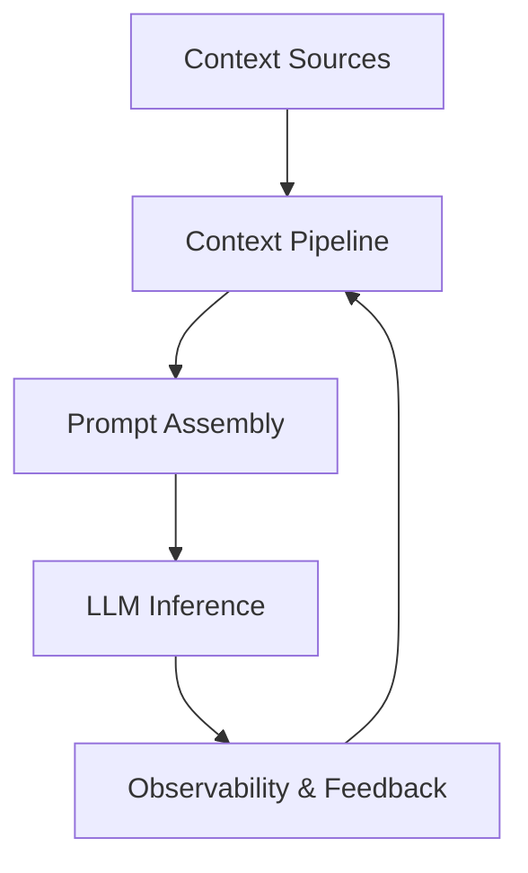
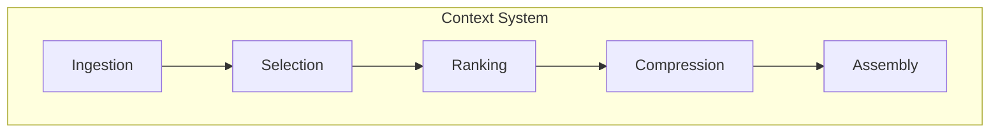
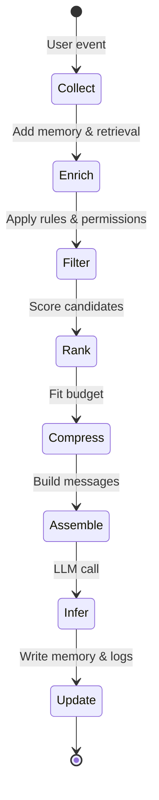
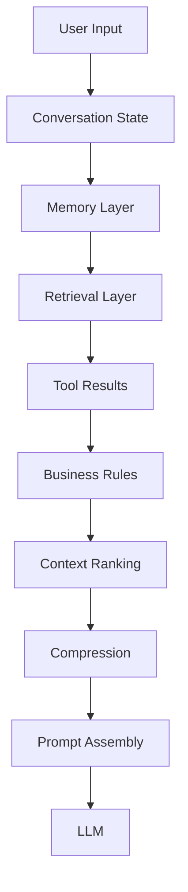

# Introduction to Context Engineering

> Context engineering is the discipline of designing systems that determine what information an LLM sees, when it sees it, how much fits, how it is organized, and how it evolves across sessions.

## Table of Contents

- [Overview](#overview)
- [What Is Context Engineering?](#what-is-context-engineering)
- [Why Prompt Engineering Alone Is Insufficient](#why-prompt-engineering-alone-is-insufficient)
- [Context vs Prompt](#context-vs-prompt)
- [Context as a System](#context-as-a-system)
- [Context Lifecycle](#context-lifecycle)
- [Context Pipeline](#context-pipeline)
- [Context Orchestration](#context-orchestration)
- [Context-Aware AI Applications](#context-aware-ai-applications)
- [Why Production Failures Are Context Problems](#why-production-failures-are-context-problems)
- [Engineering Motivation](#engineering-motivation)
- [Production Considerations](#production-considerations)
- [Cost Considerations](#cost-considerations)
- [Performance Considerations](#performance-considerations)
- [Security Considerations](#security-considerations)
- [Best Practices](#best-practices)
- [Anti-Patterns](#anti-patterns)
- [Common Mistakes](#common-mistakes)
- [Python Examples](#python-examples)
- [Interview Preparation](#interview-preparation)
- [Navigation](#navigation)

---

## Overview

**Context engineering** answers a different question than prompt engineering. Prompt engineering defines *how to instruct* the model. Context engineering defines *what the model knows at inference time* — user state, memory, retrieved knowledge, tool results, business rules, and conversation history — assembled within a fixed token budget.

Most engineers start by perfecting system prompts. Production systems fail when context is wrong: stale memory, irrelevant retrieval, duplicated information, overflowed windows, or missing permissions boundaries. The model is often capable; the **context system** is not.

This document is **Section 1** of Phase 6 in the AI Engineering Playbook.



> **Prerequisites:** [Phase 5: Prompt Engineering](../prompt-engineering/README.md) and [Phase 4: LLM Engineering](../llm-engineering/README.md) — especially [Context Windows](../llm-engineering/context-windows.md).

---

## What Is Context Engineering?

| Term | Definition |
|------|------------|
| **Context** | All tokens the model attends to in one inference call — not just chat history |
| **Context assembly** | Selecting, ranking, compressing, and formatting information into messages |
| **Context budget** | Token allocation across system, memory, retrieval, tools, and user input |
| **Context lifecycle** | How context is created, updated, expired, and invalidated over time |

Context engineering treats the prompt as the **output** of a pipeline, not the starting point.



---

## Why Prompt Engineering Alone Is Insufficient

A perfect system prompt cannot compensate for:

| Gap | Symptom |
|-----|---------|
| Missing retrieved docs | Hallucinated answers |
| Stale user memory | Wrong personalization |
| Context overflow | Truncated instructions or history |
| Irrelevant chunks | Confused or contradictory responses |
| Leaked cross-tenant data | Security incident |

Prompts define behavior boundaries. **Context supplies the facts and state** the model reasons over.

---

## Context vs Prompt

| Dimension | Prompt Engineering | Context Engineering |
|-----------|-------------------|---------------------|
| Focus | Instructions, format, role | Information selection and assembly |
| Artifact | Templates, system prompts | Pipelines, memory stores, rankers |
| Changes | Wording, examples | What enters the window |
| Failure mode | Wrong tone or format | Wrong facts or missing state |
| Testing | Golden outputs | Relevance, freshness, budget compliance |

Both are required. Context engineering is not "advanced prompting" — it is **systems engineering for model input**.

---

## Context as a System

Production context is a subsystem with:

- **Inputs:** user message, session, memory, retrieval, tools, policies
- **Processing:** filtering, ranking, compression, deduplication
- **Output:** message list + token count within budget
- **State:** conversation, user profile, cache layers
- **Observability:** what was included, excluded, and why



---

## Context Lifecycle



| Stage | Responsibility |
|-------|----------------|
| Collect | Capture user input and session identifiers |
| Enrich | Fetch memory, retrieval, tool context |
| Filter | Remove forbidden, duplicate, or low-confidence items |
| Rank | Order by relevance, recency, business priority |
| Compress | Summarize or extract to fit budget |
| Assemble | Format into system/user/tool messages |
| Update | Persist new facts, invalidate caches |

---

## Context Pipeline

End-to-end flow for a single request:



See [Context Architecture](context-architecture.md) for component-level design.

---

## Context Orchestration

**Orchestration** coordinates multiple context sources with dependencies:

- Retrieval may depend on rewritten query from conversation state
- Tool calls may require fresh context injection mid-turn
- Compression may run only when budget is exceeded
- Personalization may override ranking weights per tenant

Use explicit **context policies** (YAML/config) rather than hardcoding assembly in API routes.

---

## Context-Aware AI Applications

| Application Type | Context Priorities |
|------------------|-------------------|
| Support chatbot | Policies, ticket history, user tier |
| Coding assistant | Repo files, open tabs, diagnostics |
| Research agent | Retrieved papers, citation freshness |
| Long-running assistant | Episodic + semantic memory, summarization |

---

## Why Production Failures Are Context Problems

| User Report | Likely Context Cause |
|-------------|---------------------|
| "It forgot what I said" | History pruning or no session persistence |
| "Wrong answer despite good docs" | Poor retrieval ranking or stale index |
| "Inconsistent across sessions" | Memory drift or no versioning |
| "Slow and expensive" | No budgeting or caching |
| "Leaked another user's data" | Missing tenant isolation in context assembly |

> **Engineering heuristic:** Before changing models, audit what entered the context window for failing requests.

---

## Engineering Motivation

Context engineering maximizes **reasoning quality per token** — the core production metric. Every token has cost and latency. Unnecessary context dilutes attention ([lost in the middle](../llm-engineering/context-windows.md)); insufficient context causes hallucination.

---

## Production Considerations

- Version context policies alongside prompts
- Log inclusion/exclusion decisions with trace IDs
- Feature-flag ranking and compression strategies
- Define SLOs for context assembly latency (typically &lt;200ms excluding retrieval)

---

## Cost Considerations

Context directly drives input token cost. Budget allocation prevents history from crowding out retrieval. Caching stable prefixes (system + policies) reduces spend — see [Context Caching](context-caching.md).

---

## Performance Considerations

Parallelize memory and retrieval fetches. Pre-compute embeddings. Avoid synchronous compression on every turn — trigger on budget threshold.

---

## Security Considerations

Context assembly is a **trust boundary**. Untrusted user content must be delimited and never treated as instructions. Apply tenant filters before ranking. See [Context Security](context-security.md).

---

## Best Practices

1. Treat context assembly as a dedicated service/module
2. Define explicit token budgets per layer
3. Measure context quality, not just output quality
4. Cross-link prompts (Phase 5) with context policies (Phase 6)
5. Replay production failures with full context snapshots

---

## Anti-Patterns

| Anti-Pattern | Why It Fails |
|--------------|--------------|
| "Just send full history" | Overflow, cost, attention dilution |
| Context logic in controller | Untestable, inconsistent |
| No observability | Cannot debug failures |
| Same context for all users | Poor personalization and security risk |

---

## Common Mistakes

- Conflating prompt templates with context pipelines
- Ignoring Phase 4 token limits when designing memory
- Skipping deduplication between memory and retrieval

---

## Python Examples

```python
from dataclasses import dataclass, field


@dataclass
class ContextRequest:
    user_id: str
    session_id: str
    message: str
    max_tokens: int = 8000


@dataclass
class AssembledContext:
    messages: list[dict[str, str]]
    token_count: int
    metadata: dict = field(default_factory=dict)


class ContextEngine:
    """Orchestrates context lifecycle for one inference call."""

    async def build(self, req: ContextRequest) -> AssembledContext:
        state = await self.conversation_store.get(req.session_id)
        memory = await self.memory_store.recall(req.user_id, req.message)
        retrieved = await self.retriever.search(req.message, top_k=5)
        candidates = self.merge(state, memory, retrieved)
        ranked = self.ranker.rank(candidates, query=req.message)
        compressed = self.compressor.fit(ranked, budget=req.max_tokens)
        messages = self.assembler.to_messages(compressed, req.message)
        return AssembledContext(
            messages=messages,
            token_count=self.tokenizer.count(messages),
            metadata={"sources": [c.id for c in ranked]},
        )
```

---

## Interview Preparation

**Q: What is the difference between prompt engineering and context engineering?**

> Prompts specify behavior and format. Context engineering selects and assembles the information the model reasons over within a token budget, including memory, retrieval, and state.

**Q: Why do production AI failures often trace to context?**

> Models are general-purpose; failures usually mean wrong, missing, stale, or overflowing information — not inability to follow instructions.

**Q: Design a context pipeline for a support chatbot.**

> Discuss: ticket history, KB retrieval, user tier policies, token budget split, PII redaction, caching policies, observability.

---

## Navigation

### Prerequisites

- [Prompt Engineering](../prompt-engineering/README.md) — Phase 5
- [LLM Engineering](../llm-engineering/README.md) — Phase 4
- [Context Windows (LLM)](../llm-engineering/context-windows.md)

### Related Topics

- [Context Architecture](context-architecture.md) — Section 2
- [Memory Systems](memory-systems.md) — Section 5
- [Production Context Engineering](production-context-engineering.md) — Section 19

### Next

- [Context Architecture](context-architecture.md)

### Unlocks

- [RAG](../rag/README.md) · [AI Agents](../ai-agents/README.md) · [MCP](../mcp/README.md)

### Future Reading

- [Context Comparison Guides](context-comparison-guides.md)
- [Context Engineering Mistakes](context-engineering-mistakes.md)

---

## Changelog

| Version | Date | Changes |
|---------|------|---------|
| 1.0 | 2026-07-13 | Initial publication — Phase 6 Section 1 |
