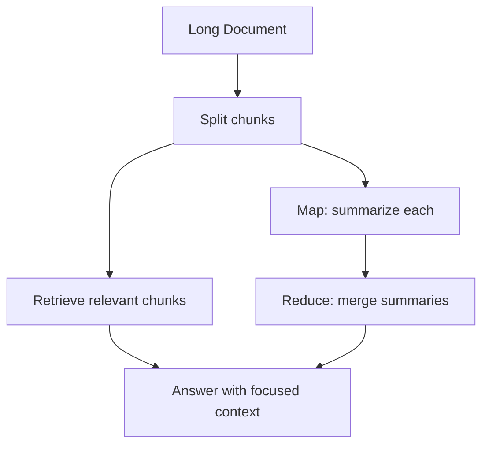
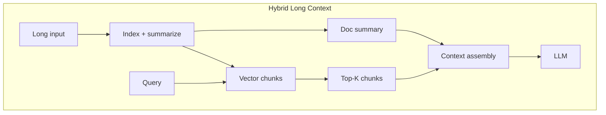

# Long Context Strategies

> Engineering approaches when inputs exceed practical context limits — beyond simply choosing a bigger model.

## Table of Contents

- [Overview](#overview)
- [Strategy Comparison](#strategy-comparison)
- [Long-Context Models](#long-context-models)
- [Chunk Prioritization](#chunk-prioritization)
- [Window Management](#window-management)
- [Recursive Summarization](#recursive-summarization)
- [Hierarchical Context](#hierarchical-context)
- [Retrieval Augmentation](#retrieval-augmentation)
- [Hybrid Strategies](#hybrid-strategies)
- [Architecture Diagram](#architecture-diagram)
- [Production Considerations](#production-considerations)
- [Interview Preparation](#interview-preparation)
- [Navigation](#navigation)

---

## Overview

Long documents, codebases, and multi-hour conversations exceed sensible single-pass windows. Production systems combine **retrieval**, **hierarchical summarization**, and **multi-pass reasoning** — even when using 128K+ models.

Section **11** of Phase 6.

---

## Strategy Comparison

| Strategy | Latency | Cost | Quality | Complexity |
|----------|---------|------|---------|------------|
| Stuff full doc (long model) | Low | High | Medium (lost-in-middle) | Low |
| Retrieval only | Medium | Medium | High for Q&A | Medium |
| Map-reduce summarize | High | High | High for global | High |
| Hierarchical index | Medium | Medium | High | High |
| Hybrid RAG + summary | Medium | Medium | Highest | High |

---

## Long-Context Models

Use when: holistic reasoning over full doc, few queries per doc, latency budget allows.

Mitigate attention issues by still **ranking internal sections** and placing key passages at start/end.

---

## Chunk Prioritization

Score chunks before inclusion — don't naively take first N tokens of document.

---

## Window Management

Sliding window over chunks for streaming analysis; checkpoint summaries at window boundaries.

---

## Recursive Summarization

Summarize chunks → summarize summaries → final answer pass. See [Prompt Chaining](../prompt-engineering/prompt-chaining.md).

---

## Hierarchical Context

Tree index: document → sections → paragraphs. Navigate tree with query — include path from root to relevant leaves.

---

## Retrieval Augmentation

Default production approach: embed chunks, retrieve top-K, assemble — foundation for [RAG](../rag/README.md) phase.

---

## Hybrid Strategies

1. Retrieve top chunks for precision
2. Add document-level summary for global context
3. Answer with both in structured blocks

---

## Architecture Diagram

---

## Production Considerations

- Pre-index offline; don't chunk at request time for large corpora
- Cache document-level summaries
- Eval with long-doc QA benchmarks

---

## Interview Preparation

**Q: 200-page PDF Q&A — approach?**

> Chunk + embed + retrieve + optional doc summary; map-reduce if holistic questions; avoid single stuff unless eval proves sufficient.

---

## Navigation

### Prerequisites

- [Context Windows](context-windows.md)
- [Context Compression](context-compression.md)

### Related Topics

- [Retrieval Context](retrieval-context.md) — Section 12
- [RAG](../rag/README.md)

### Next

- [Retrieval Context](retrieval-context.md)

---

## Changelog

| Version | Date | Changes |
|---------|------|---------|
| 1.0 | 2026-07-13 | Initial publication — Phase 6 Section 11 |
