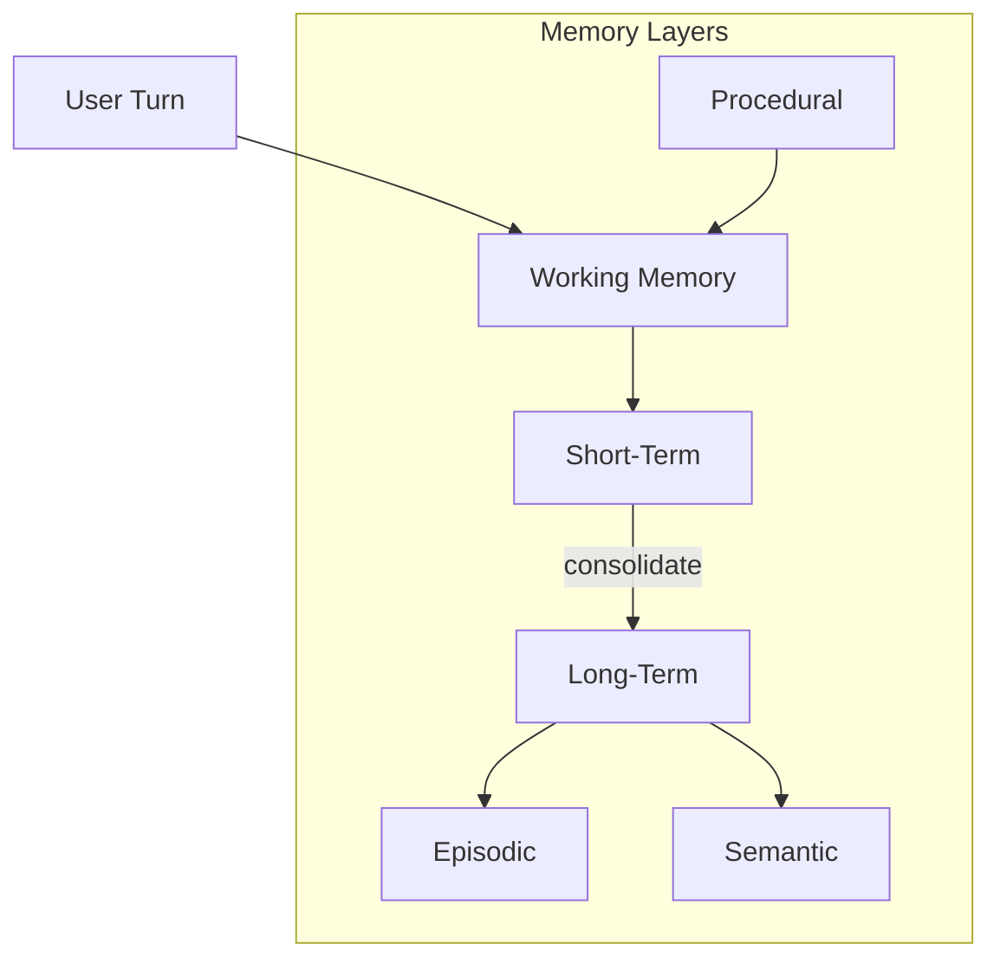
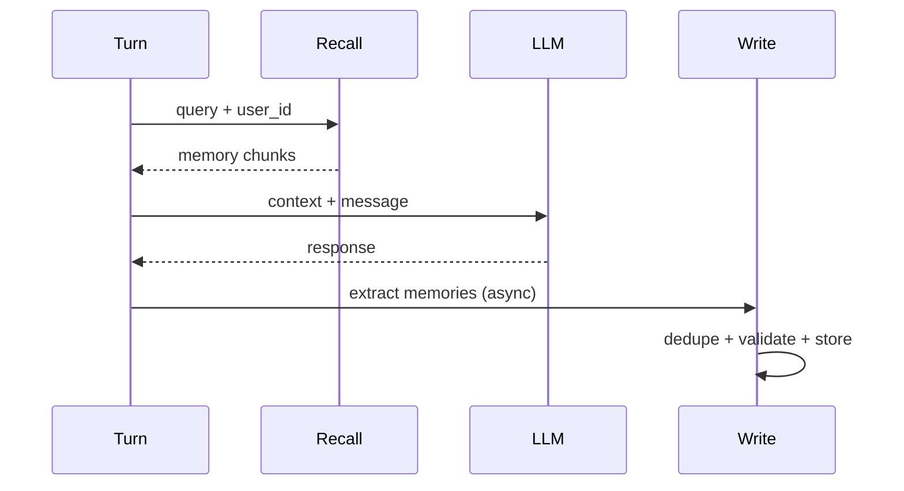

# Memory Systems

> How production AI applications implement memory — types, storage, retrieval, expiration, and update strategies beyond raw conversation logs.

## Table of Contents

- [Overview](#overview)
- [Memory Architecture](#memory-architecture)
- [Short-Term Memory](#short-term-memory)
- [Long-Term Memory](#long-term-memory)
- [Episodic Memory](#episodic-memory)
- [Semantic Memory](#semantic-memory)
- [Procedural Memory](#procedural-memory)
- [Working Memory](#working-memory)
- [Retrieval and Updates](#retrieval-and-updates)
- [Expiration Strategies](#expiration-strategies)
- [Production Considerations](#production-considerations)
- [Security Considerations](#security-considerations)
- [Best Practices](#best-practices)
- [Python Examples](#python-examples)
- [Interview Preparation](#interview-preparation)
- [Navigation](#navigation)

---

## Overview

**Memory** is durable or semi-durable information an application recalls to enrich context — distinct from conversation transcripts and retrieved documents. Production assistants need layered memory types with explicit write and recall policies.

Section **5** of Phase 6.



---

## Memory Architecture

| Layer | TTL | Storage | Recall Trigger |
|-------|-----|---------|----------------|
| Working | Request | In-process | Every turn in agent loop |
| Short-term | Session | Redis | Session ID |
| Long-term | Months+ | DB + vector | User ID + semantic query |
| Episodic | Configurable | Event store | Time, topic similarity |
| Semantic | Permanent | Vector DB | Embedding similarity |
| Procedural | Versioned | Config/code | Task type |

---

## Short-Term Memory

**Purpose:** Hold information for the current session — recent facts user mentioned, active task context.

| Aspect | Detail |
|--------|--------|
| Storage | Redis hash or session document |
| Retrieval | Load full session blob |
| Expiration | Session TTL (24–72h) |
| Update | Append on each turn; optional rolling summary |

**Implementation:** Extend [Conversation State](conversation-state.md) with a `session_facts: list[str]` updated by extraction prompts or rules.

---

## Long-Term Memory

**Purpose:** Persist user-specific knowledge across sessions — preferences, account context, past resolutions.

| Aspect | Detail |
|--------|--------|
| Storage | PostgreSQL + vector index |
| Retrieval | Hybrid: user_id filter + semantic search |
| Expiration | Soft-delete + GDPR deletion |
| Update | Explicit writes after validated extraction |

---

## Episodic Memory

**Purpose:** Remember **events** — "On March 3 user reported billing bug" — with timestamps and narrative.

| Aspect | Detail |
|--------|--------|
| Storage | Event log or document store |
| Retrieval | Recency + semantic relevance |
| Expiration | Archive after N months |
| Update | Append-only episodes; summarize old episodes |

Useful for continuity: "Last time we discussed X..."

---

## Semantic Memory

**Purpose:** Generalized facts about the user or domain — "User prefers concise answers", "Works in healthcare".

| Aspect | Detail |
|--------|--------|
| Storage | Vector DB with metadata `{user_id, type, confidence}` |
| Retrieval | Top-K by query embedding |
| Expiration | Decay low-confidence facts |
| Update | Merge duplicates; bump confidence on reinforcement |

---

## Procedural Memory

**Purpose:** How to perform tasks — workflows, tool sequences, org-specific procedures.

| Aspect | Detail |
|--------|--------|
| Storage | Versioned prompt/policy repository, not per-user |
| Retrieval | Task classifier routes to procedure |
| Expiration | Version with deployments |
| Update | CI/CD for procedure docs |

Often overlaps with [Prompt Engineering](../prompt-engineering/README.md) — procedures are institutional memory.

---

## Working Memory

**Purpose:** Agent scratchpad for current reasoning chain — plan steps, intermediate conclusions.

| Aspect | Detail |
|--------|--------|
| Storage | Agent state object |
| Retrieval | Injected each agent iteration |
| Expiration | Cleared after task completion |
| Update | Agent writes via structured output |

Not persisted unless promoted to episodic/semantic memory.

---

## Retrieval and Updates



**Write policies:**
- Explicit user statements ("Remember that...")
- Validated extraction with confidence threshold
- Never write from unverified model hallucinations

---

## Expiration Strategies

| Strategy | Use Case |
|----------|----------|
| TTL | Session facts |
| Confidence decay | Stale preferences |
| LRU cap | Max N memories per user |
| User deletion | GDPR/CCPA |
| Consolidation | Merge old episodes into summary |

---

## Production Considerations

- Async memory writes — don't block response latency
- Conflict resolution when new fact contradicts old
- Memory versioning for debugging "why did it think X?"

---

## Security Considerations

- Strict `user_id` / `tenant_id` filters on all memory queries
- PII classification before persistence
- Audit log for memory reads in regulated industries

---

## Best Practices

1. Separate memory types into different stores/schemas
2. Attribute every recalled memory in context (`source: semantic_memory`)
3. Eval memory precision/recall independently of answer quality
4. Allow users to view and delete stored memories

---

## Python Examples

```python
from dataclasses import dataclass
from datetime import datetime


@dataclass
class MemoryRecord:
    id: str
    user_id: str
    memory_type: str  # episodic | semantic
    content: str
    embedding: list[float]
    confidence: float
    created_at: datetime


class MemoryStore:
    async def recall(self, user_id: str, query: str, top_k: int = 5) -> list[MemoryRecord]:
        # Filter by user_id FIRST, then vector search
        candidates = await self.vector_search(query, filter={"user_id": user_id}, k=top_k)
        return [c for c in candidates if c.confidence >= 0.5]

    async def write(self, record: MemoryRecord) -> None:
        existing = await self.find_similar(record.user_id, record.content)
        if existing:
            await self.merge(existing.id, record)
        else:
            await self.insert(record)
```

---

## Interview Preparation

**Q: Short-term vs long-term memory in AI apps?**

> Short-term is session-scoped (Redis). Long-term persists across sessions with structured recall and GDPR controls.

**Q: How prevent memory pollution from model hallucinations?**

> Write only validated extractions, confidence thresholds, human confirmation for high-impact facts, deduplication.

---

## Navigation

### Prerequisites

- [Conversation State](conversation-state.md)
- [Databases for AI](../databases/databases-for-ai-applications.md)

### Related Topics

- [Conversation History](conversation-history.md) — Section 6
- [Context Personalization](context-personalization.md) — Section 15
- [Multi-Agent Context Sharing](multi-agent-context-sharing.md) — Section 16

### Next

- [Conversation History](conversation-history.md)

---

## Changelog

| Version | Date | Changes |
|---------|------|---------|
| 1.0 | 2026-07-13 | Initial publication — Phase 6 Section 5 |
