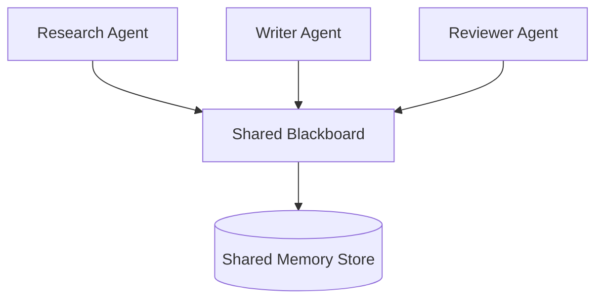
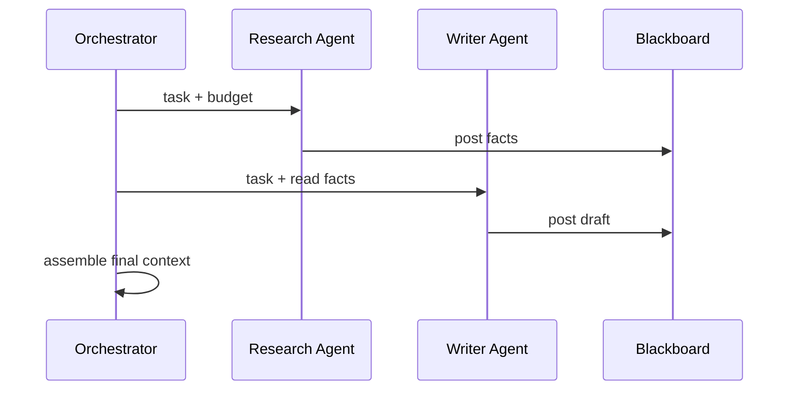

# Multi-Agent Context Sharing

> How multiple agents share, read, and write context — introductory patterns for the [AI Agents](../ai-agents/README.md) handbook..

## Table of Contents

- [Overview](#overview)
- [Shared Memory](#shared-memory)
- [Blackboard Architecture](#blackboard-architecture)
- [Context Synchronization](#context-synchronization)
- [Agent Communication](#agent-communication)
- [Shared Knowledge](#shared-knowledge)
- [Coordination](#coordination)
- [Architecture Diagram](#architecture-diagram)
- [Production Considerations](#production-considerations)
- [Interview Preparation](#interview-preparation)
- [Navigation](#navigation)

---

## Overview

Multi-agent systems require **shared context stores** beyond individual session memory — coordinated facts, task state, and observations visible to authorized agents.

Section **16** — expanded in [AI Agents](../ai-agents/README.md).



---

## Shared Memory

Central store keyed by `task_id` or `workflow_id`:

| Entry type | Writers | Readers |
|------------|---------|---------|
| Facts | Research agent | All |
| Draft | Writer agent | Reviewer |
| Decisions | Orchestrator | All |

ACL per entry type — not all agents see everything.

---

## Blackboard Architecture

Classic pattern: agents post structured artifacts to a shared board; orchestrator or event bus notifies subscribers.

```python
@dataclass
class BlackboardEntry:
    task_id: str
    agent_id: str
    entry_type: str
    content: dict
    version: int
```

Optimistic concurrency with version checks.

---

## Context Synchronization

- **Event-driven:** agent completes → publish → others refresh context
- **Polling:** orchestrator pulls board state each step
- **Lease-based:** agent locks section while editing

Avoid two agents writing conflicting global state without coordination.

---

## Agent Communication

Messages are context for receiving agents — format as structured blocks, not free-form chat when possible.

---

## Shared Knowledge

Org-wide knowledge (retrieval index) vs task-specific blackboard — separate namespaces.

---

## Coordination

Orchestrator assigns budgets per agent:

- Research agent: high retrieval budget
- Writer agent: high output budget, blackboard facts as input
- Reviewer: draft + rubric only

---

## Architecture Diagram



---

## Production Considerations

- Trace agent ID on every blackboard write
- TTL and cleanup for completed tasks
- Tenant isolation on shared stores

---

## Interview Preparation

**Q: How do agents share context without chaos?**

> Structured blackboard, typed entries, orchestrator coordination, ACLs, versioning, separate task-scoped vs global knowledge.

---

## Navigation

### Prerequisites

- [Memory Systems](memory-systems.md)
- [Context Architecture](context-architecture.md)

### Related Topics

- [AI Agents](../ai-agents/README.md)
- [Agent Architectures](../agent-architectures/README.md)

### Next

- [Context Quality](context-quality.md)

---

## Changelog

| Version | Date | Changes |
|---------|------|---------|
| 1.0 | 2026-07-13 | Initial publication |
