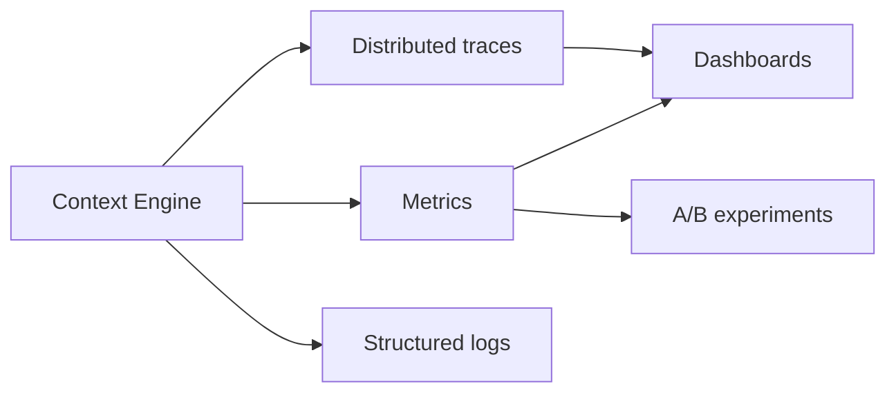

# Production Context Engineering

> Operating context systems at scale — observability, experimentation, and continuous optimization.

## Table of Contents

- [Overview](#overview)
- [Scalable Context Systems](#scalable-context-systems)
- [Context Observability](#context-observability)
- [Monitoring](#monitoring)
- [Debugging](#debugging)
- [Analytics](#analytics)
- [Optimization](#optimization)
- [Experimentation and A/B Testing](#experimentation-and-ab-testing)
- [Production Considerations](#production-considerations)
- [Best Practices](#best-practices)
- [Python Examples](#python-examples)
- [Interview Preparation](#interview-preparation)
- [Navigation](#navigation)

---

## Overview

Production context engineering requires the same rigor as any backend subsystem: SLOs, traces, dashboards, feature flags, and versioned policies.

Section **19** of Phase 6.



---

## Scalable Context Systems

- Stateless context workers behind queue for heavy compression
- Horizontal retrieval replicas
- Shard memory by `user_id` hash
- Circuit breakers on dependency failures

---

## Context Observability

Log per request:

```json
{
  "trace_id": "...",
  "session_id": "...",
  "context_tokens": 4200,
  "layers": {"retrieval": 12, "history": 8, "memory": 3},
  "included_ids": ["doc-1", "doc-2"],
  "excluded_reasons": {"doc-9": "below_threshold"},
  "compression_applied": true,
  "latency_ms": {"fetch": 120, "rank": 15, "compress": 45}
}
```

---

## Monitoring

| Alert | Condition |
|-------|-----------|
| High truncation rate | >15% requests |
| Empty retrieval | >10% for KB bot |
| Context assembly latency | p95 > 300ms |
| Token spike | 2x baseline |

---

## Debugging

**Context replay:** Reconstruct `ContextPackage` from stored trace + source snapshots. Re-run assembly without LLM to verify ranking changes.

---

## Analytics

- Which docs appear most in winning traces
- Token cost by layer over time
- Correlation context recall@K vs user satisfaction

---

## Optimization

Iterative loop: measure context quality → adjust weights/budgets → eval offline → canary online.

---

## Experimentation and A/B Testing

Test variants:

- Retrieval `top_k` and thresholds
- History summary vs verbatim depth
- Ranking weight profiles
- Compression aggressiveness

Assign by `user_id` hash; measure answer quality + cost + latency.

---

## Production Considerations

- Version `context_policy_v3` in traces
- Rollback policy via feature flag in minutes
- Separate staging index for policy experiments

---

## Best Practices

1. Treat context policy as code — PR review, CI tests
2. Never debug production without redacted traces
3. Joint on-call runbooks for retrieval + context + LLM

---

## Python Examples

```python
@dataclass
class ContextTrace:
    trace_id: str
    token_count: int
    included_ids: list[str]
    policy_version: str
    timings_ms: dict[str, float]

    def emit(self, metrics_client) -> None:
        metrics_client.histogram("context.tokens", self.token_count)
        metrics_client.histogram("context.fetch_ms", self.timings_ms.get("fetch", 0))
```

---

## Interview Preparation

**Q: How debug 'wrong answer' in production RAG?**

> Trace: retrieval IDs, scores, final context, compression, compare to golden supporting doc, replay assembly.

---

## Navigation

### Prerequisites

- [Context Architecture](context-architecture.md)
- [Logging for AI](../logging/backend-logging-for-ai.md)

### Related Topics

- [Context Engineering Mistakes](context-engineering-mistakes.md) — Section 20

### Next

- [Context Engineering Mistakes](context-engineering-mistakes.md)

---

## Changelog

| Version | Date | Changes |
|---------|------|---------|
| 1.0 | 2026-07-13 | Initial publication — Phase 6 Section 19 |
