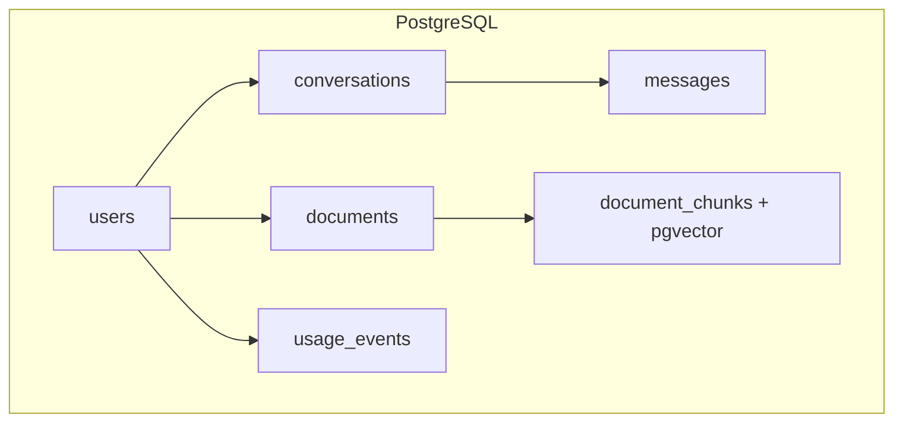

# PostgreSQL for AI

> PostgreSQL as the backbone of AI applications — conversation storage, document metadata, JSONB flexibility, pgvector for small-scale RAG, and production operations.

## Table of Contents

- [Why PostgreSQL for AI](#why-postgresql-for-ai)
- [Schema Patterns](#schema-patterns)
- [JSONB for Flexible AI State](#jsonb-for-flexible-ai-state)
- [pgvector for Embeddings](#pgvector-for-embeddings)
- [Full-Text Search](#full-text-search)
- [Async Access with SQLAlchemy](#async-access-with-sqlalchemy)
- [Repository Pattern](#repository-pattern)
- [Migrations with Alembic](#migrations-with-alembic)
- [Query Optimization](#query-optimization)
- [Production Operations](#production-operations)
- [Common Mistakes](#common-mistakes)
- [Interview Preparation](#interview-preparation)
- [Navigation](#navigation)

---

## Why PostgreSQL for AI

PostgreSQL is the default choice for AI application transactional data. It provides ACID guarantees, rich indexing, JSONB for semi-structured data, full-text search, and — via the pgvector extension — vector similarity search for development and small-to-medium RAG workloads.

| Capability | AI Application Use |
|-----------|-------------------|
| Relational model | Users, conversations, messages, billing |
| JSONB | Agent config, tool call logs, flexible metadata |
| Full-text search | Keyword fallback when vector search is overkill |
| pgvector | Embedding storage for <1M vectors |
| Row-level security | Multi-tenant data isolation |
| LISTEN/NOTIFY | Real-time job status updates |
| Partitioning | Time-based partitioning for usage events |



> **Scope note:** For large-scale vector search (>1M vectors) or hybrid retrieval pipelines, see the [RAG domain](../../rag/README.md) and [Vector Databases domain](../../vector-databases/README.md). This document covers pgvector for development and moderate workloads.

---

## Schema Patterns

### Core Tables

```sql
CREATE EXTENSION IF NOT EXISTS "pgcrypto";
CREATE EXTENSION IF NOT EXISTS "vector";

CREATE TABLE users (
    id            UUID PRIMARY KEY DEFAULT gen_random_uuid(),
    email         TEXT UNIQUE NOT NULL,
    display_name  TEXT,
    preferences   JSONB NOT NULL DEFAULT '{}',
    created_at    TIMESTAMPTZ NOT NULL DEFAULT now(),
    updated_at    TIMESTAMPTZ NOT NULL DEFAULT now()
);

CREATE TABLE conversations (
    id         UUID PRIMARY KEY DEFAULT gen_random_uuid(),
    user_id    UUID NOT NULL REFERENCES users(id) ON DELETE CASCADE,
    title      TEXT,
    model      TEXT NOT NULL DEFAULT 'gpt-4o-mini',
    metadata   JSONB NOT NULL DEFAULT '{}',
    created_at TIMESTAMPTZ NOT NULL DEFAULT now(),
    updated_at TIMESTAMPTZ NOT NULL DEFAULT now()
);

CREATE TABLE messages (
    id              UUID PRIMARY KEY DEFAULT gen_random_uuid(),
    conversation_id UUID NOT NULL REFERENCES conversations(id) ON DELETE CASCADE,
    role            TEXT NOT NULL CHECK (role IN ('user', 'assistant', 'system', 'tool')),
    content         TEXT NOT NULL,
    token_count     INT,
    metadata        JSONB NOT NULL DEFAULT '{}',
    created_at      TIMESTAMPTZ NOT NULL DEFAULT now()
);

CREATE TABLE documents (
    id           UUID PRIMARY KEY DEFAULT gen_random_uuid(),
    user_id      UUID NOT NULL REFERENCES users(id) ON DELETE CASCADE,
    filename     TEXT NOT NULL,
    storage_key  TEXT NOT NULL,
    mime_type    TEXT NOT NULL,
    size_bytes   BIGINT NOT NULL,
    status       TEXT NOT NULL DEFAULT 'pending'
                 CHECK (status IN ('pending', 'processing', 'indexed', 'failed')),
  chunk_count  INT DEFAULT 0,
    metadata     JSONB NOT NULL DEFAULT '{}',
    created_at   TIMESTAMPTZ NOT NULL DEFAULT now(),
    updated_at   TIMESTAMPTZ NOT NULL DEFAULT now()
);

CREATE TABLE usage_events (
    id            UUID PRIMARY KEY DEFAULT gen_random_uuid(),
    user_id       UUID NOT NULL REFERENCES users(id),
    model         TEXT NOT NULL,
    input_tokens  INT NOT NULL,
    output_tokens INT NOT NULL,
    cost_usd      NUMERIC(10, 6),
    created_at    TIMESTAMPTZ NOT NULL DEFAULT now()
);
```

### Essential Indexes

```sql
CREATE INDEX idx_conversations_user ON conversations (user_id, created_at DESC);
CREATE INDEX idx_messages_conv_time ON messages (conversation_id, created_at);
CREATE INDEX idx_documents_user_status ON documents (user_id, status);
CREATE INDEX idx_usage_user_time ON usage_events (user_id, created_at DESC);
CREATE INDEX idx_messages_metadata ON messages USING GIN (metadata);
```

### Auto-Update `updated_at`

```sql
CREATE OR REPLACE FUNCTION update_updated_at()
RETURNS TRIGGER AS $$
BEGIN
    NEW.updated_at = now();
    RETURN NEW;
END;
$$ LANGUAGE plpgsql;

CREATE TRIGGER conversations_updated_at
    BEFORE UPDATE ON conversations
    FOR EACH ROW EXECUTE FUNCTION update_updated_at();
```

---

## JSONB for Flexible AI State

JSONB stores semi-structured data with indexing support — ideal for agent configuration, tool call logs, and user preferences that evolve faster than your schema.

### Agent Run State

```sql
CREATE TABLE agent_runs (
    id          UUID PRIMARY KEY DEFAULT gen_random_uuid(),
    user_id     UUID NOT NULL REFERENCES users(id),
    status      TEXT NOT NULL DEFAULT 'running',
    config      JSONB NOT NULL DEFAULT '{}',
    steps       JSONB NOT NULL DEFAULT '[]',
    result      JSONB,
    created_at  TIMESTAMPTZ NOT NULL DEFAULT now(),
    updated_at  TIMESTAMPTZ NOT NULL DEFAULT now()
);

-- Example config value:
-- {"model": "gpt-4o", "tools": ["web_search", "calculator"], "max_steps": 10}

-- Example steps value:
-- [{"step": 1, "tool": "web_search", "input": "...", "output": "..."}]
```

### Querying JSONB

```sql
-- Exact match
SELECT * FROM agent_runs WHERE config->>'model' = 'gpt-4o';

-- Containment (uses GIN index)
SELECT * FROM agent_runs WHERE config @> '{"tools": ["web_search"]}';

-- Array element
SELECT * FROM agent_runs
WHERE steps @> '[{"tool": "web_search"}]';

-- Update nested field
UPDATE users
SET preferences = preferences || '{"theme": "dark"}'::jsonb
WHERE id = :user_id;
```

### Python JSONB Access

```python
from sqlalchemy import select
from sqlalchemy.dialects.postgresql import insert


async def log_tool_call(
    session: AsyncSession,
    run_id: UUID,
    step: dict,
) -> None:
    await session.execute(
        text("""
            UPDATE agent_runs
            SET steps = steps || :step::jsonb,
                updated_at = now()
            WHERE id = :run_id
        """),
        {"run_id": run_id, "step": json.dumps([step])},
    )
```

---

## pgvector for Embeddings

pgvector adds vector data types and similarity search to PostgreSQL. Use it for development, prototypes, and production workloads under ~1M vectors. For larger scale, migrate to a dedicated vector database — see [RAG phase](../../rag/README.md).

### Setup

```sql
CREATE EXTENSION IF NOT EXISTS vector;

CREATE TABLE document_chunks (
    id          UUID PRIMARY KEY DEFAULT gen_random_uuid(),
    document_id UUID NOT NULL REFERENCES documents(id) ON DELETE CASCADE,
    chunk_index INT NOT NULL,
    content     TEXT NOT NULL,
    embedding   vector(1536),  -- match your embedding model dimensions
    metadata    JSONB NOT NULL DEFAULT '{}',
    created_at  TIMESTAMPTZ NOT NULL DEFAULT now(),
    UNIQUE (document_id, chunk_index)
);
```

### Index Types

| Index | Build Time | Query Speed | Recall | Best For |
|-------|-----------|-------------|--------|----------|
| HNSW | Slow | Fast | High | Production default |
| IVFFlat | Fast | Moderate | Good | Large datasets, faster builds |

```sql
-- HNSW: recommended for most AI apps
CREATE INDEX idx_chunks_embedding_hnsw ON document_chunks
    USING hnsw (embedding vector_cosine_ops)
    WITH (m = 16, ef_construction = 64);

-- IVFFlat: faster to build, good for bulk loads
-- CREATE INDEX idx_chunks_embedding_ivf ON document_chunks
--     USING ivfflat (embedding vector_cosine_ops) WITH (lists = 100);
```

### Similarity Search

```sql
-- Cosine distance (most common for text embeddings)
SELECT id, content, embedding <=> :query_embedding AS distance
FROM document_chunks
WHERE document_id = ANY(:allowed_doc_ids)
ORDER BY embedding <=> :query_embedding
LIMIT 5;

-- Set HNSW search quality at query time
SET hnsw.ef_search = 100;
```

### Python Integration

```python
async def search_chunks(
    session: AsyncSession,
    query_embedding: list[float],
    document_ids: list[UUID],
    top_k: int = 5,
) -> list[dict]:
    result = await session.execute(
        text("""
            SELECT id, content, metadata,
                   embedding <=> :query_vec AS distance
            FROM document_chunks
            WHERE document_id = ANY(:doc_ids)
            ORDER BY distance
            LIMIT :top_k
        """),
        {
            "query_vec": str(query_embedding),
            "doc_ids": document_ids,
            "top_k": top_k,
        },
    )
    return [dict(row._mapping) for row in result]
```

> **Go deeper:** Vector indexing algorithms, hybrid search, and production RAG architecture are covered in the [RAG domain](../../rag/README.md) and [Vector Databases domain](../../vector-databases/README.md).

---

## Full-Text Search

PostgreSQL's built-in full-text search (FTS) complements vector search — use it for exact keyword matching, proper noun search, and as a fallback when embeddings miss.

```sql
-- Add a generated tsvector column
ALTER TABLE document_chunks
    ADD COLUMN content_tsv tsvector
    GENERATED ALWAYS AS (to_tsvector('english', content)) STORED;

CREATE INDEX idx_chunks_fts ON document_chunks USING GIN (content_tsv);

-- Keyword search
SELECT id, content, ts_rank(content_tsv, query) AS rank
FROM document_chunks, plainto_tsquery('english', 'machine learning pipeline') query
WHERE content_tsv @@ query
ORDER BY rank DESC
LIMIT 10;
```

### Hybrid Search (Keyword + Vector)

For production hybrid retrieval, use Reciprocal Rank Fusion (RRF) to combine FTS and vector results. Full implementation patterns are in the [RAG domain](../../rag/README.md).

```sql
-- Simplified: get top results from each, merge in application code
WITH vector_results AS (
    SELECT id, content, ROW_NUMBER() OVER (ORDER BY embedding <=> :q_vec) AS v_rank
    FROM document_chunks LIMIT 20
),
fts_results AS (
    SELECT id, content, ROW_NUMBER() OVER (ORDER BY ts_rank(content_tsv, query) DESC) AS f_rank
    FROM document_chunks, plainto_tsquery('english', :q_text) query
    WHERE content_tsv @@ query LIMIT 20
)
SELECT COALESCE(v.id, f.id) AS id,
       COALESCE(1.0/(60+v_rank), 0) + COALESCE(1.0/(60+f_rank), 0) AS rrf_score
FROM vector_results v
FULL OUTER JOIN fts_results f ON v.id = f.id
ORDER BY rrf_score DESC
LIMIT 5;
```

---

## Async Access with SQLAlchemy

> **Phase 3 deep dive:** Full SQLAlchemy 2.0 coverage — sessions, models, relationships, queries, transactions, and repository implementations — is in [SQLAlchemy for AI Applications](sqlalchemy-for-ai-applications.md).

Use `asyncpg` driver with SQLAlchemy 2.0 async session for non-blocking database access in FastAPI applications.

### Engine and Session Setup

```python
from sqlalchemy.ext.asyncio import (
    AsyncSession,
    async_sessionmaker,
    create_async_engine,
)
from sqlalchemy.orm import DeclarativeBase


class Base(DeclarativeBase):
    pass


def create_engine(database_url: str):
    return create_async_engine(
        database_url,
        pool_size=20,
        max_overflow=10,
        pool_timeout=30,
        pool_recycle=1800,
        pool_pre_ping=True,
        echo=False,
    )


def create_session_factory(engine):
    return async_sessionmaker(engine, class_=AsyncSession, expire_on_commit=False)
```

### FastAPI Dependency

```python
from collections.abc import AsyncGenerator
from fastapi import Depends


async def get_session() -> AsyncGenerator[AsyncSession, None]:
    async with session_factory() as session:
        try:
            yield session
            await session.commit()
        except Exception:
            await session.rollback()
            raise
```

### Model Definitions

```python
from sqlalchemy import ForeignKey, Text, Integer, BigInteger
from sqlalchemy.dialects.postgresql import JSONB, UUID
from sqlalchemy.orm import Mapped, mapped_column, relationship
from uuid import uuid4
from datetime import datetime


class Conversation(Base):
    __tablename__ = "conversations"

    id: Mapped[UUID] = mapped_column(UUID(as_uuid=True), primary_key=True, default=uuid4)
    user_id: Mapped[UUID] = mapped_column(UUID(as_uuid=True), ForeignKey("users.id"))
    title: Mapped[str | None] = mapped_column(Text)
    model: Mapped[str] = mapped_column(Text, default="gpt-4o-mini")
    metadata_: Mapped[dict] = mapped_column("metadata", JSONB, default=dict)
    created_at: Mapped[datetime] = mapped_column(default=datetime.utcnow)
    messages: Mapped[list["Message"]] = relationship(back_populates="conversation")


class Message(Base):
    __tablename__ = "messages"

    id: Mapped[UUID] = mapped_column(UUID(as_uuid=True), primary_key=True, default=uuid4)
    conversation_id: Mapped[UUID] = mapped_column(
        UUID(as_uuid=True), ForeignKey("conversations.id")
    )
    role: Mapped[str] = mapped_column(Text)
    content: Mapped[str] = mapped_column(Text)
    token_count: Mapped[int | None] = mapped_column(Integer)
    metadata_: Mapped[dict] = mapped_column("metadata", JSONB, default=dict)
    created_at: Mapped[datetime] = mapped_column(default=datetime.utcnow)
    conversation: Mapped["Conversation"] = relationship(back_populates="messages")
```

---

## Repository Pattern

Repositories abstract PostgreSQL access behind interfaces — enabling testing with in-memory fakes and keeping SQL out of service layers. See [Software Engineering for AI](../../foundations/software-engineering-for-ai.md).

```python
from abc import ABC, abstractmethod
from uuid import UUID


class ConversationRepository(ABC):
    @abstractmethod
    async def create(self, user_id: UUID, model: str) -> UUID: ...

    @abstractmethod
    async def get_messages(self, conversation_id: UUID, limit: int) -> list[Message]: ...

    @abstractmethod
    async def add_message(self, conversation_id: UUID, role: str, content: str) -> UUID: ...


class PostgresConversationRepository(ConversationRepository):
    def __init__(self, session_factory):
        self._session_factory = session_factory

    async def get_messages(self, conversation_id: UUID, limit: int = 50) -> list[Message]:
        async with self._session_factory() as session:
            result = await session.execute(
                select(Message)
                .where(Message.conversation_id == conversation_id)
                .order_by(Message.created_at.desc())
                .limit(limit)
            )
            return list(reversed(result.scalars().all()))

    async def add_message(
        self, conversation_id: UUID, role: str, content: str
    ) -> UUID:
        async with self._session_factory() as session:
            message = Message(conversation_id=conversation_id, role=role, content=content)
            session.add(message)
            await session.commit()
            return message.id
```

---

## Migrations with Alembic

> **Phase 3 deep dive:** Alembic workflows, rollbacks, zero-downtime patterns, pgvector migrations, and CI integration — see [Alembic Migrations for AI](alembic-migrations-for-ai.md).

### Project Setup

```bash
pip install alembic asyncpg sqlalchemy[asyncio]
alembic init alembic
```

### `alembic/env.py` (async)

```python
from sqlalchemy.ext.asyncio import create_async_engine
from app.models import Base

target_metadata = Base.metadata


async def run_async_migrations():
    connectable = create_async_engine(config.get_main_option("sqlalchemy.url"))
    async with connectable.connect() as connection:
        await connection.run_sync(do_run_migrations)
    await connectable.dispose()
```

### Migration Workflow

```bash
# After changing SQLAlchemy models:
alembic revision --autogenerate -m "add agent_runs table"
alembic upgrade head

# In CI: verify no pending migrations
alembic check
```

### Safe Column Addition

```python
def upgrade() -> None:
    op.add_column("messages", sa.Column("token_count", sa.Integer, nullable=True))

    # Backfill in a separate data migration script, then:
    # op.alter_column("messages", "token_count", nullable=False)


def downgrade() -> None:
    op.drop_column("messages", "token_count")
```

---

## Query Optimization

### EXPLAIN ANALYZE

```sql
EXPLAIN (ANALYZE, BUFFERS, FORMAT TEXT)
SELECT m.*
FROM messages m
JOIN conversations c ON c.id = m.conversation_id
WHERE c.user_id = '...'
ORDER BY m.created_at DESC
LIMIT 50;
```

Look for: `Seq Scan` (bad on large tables), `Index Scan` (good), high `actual time`, buffer cache misses.

### Common Optimizations

| Problem | Symptom | Fix |
|---------|---------|-----|
| Missing index | Seq Scan on large table | Add composite index matching WHERE + ORDER BY |
| N+1 queries | One query per message | Use `selectinload` or JOIN |
| Large JSONB scans | Slow metadata queries | GIN index on JSONB column |
| Table bloat | Degrading performance | `VACUUM ANALYZE`; consider partitioning |
| Lock contention | Timeouts on writes | Shorter transactions; batch inserts |

### SQLAlchemy N+1 Prevention

```python
from sqlalchemy.orm import selectinload

result = await session.execute(
    select(Conversation)
    .options(selectinload(Conversation.messages))
    .where(Conversation.user_id == user_id)
)
```

---

## Production Operations

### Connection Pooling with PgBouncer

```ini
; pgbouncer.ini
[databases]
aiapp = host=localhost port=5432 dbname=aiapp

[pgbouncer]
pool_mode = transaction
default_pool_size = 25
max_client_conn = 200
```

Point your application at PgBouncer (port 6432), not PostgreSQL directly (port 5432).

### Row-Level Security (Multi-Tenancy)

```sql
ALTER TABLE documents ENABLE ROW LEVEL SECURITY;

CREATE POLICY tenant_isolation ON documents
    USING (user_id = current_setting('app.current_user_id')::uuid);
```

```python
async def set_user_context(session: AsyncSession, user_id: UUID) -> None:
    await session.execute(
        text("SET LOCAL app.current_user_id = :uid"),
        {"uid": str(user_id)},
    )
```

### Backup and Recovery

```bash
# Point-in-time recovery requires WAL archiving
pg_dump -Fc aiapp > aiapp_backup.dump
pg_restore -d aiapp aiapp_backup.dump
```

### Monitoring Essentials

| Metric | Alert Threshold |
|--------|----------------|
| Active connections | > 80% of max_connections |
| Replication lag | > 10 seconds |
| Cache hit ratio | < 99% |
| Longest running query | > 30 seconds |
| Disk usage | > 80% |

### Partitioning Usage Events

```sql
CREATE TABLE usage_events (
    id UUID NOT NULL,
    user_id UUID NOT NULL,
    created_at TIMESTAMPTZ NOT NULL DEFAULT now(),
    -- ...
) PARTITION BY RANGE (created_at);

CREATE TABLE usage_events_2026_07 PARTITION OF usage_events
    FOR VALUES FROM ('2026-07-01') TO ('2026-08-01');
```

---

## Common Mistakes

| Mistake | Impact | Fix |
|---------|--------|-----|
| Using pgvector for millions of vectors | Slow queries, high memory | Dedicated vector DB — see [RAG phase](../../rag/README.md) |
| Storing file content in TEXT columns | Bloated tables, slow backups | Object storage + `storage_key` reference |
| Synchronous DB driver in async app | Blocked event loop | `asyncpg` + SQLAlchemy async |
| No `ON DELETE CASCADE` on messages | Orphan data on conversation delete | Cascade or explicit cleanup |
| JSONB without GIN index | Full table scans on metadata queries | `CREATE INDEX ... USING GIN (metadata)` |
| Running migrations manually in production | Environment drift | Alembic in CI/CD pipeline |
| `SELECT *` in hot paths | Unnecessary I/O | Select only needed columns |

---

## Interview Preparation

### Frequently Asked Questions

**Q1: When would you use pgvector vs a dedicated vector database?**

> **Strong answer:** pgvector for prototypes, <1M vectors, and teams already running PostgreSQL — simpler ops, transactional consistency with metadata. Dedicated vector DB (Pinecone, Qdrant, Weaviate) for >1M vectors, sub-10ms latency requirements, hybrid search at scale, or when vector operations should not compete with transactional queries for resources. See [RAG](../../rag/README.md) and [Vector Databases](../../vector-databases/README.md) for deep comparison.

**Q2: How do you store conversation history efficiently?**

> **Strong answer:** `conversations` table for metadata, `messages` table with `(conversation_id, created_at)` composite index. Paginate with cursor-based pagination (`WHERE created_at < :cursor`). Store token counts for billing. Use JSONB metadata for model-specific fields. Partition or archive conversations older than retention policy.

**Q3: How do you handle schema changes without downtime?**

> **Strong answer:** Alembic migrations in CI. Add columns as nullable first, deploy code that writes to new column, backfill existing rows, add NOT NULL constraint in a follow-up migration. Never drop columns until all code stops reading them. Test migrations against production-sized data.

### Real-World Scenario

**Scenario:** RAG search is fast in development (10K chunks) but takes 2+ seconds in production (500K chunks) with pgvector.

> **Discussion points:**
> 1. Check index type — IVFFlat needs enough lists; HNSW needs tuning (`ef_search`).
> 2. Evaluate if pgvector is the right tool at this scale.
> 3. Consider migrating vectors to a dedicated store while keeping metadata in PG.
> 4. Add filtering (`WHERE document_id = ANY(...)`) to reduce search space.
> 5. See [Vector Databases domain](../../vector-databases/README.md) for scaling strategies.

---

## Navigation

### Prerequisites

- [Databases for AI Applications](../databases-for-ai-applications.md)
- [Software Engineering for AI](../../foundations/software-engineering-for-ai.md)

### Related Topics

- [SQLAlchemy for AI Applications](sqlalchemy-for-ai-applications.md) — ORM, repositories, transactions
- [Alembic Migrations for AI](alembic-migrations-for-ai.md) — schema versioning
- [Redis for AI](../redis/redis-for-ai.md)
- [RAG Domain](../../rag/README.md)
- [Vector Databases Domain](../../vector-databases/README.md)
- [Backend Fundamentals for AI](../../backend-engineering/backend-fundamentals-for-ai.md)

### Next Topics

- [SQLAlchemy for AI Applications](sqlalchemy-for-ai-applications.md)
- [Alembic Migrations for AI](alembic-migrations-for-ai.md)
- [Redis Backend Patterns for AI](../redis/redis-backend-patterns-for-ai.md)

---

## See Also

- [PostgreSQL Subdomain README](README.md)
- [Databases Domain README](../README.md)
- [Master Index](../../../meta/indexes/MASTER-INDEX.md)

## Changelog

| Version | Date | Changes |
|---------|------|---------|
| 1.0 | 2026-07-13 | Initial version |
