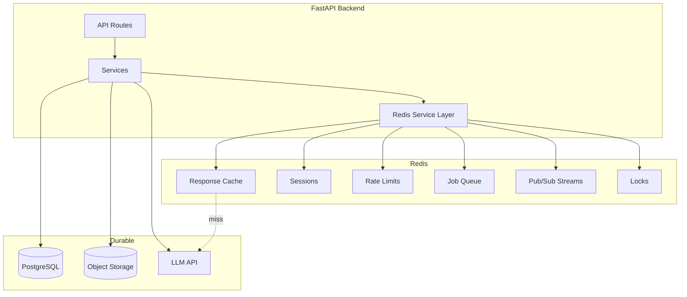

# Redis Backend Patterns for AI

> Backend implementation patterns for Redis in AI applications — service-layer integration, connection pooling, caching, sessions, rate limiting, background jobs, pub/sub streaming, distributed locks, and performance tuning.

## Table of Contents

- [Where Redis Fits in AI Systems](#where-redis-fits-in-ai-systems)
- [Backend Architecture](#backend-architecture)
- [Connection Pooling and Lifecycle](#connection-pooling-and-lifecycle)
- [Key Naming and Namespacing](#key-naming-and-namespacing)
- [Caching Patterns](#caching-patterns)
- [Session Management](#session-management)
- [Rate Limiting](#rate-limiting)
- [Background Jobs](#background-jobs)
- [Pub/Sub for Streaming](#pubsub-for-streaming)
- [Distributed Locks](#distributed-locks)
- [Expiration Strategies](#expiration-strategies)
- [Performance Tuning](#performance-tuning)
- [Production Operations](#production-operations)
- [Common Mistakes](#common-mistakes)
- [Interview Preparation](#interview-preparation)
- [Navigation](#navigation)

---

## Where Redis Fits in AI Systems

Redis is the **fast ephemeral layer** in a polyglot persistence architecture. PostgreSQL holds durable truth; Redis accelerates reads, enforces limits, coordinates workers, and streams tokens to clients. See [Databases for AI Applications](../databases-for-ai-applications.md) for store selection and [Redis for AI](redis-for-ai.md) for conceptual patterns (semantic cache, architecture diagrams).

| Layer | Store | Data Lifetime | Example |
|-------|-------|---------------|---------|
| Durable | PostgreSQL | Permanent | Full message history, users, billing |
| Fast ephemeral | Redis | Seconds to days (TTL) | LLM cache, sessions, rate counters |
| Blob | Object storage | Permanent | PDFs, images |
| Vector | pgvector / Vector DB | Permanent | Embeddings |



> **Critical rule:** Write durable state to PostgreSQL first (or atomically with outbox pattern). Redis is a cache and coordination layer — data loss on restart or eviction must be recoverable.

---

## Backend Architecture

Isolate Redis access behind service classes — mirroring the repository pattern used for PostgreSQL in [SQLAlchemy for AI Applications](../postgresql/sqlalchemy-for-ai-applications.md).

```
app/
├── redis/
│   ├── client.py           # pool factory, lifespan
│   ├── keys.py               # key builders
│   └── services/
│       ├── cache.py          # LLM response cache
│       ├── session.py        # user sessions
│       ├── rate_limit.py     # sliding window limiter
│       ├── pubsub.py         # token streaming
│       └── locks.py          # distributed locks
├── services/
│   └── chat.py               # orchestrates PG + Redis + LLM
└── main.py
```

### Service Interface Example

```python
# app/redis/services/cache.py
from abc import ABC, abstractmethod


class LLMCacheService(ABC):
    @abstractmethod
    async def get(self, cache_key: str) -> str | None: ...

    @abstractmethod
    async def set(self, cache_key: str, response: str, ttl_seconds: int) -> None: ...


class RedisLLMCacheService(LLMCacheService):
    def __init__(self, redis_client, prefix: str = "llm") -> None:
        self._redis = redis_client
        self._prefix = prefix

    def _key(self, cache_key: str) -> str:
        return f"{self._prefix}:{cache_key}"

    async def get(self, cache_key: str) -> str | None:
        value = await self._redis.get(self._key(cache_key))
        return value.decode() if value else None

    async def set(self, cache_key: str, response: str, ttl_seconds: int) -> None:
        await self._redis.set(self._key(cache_key), response, ex=ttl_seconds)
```

---

## Connection Pooling and Lifecycle

### Pool Configuration

```python
# app/redis/client.py
import redis.asyncio as redis


def create_redis_pool(redis_url: str) -> redis.Redis:
    return redis.from_url(
        redis_url,
        max_connections=50,
        decode_responses=False,       # explicit bytes handling
        socket_timeout=5.0,
        socket_connect_timeout=5.0,
        retry_on_timeout=True,
        health_check_interval=30,
    )
```

| Parameter | Recommendation | Why |
|-----------|---------------|-----|
| `max_connections` | 2–5× expected concurrent requests per worker | Prevents connection exhaustion |
| `decode_responses=False` | Default for binary-safe operations | Explicit encoding control |
| `socket_timeout` | 5s | Fail fast on hung Redis |
| `health_check_interval` | 30s | Detect stale connections |

### FastAPI Lifespan

```python
from contextlib import asynccontextmanager
from fastapi import FastAPI, Request


@asynccontextmanager
async def lifespan(app: FastAPI):
    app.state.redis = create_redis_pool(settings.redis_url)
    app.state.session_factory = create_session_factory(engine)
    yield
    await app.state.redis.aclose()


app = FastAPI(lifespan=lifespan)


def get_redis(request: Request) -> redis.Redis:
    return request.app.state.redis
```

### Separate Redis Instances

For production AI apps, consider separate Redis instances or databases (DB 0, DB 1) with different `maxmemory-policy`:

| Instance | Policy | Purpose |
|----------|--------|---------|
| Cache Redis | `allkeys-lru` | LLM response cache — evictable |
| Limits Redis | `noeviction` | Rate limits — never silently drop |
| Queue Redis | `noeviction` | Job queue integrity |

See [Redis for AI — Production Configuration](redis-for-ai.md#production-configuration).

---

## Key Naming and Namespacing

Consistent key naming prevents collisions and simplifies debugging.

```python
# app/redis/keys.py
def llm_cache_key(model: str, messages_hash: str, prompt_version: str) -> str:
    return f"llm:v{prompt_version}:{model}:{messages_hash}"


def session_key(session_id: str) -> str:
    return f"sess:{session_id}"


def rate_limit_key(user_id: str, window: str) -> str:
    return f"rl:{user_id}:{window}"


def pubsub_channel(conversation_id: str) -> str:
    return f"chat:stream:{conversation_id}"


def lock_key(resource: str) -> str:
    return f"lock:{resource}"


def job_queue(stream: str) -> str:
    return f"jobs:{stream}"
```

Convention: `{domain}:{identifier}[:{sub-identifier}]`. Include `prompt_version` in cache keys — detailed rationale in [Redis for AI — LLM Response Caching](redis-for-ai.md#llm-response-caching).

---

## Caching Patterns

### Cache-Aside with Stampede Protection

```python
import hashlib
import json
import uuid

from app.redis.services.locks import DistributedLockService


class CachedLLMService:
    def __init__(
        self,
        llm_client,
        cache: LLMCacheService,
        locks: DistributedLockService,
    ) -> None:
        self._llm = llm_client
        self._cache = cache
        self._locks = locks

    def _build_key(self, model: str, messages: list[dict], prompt_version: str) -> str:
        payload = json.dumps(
            {"model": model, "messages": messages, "prompt_version": prompt_version},
            sort_keys=True,
        )
        digest = hashlib.sha256(payload.encode()).hexdigest()
        return llm_cache_key(model, digest, prompt_version)

    async def complete(
        self,
        model: str,
        messages: list[dict],
        prompt_version: str = "v1",
        ttl: int = 3600,
    ) -> str:
        key = self._build_key(model, messages, prompt_version)

        cached = await self._cache.get(key)
        if cached is not None:
            return cached

        lock_key = f"regen:{key}"
        async with self._locks.acquire(lock_key, ttl_seconds=30) as acquired:
            if not acquired:
                # Another worker is regenerating — brief wait and retry
                cached = await self._cache.get(key)
                return cached or await self._llm.complete(model, messages)

            cached = await self._cache.get(key)  # double-check
            if cached is not None:
                return cached

            response = await self._llm.complete(model, messages)
            await self._cache.set(key, response, ttl)
            return response
```

### Embedding Cache

```python
async def get_or_compute_embedding(
    redis_client: redis.Redis,
    embed_fn,
    text: str,
    model: str,
    ttl: int = 86400,
) -> list[float]:
    key = f"emb:{model}:{hashlib.sha256(text.encode()).hexdigest()}"
    cached = await redis_client.get(key)
    if cached:
        return json.loads(cached)

    embedding = await embed_fn(text)
    await redis_client.set(key, json.dumps(embedding), ex=ttl)
    return embedding
```

### Pipeline for Batch Reads

```python
async def batch_cache_get(redis_client: redis.Redis, keys: list[str]) -> dict[str, bytes | None]:
    pipe = redis_client.pipeline()
    for key in keys:
        pipe.get(key)
    results = await pipe.execute()
    return dict(zip(keys, results))
```

---

## Session Management

Store session state in Redis hashes for O(1) field access. Durable user profile remains in PostgreSQL.

```python
# app/redis/services/session.py
import json
from uuid import uuid4


class RedisSessionService:
    def __init__(self, redis_client, ttl_seconds: int = 86400) -> None:
        self._redis = redis_client
        self._ttl = ttl_seconds

    async def create(self, user_id: str, metadata: dict | None = None) -> str:
        session_id = str(uuid4())
        key = session_key(session_id)
        await self._redis.hset(
            key,
            mapping={
                "user_id": user_id,
                "metadata": json.dumps(metadata or {}),
            },
        )
        await self._redis.expire(key, self._ttl)
        return session_id

    async def get_user_id(self, session_id: str) -> str | None:
        key = session_key(session_id)
        user_id = await self._redis.hget(key, "user_id")
        if user_id:
            await self._redis.expire(key, self._ttl)  # sliding expiration
        return user_id.decode() if user_id else None

    async def destroy(self, session_id: str) -> None:
        await self._redis.delete(session_key(session_id))
```

### Context Window Buffer (List)

Maintain the active context window as a Redis list for fast assembly before LLM calls:

```python
async def append_context_message(
    redis_client: redis.Redis,
    conversation_id: str,
    message: dict,
    max_messages: int = 50,
    ttl: int = 3600,
) -> None:
    key = f"ctx:{conversation_id}"
    pipe = redis_client.pipeline()
    pipe.rpush(key, json.dumps(message))
    pipe.ltrim(key, -max_messages, -1)  # keep last N messages
    pipe.expire(key, ttl)
    await pipe.execute()


async def get_context_window(redis_client: redis.Redis, conversation_id: str) -> list[dict]:
    key = f"ctx:{conversation_id}"
    raw_messages = await redis_client.lrange(key, 0, -1)
    return [json.loads(m) for m in raw_messages]
```

Full history still persists to PostgreSQL via SQLAlchemy repositories. Redis holds the hot window only.

---

## Rate Limiting

### Sliding Window with Sorted Sets

```python
# app/redis/services/rate_limit.py
import time


class SlidingWindowRateLimiter:
    def __init__(self, redis_client, limit: int, window_seconds: int) -> None:
        self._redis = redis_client
        self._limit = limit
        self._window = window_seconds

    async def is_allowed(self, user_id: str) -> tuple[bool, int]:
        key = rate_limit_key(user_id, f"{self._window}s")
        now = time.time()
        window_start = now - self._window

        pipe = self._redis.pipeline()
        pipe.zremrangebyscore(key, 0, window_start)
        pipe.zadd(key, {str(now): now})
        pipe.zcard(key)
        pipe.expire(key, self._window + 1)
        _, _, count, _ = await pipe.execute()

        remaining = max(0, self._limit - count)
        return count <= self._limit, remaining
```

### FastAPI Middleware Integration

```python
from fastapi import HTTPException, Request


async def rate_limit_dependency(
    request: Request,
    user=Depends(get_current_user),
    limiter: SlidingWindowRateLimiter = Depends(get_rate_limiter),
):
    allowed, remaining = await limiter.is_allowed(str(user.id))
    if not allowed:
        raise HTTPException(
            status_code=429,
            detail="Rate limit exceeded",
            headers={"Retry-After": str(60), "X-RateLimit-Remaining": "0"},
        )
    request.state.rate_limit_remaining = remaining
```

### Token Budget (Daily Counter)

```python
async def consume_token_budget(
    redis_client: redis.Redis,
    user_id: str,
    tokens: int,
    daily_limit: int,
) -> bool:
    key = f"budget:{user_id}:{date.today().isoformat()}"
    pipe = redis_client.pipeline()
    pipe.incrby(key, tokens)
    pipe.expire(key, 86400 * 2)
    new_total, _ = await pipe.execute()
    return new_total <= daily_limit
```

Durable billing records go to PostgreSQL `usage_events` — Redis enforces real-time limits only.

---

## Background Jobs

### Redis Streams (Reliable Queue)

```python
async def enqueue_embedding_job(
    redis_client: redis.Redis,
    document_id: str,
    payload: dict,
) -> str:
    return await redis_client.xadd(
        job_queue("embedding"),
        {"document_id": document_id, "payload": json.dumps(payload)},
    )


async def consume_embedding_jobs(
    redis_client: redis.Redis,
    group: str,
    consumer: str,
    handler,
) -> None:
    stream = job_queue("embedding")
    try:
        await redis_client.xgroup_create(stream, group, id="0", mkstream=True)
    except redis.ResponseError:
        pass  # group exists

    while True:
        messages = await redis_client.xreadgroup(
            group, consumer, {stream: ">"}, count=1, block=5000
        )
        for _, entries in messages:
            for msg_id, data in entries:
                job = json.loads(data[b"payload"])
                await handler(job)
                await redis_client.xack(stream, group, msg_id)
```

### ARQ (Async Redis Queue)

For production AI pipelines with retries and scheduling:

```python
# worker.py
from arq import create_pool
from arq.connections import RedisSettings


async def embed_document(ctx, document_id: str) -> None:
    await process_document_embedding(document_id)


class WorkerSettings:
    functions = [embed_document]
    redis_settings = RedisSettings.from_dsn("redis://localhost:6379/2")
    max_jobs = 10
    job_timeout = 300
```

```python
# Enqueue from API
redis_pool = await create_pool(RedisSettings.from_dsn(settings.redis_url))
await redis_pool.enqueue_job("embed_document", document_id=str(doc_id))
```

| Approach | Best For |
|----------|----------|
| Redis Lists | Simple fire-and-forget |
| Redis Streams | At-least-once delivery, consumer groups |
| ARQ | Async Python workers, retries, cron |
| Celery | Complex workflows, large ecosystems |

---

## Pub/Sub for Streaming

Push LLM tokens to WebSocket clients without polling PostgreSQL.

```python
# app/redis/services/pubsub.py
class ChatStreamPublisher:
    def __init__(self, redis_client) -> None:
        self._redis = redis_client

    async def publish_token(self, conversation_id: str, token: str) -> None:
        channel = pubsub_channel(conversation_id)
        await self._redis.publish(channel, json.dumps({"type": "token", "data": token}))

    async def publish_done(self, conversation_id: str, message_id: str) -> None:
        channel = pubsub_channel(conversation_id)
        await self._redis.publish(
            channel, json.dumps({"type": "done", "message_id": message_id})
        )


class ChatStreamSubscriber:
    def __init__(self, redis_client) -> None:
        self._redis = redis_client

    async def subscribe(self, conversation_id: str):
        pubsub = self._redis.pubsub()
        await pubsub.subscribe(pubsub_channel(conversation_id))
        return pubsub
```

### WebSocket Bridge

```python
@router.websocket("/ws/chat/{conversation_id}")
async def chat_stream(websocket: WebSocket, conversation_id: str):
    await websocket.accept()
    pubsub = await stream_subscriber.subscribe(conversation_id)
    try:
        async for message in pubsub.listen():
            if message["type"] == "message":
                await websocket.send_text(message["data"].decode())
    finally:
        await pubsub.unsubscribe()
        await pubsub.aclose()
```

> **Note:** Pub/Sub is fire-and-forget — subscribers offline miss messages. Use for live streaming only; persist final messages to PostgreSQL.

---

## Distributed Locks

Coordinate exclusive access to resources (cache regeneration, document processing, agent tool execution).

```python
# app/redis/services/locks.py
import uuid
from contextlib import asynccontextmanager


class DistributedLockService:
    def __init__(self, redis_client) -> None:
        self._redis = redis_client

    @asynccontextmanager
    async def acquire(self, resource: str, ttl_seconds: int = 30):
        key = lock_key(resource)
        token = str(uuid.uuid4())
        acquired = await self._redis.set(key, token, nx=True, ex=ttl_seconds)
        try:
            yield acquired
        finally:
            if acquired:
                # Release only if we still hold the lock (Lua script for atomicity)
                script = """
                if redis.call('get', KEYS[1]) == ARGV[1] then
                    return redis.call('del', KEYS[1])
                end
                return 0
                """
                await self._redis.eval(script, 1, key, token)


# Usage: prevent duplicate document processing
async def process_document(doc_id: str, locks: DistributedLockService):
    async with locks.acquire(f"doc:{doc_id}", ttl_seconds=120) as acquired:
        if not acquired:
            return  # another worker is processing
        await run_embedding_pipeline(doc_id)
```

Redlock algorithm is needed only for multi-master Redis Cluster edge cases. Single-instance or Sentinel setups use simple `SET NX EX`.

---

## Expiration Strategies

| Pattern | TTL | Use Case |
|---------|-----|----------|
| Fixed TTL | `EX 3600` | LLM cache — same duration for all keys |
| Sliding TTL | Refresh on access | Sessions — active users stay logged in |
| Daily reset | `EX 172800` on date-keyed counters | Token budgets |
| No TTL | None | Rate limit keys on `noeviction` instance |
| Probabilistic early refresh | Refresh before expiry | Prevent cache stampede — see [Redis for AI](redis-for-ai.md#interview-preparation) |

### Stale-While-Revalidate

```python
async def get_with_stale(
    redis_client: redis.Redis,
    key: str,
    refresh_fn,
    ttl: int = 3600,
    stale_ttl: int = 7200,
) -> str:
    value = await redis_client.get(key)
    if value:
        return value.decode()

    stale_key = f"{key}:stale"
    stale = await redis_client.get(stale_key)
    if stale:
        # Return stale immediately; refresh in background
        asyncio.create_task(_refresh(redis_client, key, stale_key, refresh_fn, ttl, stale_ttl))
        return stale.decode()

    fresh = await refresh_fn()
    pipe = redis_client.pipeline()
    pipe.set(key, fresh, ex=ttl)
    pipe.set(stale_key, fresh, ex=stale_ttl)
    await pipe.execute()
    return fresh
```

---

## Performance Tuning

### Avoid Blocking Commands

| Avoid | Use Instead |
|-------|-------------|
| `KEYS *` | `SCAN` with cursor |
| Large `HGETALL` on big hashes | `HMGET` specific fields |
| Unpipelined bulk operations | `pipeline()` |
| Values > 1 MB | Store reference ID, fetch from S3 |

### Memory Optimization

```python
# Store compact JSON without whitespace
await redis.set(key, json.dumps(data, separators=(",", ":")), ex=ttl)

# Use hashes for structured session data instead of serialized blobs
await redis.hset(session_key(id), mapping={"user_id": uid, "tier": tier})
```

### Latency Targets

| Operation | Target p99 |
|-----------|-------------|
| `GET` / `SET` | < 2 ms |
| Pipeline (10 ops) | < 5 ms |
| `PUBLISH` | < 3 ms |
| `XADD` | < 3 ms |

Monitor with Redis `LATENCY DOCTOR` and application APM.

### Connection Math

```
max_connections_per_worker × num_workers < redis_maxclients × 0.8
```

With 4 Uvicorn workers and `max_connections=50`, you need Redis `maxclients` ≥ 200 plus headroom for workers and admin connections.

---

## Production Operations

### Health Check

```python
@router.get("/health/redis")
async def redis_health(redis_client: redis.Redis = Depends(get_redis)):
    try:
        pong = await redis_client.ping()
        info = await redis_client.info("memory")
        return {
            "status": "ok",
            "redis": pong,
            "used_memory_human": info["used_memory_human"],
        }
    except redis.ConnectionError:
        raise HTTPException(status_code=503, detail="Redis unavailable")
```

### Monitoring Alerts

| Metric | Threshold | Action |
|--------|-----------|--------|
| Memory usage | > 80% `maxmemory` | Scale up or tune TTLs |
| Evicted keys/sec | > 0 on limits instance | Wrong policy or undersized |
| Connected clients | > 80% `maxclients` | Reduce pool size or scale |
| Command latency p99 | > 5 ms | Check network, slow commands |
| Replication lag | > 1 s | Investigate primary load |

### Security

- Use `rediss://` (TLS) in production.
- ACLs per application: restrict to needed commands (`+get`, `+set`, `+publish`, deny `FLUSHALL`).
- Never expose Redis port publicly.
- Auth token from environment — see [Configuration and Secrets](../../foundations/configuration-and-secrets.md).

---

## Common Mistakes

| Mistake | Impact | Fix |
|---------|--------|-----|
| Redis as source of truth | Data loss on eviction | PostgreSQL for durable state |
| No TTL on cache keys | Memory exhaustion | Always `EX` on cache writes |
| Same instance for cache + rate limits | Eviction breaks limits | Separate instances/policies |
| Pub/Sub for durable events | Lost messages | Streams or PostgreSQL outbox |
| `KEYS` in production | Redis blocks | `SCAN` |
| Giant cached LLM responses | Memory pressure | Cache summaries or truncate |
| No connection pool | Connection storms | `max_connections` on pool |
| Lock without token check on release | Releases another worker's lock | Lua compare-and-delete |

---

## Interview Preparation

### Frequently Asked Questions

**Q1: How do you structure Redis in a FastAPI AI backend?**

> **Strong answer:** Redis client in app lifespan with connection pool. Service classes per concern (cache, sessions, rate limits, pub/sub, locks). Key naming conventions with namespaces. FastAPI dependencies inject services. Durable data in PostgreSQL repositories. Never call Redis directly from route handlers.

**Q2: How do caching and PostgreSQL interact in a chat application?**

> **Strong answer:** PostgreSQL stores full message history durably. Redis holds: (1) LLM response cache with TTL and prompt version in key, (2) active context window as a list for fast prompt assembly, (3) pub/sub for streaming tokens. On cache miss, call LLM, persist final message to PG, publish tokens via Redis. Cache is optional; PG is required.

**Q3: Redis Streams vs Pub/Sub for AI workloads?**

> **Strong answer:** Pub/Sub for real-time token streaming to WebSockets — fire-and-forget, low latency, no persistence needed. Streams for background jobs (embedding, indexing) — consumer groups, at-least-once delivery, acknowledgment. Use ARQ or Celery on top of Redis for retries and scheduling.

**Q4: How do you handle Redis failure gracefully?**

> **Strong answer:** Cache miss path falls through to LLM (slower, not broken). Rate limiting may fail open or closed depending on policy — document the choice. Sessions may fall back to JWT-only auth. Health check returns 503 if Redis is required for the endpoint. Circuit breaker pattern for repeated connection failures.

### Real-World Scenario

**Scenario:** Embedding workers occasionally process the same document twice, wasting API credits.

> **Discussion points:**
> 1. Add distributed lock per `document_id` during processing.
> 2. Use `SELECT ... FOR UPDATE SKIP LOCKED` in PostgreSQL to claim documents.
> 3. Set document status to `processing` atomically before enqueueing.
> 4. Idempotent embedding writes (upsert on `document_id + chunk_index`).
> 5. Redis lock as optimization; PostgreSQL status as source of truth.

---

## Navigation

### Prerequisites

- [Redis for AI](redis-for-ai.md) — concepts, semantic cache, architecture
- [Databases for AI Applications](../databases-for-ai-applications.md)
- [SQLAlchemy for AI Applications](../postgresql/sqlalchemy-for-ai-applications.md)
- [Backend Fundamentals for AI](../../backend-engineering/backend-fundamentals-for-ai.md)

### Related Topics

- [PostgreSQL for AI](../postgresql/postgresql-for-ai.md)
- [FastAPI Foundation](../../fastapi/fastapi-foundation.md)
- [Configuration and Secrets](../../foundations/configuration-and-secrets.md)

### Next Topics

- [RAG Domain](../../rag/README.md) — embedding pipelines at scale
- [Observability Domain](../../observability/README.md) — Redis monitoring

---

## See Also

- [Redis Subdomain README](README.md)
- [Databases Domain README](../README.md)
- [Master Index](../../../meta/indexes/MASTER-INDEX.md)

## Changelog

| Version | Date | Changes |
|---------|------|---------|
| 1.0 | 2026-07-13 | Initial version — backend Redis services, caching, jobs, locks, performance |
