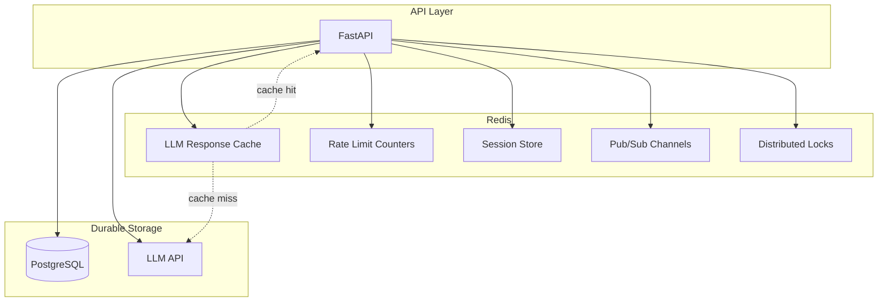
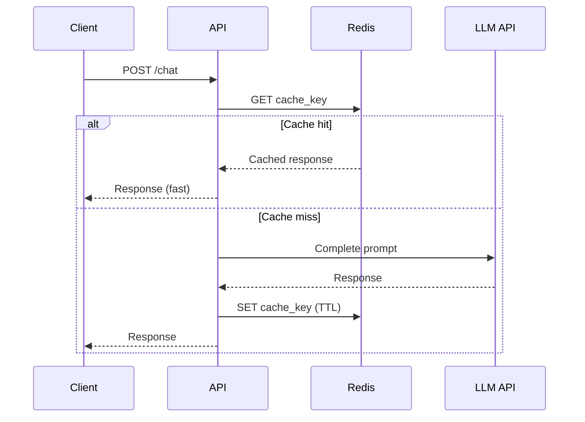
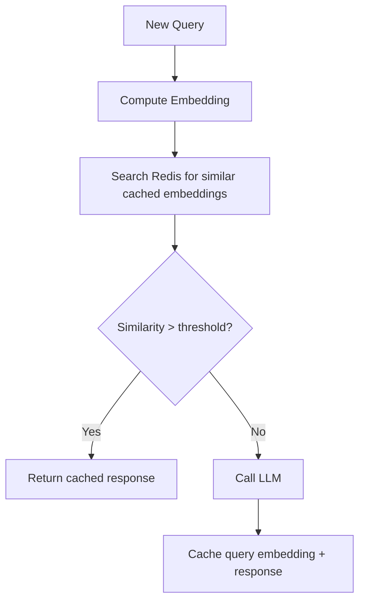
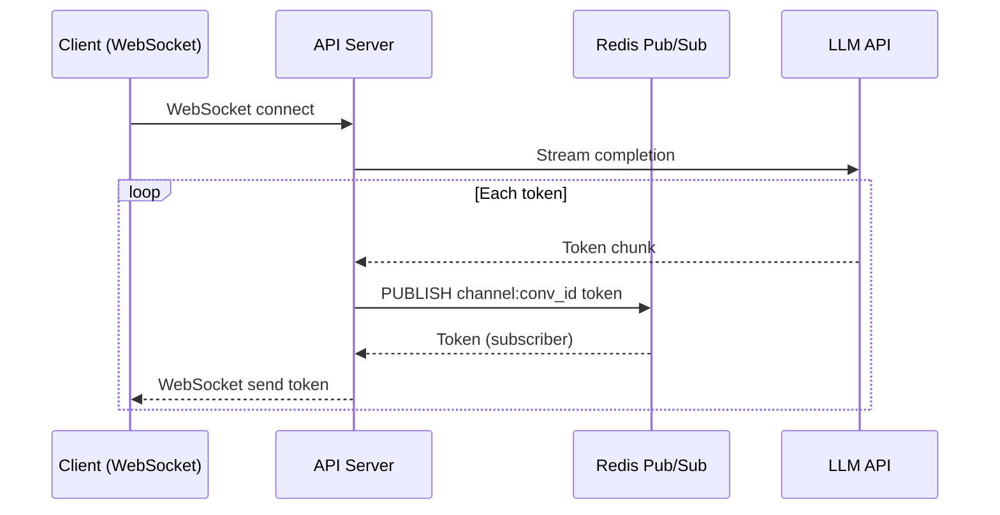

# Redis for AI

> Redis patterns for AI applications — caching expensive LLM calls, rate limiting API usage, streaming responses, and managing ephemeral agent state at sub-millisecond latency.

## Table of Contents

- [Why Redis for AI](#why-redis-for-ai)
- [Architecture Patterns](#architecture-patterns)
- [LLM Response Caching](#llm-response-caching)
- [Semantic Caching](#semantic-caching)
- [Rate Limiting](#rate-limiting)
- [Session Management](#session-management)
- [Pub/Sub for Streaming](#pubsub-for-streaming)
- [Distributed Locks](#distributed-locks)
- [Job Queues](#job-queues)
- [Data Structures Reference](#data-structures-reference)
- [Python Client Patterns](#python-client-patterns)
- [Production Configuration](#production-configuration)
- [Common Mistakes](#common-mistakes)
- [Interview Preparation](#interview-preparation)
- [Navigation](#navigation)

---

## Why Redis for AI

Redis is an in-memory data store that provides microsecond-latency reads and writes. In AI applications, it sits between your API and expensive external services (LLMs, embedding APIs) to reduce cost, enforce limits, and improve response times.

| Use Case | Without Redis | With Redis |
|----------|--------------|------------|
| Repeated identical prompts | Full LLM call ($$, 2-10s) | Cache hit (<1ms) |
| 1000 concurrent users | DB connection exhaustion | Rate-limited, graceful 429s |
| Streaming chat to UI | Polling PostgreSQL | Pub/Sub push to WebSocket |
| Agent tool coordination | Race conditions | Distributed locks |
| Session state | PostgreSQL reads on every request | In-memory hash lookup |

> **Critical rule:** Redis is for **ephemeral, fast data**. Never use it as your primary data store. PostgreSQL remains the source of truth for durable state. See [Databases for AI Applications](../databases-for-ai-applications.md).

---

## Architecture Patterns



### Request Flow with Cache



---

## LLM Response Caching

Cache deterministic LLM responses to avoid redundant API calls. Key the cache on model, prompt, system message, and relevant parameters.

### Cache Key Design

```python
import hashlib
import json


def llm_cache_key(
    model: str,
    messages: list[dict],
    temperature: float = 0.0,
    prompt_version: str = "v1",
) -> str:
    payload = json.dumps(
        {
            "model": model,
            "messages": messages,
            "temperature": temperature,
            "prompt_version": prompt_version,
        },
        sort_keys=True,
    )
    return f"llm:{hashlib.sha256(payload.encode()).hexdigest()}"
```

> **Include `prompt_version` in the cache key.** When you update a prompt template, old cached responses must not be served.

### Cache-Aside Pattern

```python
import redis.asyncio as redis


class LLMCache:
    def __init__(self, redis_client: redis.Redis, default_ttl: int = 3600):
        self._redis = redis_client
        self._ttl = default_ttl

    async def get(self, key: str) -> str | None:
        return await self._redis.get(key)

    async def set(self, key: str, response: str, ttl: int | None = None) -> None:
        await self._redis.set(key, response, ex=ttl or self._ttl)

    async def invalidate_pattern(self, pattern: str) -> int:
        keys = []
        async for key in self._redis.scan_iter(match=pattern, count=100):
            keys.append(key)
        if keys:
            return await self._redis.delete(*keys)
        return 0
```

### When to Cache

| Cache? | Scenario |
|--------|----------|
| Yes | `temperature=0`, identical prompts, FAQ responses |
| Yes | Embedding results (same text → same vector) |
| No | `temperature > 0` with creative outputs |
| No | Responses containing timestamps or user-specific data |
| No | Tool-augmented responses with live data |
| Maybe | RAG responses — cache with document version in key |

### Embedding Cache

```python
async def get_or_compute_embedding(
    redis_client: redis.Redis,
    embed_fn,
    text: str,
    model: str = "text-embedding-3-small",
) -> list[float]:
    key = f"emb:{model}:{hashlib.sha256(text.encode()).hexdigest()}"
    cached = await redis_client.get(key)
    if cached:
        return json.loads(cached)

    embedding = await embed_fn(text)
    await redis_client.set(key, json.dumps(embedding), ex=86400)
    return embedding
```

---

## Semantic Caching

Semantic caching stores responses keyed by embedding similarity, not exact string match. A new query that is semantically similar to a cached query returns the cached response without an LLM call.



### Implementation Sketch

```python
import numpy as np


async def semantic_cache_lookup(
    redis_client: redis.Redis,
    query_embedding: list[float],
    threshold: float = 0.95,
) -> str | None:
    best_match = None
    best_score = 0.0

    async for key in redis_client.scan_iter(match="sem_cache:*", count=50):
        data = await redis_client.hgetall(key)
        if not data:
            continue
        cached_embedding = json.loads(data[b"embedding"])
        score = cosine_similarity(query_embedding, cached_embedding)
        if score > best_score:
            best_score = score
            best_match = data[b"response"].decode()

    return best_match if best_score >= threshold else None


def cosine_similarity(a: list[float], b: list[float]) -> float:
    a_arr, b_arr = np.array(a), np.array(b)
    return float(np.dot(a_arr, b_arr) / (np.linalg.norm(a_arr) * np.linalg.norm(b_arr)))
```

> **Production note:** Scanning all cached embeddings does not scale. For production semantic caching, use a vector index (Redis Stack with vector search, or a dedicated vector DB). Deep patterns are covered in the [RAG domain](../../rag/README.md).

### TTL Strategy for Semantic Cache

| Content Type | TTL | Rationale |
|-------------|-----|-----------|
| FAQ / static knowledge | 24h–7d | Rarely changes |
| RAG responses | 1h–4h | Source documents may update |
| Agent tool results | 5–15min | Live data goes stale |
| User-specific answers | Do not cache | Personalization |

---

## Rate Limiting

Protect LLM API budgets and ensure fair usage with Redis atomic counters.

### Fixed Window

```python
async def check_rate_limit(
    redis_client: redis.Redis,
    user_id: str,
    limit: int = 60,
    window_seconds: int = 60,
) -> tuple[bool, int]:
    key = f"rate:{user_id}:{int(time.time()) // window_seconds}"
    current = await redis_client.incr(key)
    if current == 1:
        await redis_client.expire(key, window_seconds)
    return current <= limit, limit - current
```

### Sliding Window (More Accurate)

```python
async def sliding_window_rate_limit(
    redis_client: redis.Redis,
    user_id: str,
    limit: int = 100,
    window_seconds: int = 3600,
) -> bool:
    key = f"rate_sliding:{user_id}"
    now = time.time()
    window_start = now - window_seconds

    pipe = redis_client.pipeline()
    pipe.zremrangebyscore(key, 0, window_start)
    pipe.zadd(key, {str(now): now})
    pipe.zcard(key)
    pipe.expire(key, window_seconds)
    _, _, count, _ = await pipe.execute()

    return count <= limit
```

### Tiered Rate Limits

```python
RATE_LIMITS = {
    "free": {"requests_per_minute": 10, "tokens_per_day": 50_000},
    "pro": {"requests_per_minute": 60, "tokens_per_day": 500_000},
    "enterprise": {"requests_per_minute": 300, "tokens_per_day": 5_000_000},
}


async def check_tiered_limits(redis_client: redis.Redis, user_id: str, tier: str) -> bool:
    limits = RATE_LIMITS[tier]
    req_ok, _ = await check_rate_limit(redis_client, user_id, limits["requests_per_minute"])
    token_key = f"tokens_daily:{user_id}"
    daily_tokens = int(await redis_client.get(token_key) or 0)
    return req_ok and daily_tokens < limits["tokens_per_day"]
```

### FastAPI Middleware

```python
from fastapi import Request, HTTPException


async def rate_limit_middleware(request: Request, call_next):
    user_id = request.state.user_id
    allowed, remaining = await check_rate_limit(redis_client, user_id)
    if not allowed:
        raise HTTPException(
            status_code=429,
            detail="Rate limit exceeded",
            headers={"Retry-After": "60", "X-RateLimit-Remaining": "0"},
        )
    response = await call_next(request)
    response.headers["X-RateLimit-Remaining"] = str(remaining)
    return response
```

---

## Session Management

Store user session data in Redis hashes for fast lookup without hitting PostgreSQL on every request.

```python
async def create_session(
    redis_client: redis.Redis,
    user_id: str,
    session_data: dict,
    ttl: int = 86400,
) -> str:
    session_id = str(uuid4())
    key = f"session:{session_id}"
    await redis_client.hset(key, mapping={
        "user_id": user_id,
        "data": json.dumps(session_data),
        "created_at": str(time.time()),
    })
    await redis_client.expire(key, ttl)
    return session_id


async def get_session(redis_client: redis.Redis, session_id: str) -> dict | None:
    key = f"session:{session_id}"
    data = await redis_client.hgetall(key)
    if not data:
        return None
    return {
        "user_id": data[b"user_id"].decode(),
        "data": json.loads(data[b"data"]),
    }
```

### Conversation Context Window

Store the active conversation's recent messages in Redis for fast context assembly before the LLM call:

```python
async def push_message(
    redis_client: redis.Redis,
    conversation_id: str,
    message: dict,
    max_messages: int = 20,
) -> None:
    key = f"ctx:{conversation_id}"
    pipe = redis_client.pipeline()
    pipe.rpush(key, json.dumps(message))
    pipe.ltrim(key, -max_messages, -1)
    pipe.expire(key, 3600)
    await pipe.execute()


async def get_context(redis_client: redis.Redis, conversation_id: str) -> list[dict]:
    key = f"ctx:{conversation_id}"
    messages = await redis_client.lrange(key, 0, -1)
    return [json.loads(m) for m in messages]
```

> Persist messages to PostgreSQL asynchronously. Redis holds the hot context window; PostgreSQL holds the full history.

---

## Pub/Sub for Streaming

Redis Pub/Sub enables real-time streaming of LLM tokens to connected clients via WebSockets.



### Publisher (Token Stream)

```python
async def stream_to_redis(
    redis_client: redis.Redis,
    channel: str,
    token_stream,
) -> str:
    full_response = []
    async for token in token_stream:
        full_response.append(token)
        await redis_client.publish(channel, token)
    await redis_client.publish(channel, "[DONE]")
    return "".join(full_response)
```

### Subscriber (WebSocket Relay)

```python
async def relay_stream(redis_client: redis.Redis, channel: str, websocket):
    pubsub = redis_client.pubsub()
    await pubsub.subscribe(channel)
    async for message in pubsub.listen():
        if message["type"] != "message":
            continue
        data = message["data"].decode()
        if data == "[DONE]":
            break
        await websocket.send_text(data)
    await pubsub.unsubscribe(channel)
```

---

## Distributed Locks

Prevent duplicate processing when multiple workers handle the same embedding or agent task.

```python
import uuid


async def acquire_lock(
    redis_client: redis.Redis,
    resource: str,
    ttl: int = 30,
) -> str | None:
    lock_id = str(uuid4())
    acquired = await redis_client.set(
        f"lock:{resource}", lock_id, nx=True, ex=ttl
    )
    return lock_id if acquired else None


async def release_lock(
    redis_client: redis.Redis, resource: str, lock_id: str
) -> bool:
    key = f"lock:{resource}"
    current = await redis_client.get(key)
    if current and current.decode() == lock_id:
        await redis_client.delete(key)
        return True
    return False
```

### Usage: Prevent Duplicate Embedding

```python
async def embed_document(redis_client: redis.Redis, document_id: str) -> None:
    lock_id = await acquire_lock(redis_client, f"embed:{document_id}", ttl=120)
    if not lock_id:
        return  # another worker is processing

    try:
        await _do_embedding(document_id)
    finally:
        await release_lock(redis_client, f"embed:{document_id}", lock_id)
```

---

## Job Queues

Redis lists or streams serve as lightweight job queues for async AI tasks (document ingestion, batch embedding, evaluation runs).

### Simple Queue with Lists

```python
async def enqueue_job(redis_client: redis.Redis, queue: str, job: dict) -> None:
    await redis_client.lpush(f"queue:{queue}", json.dumps(job))


async def process_jobs(redis_client: redis.Redis, queue: str, handler):
    while True:
        _, raw = await redis_client.brpop(f"queue:{queue}", timeout=5)
        if raw is None:
            continue
        job = json.loads(raw)
        try:
            await handler(job)
        except Exception:
            await redis_client.lpush(f"queue:{queue}:dead", raw)
```

### Queue with Redis Streams (More Robust)

```python
async def enqueue_stream(redis_client: redis.Redis, stream: str, job: dict) -> str:
    return await redis_client.xadd(stream, {"payload": json.dumps(job)})


async def consume_stream(redis_client: redis.Redis, stream: str, group: str, consumer: str):
    try:
        await redis_client.xgroup_create(stream, group, id="0", mkstream=True)
    except redis.ResponseError:
        pass  # group already exists

    while True:
        messages = await redis_client.xreadgroup(
            group, consumer, {stream: ">"}, count=1, block=5000
        )
        for _, entries in messages:
            for msg_id, data in entries:
                job = json.loads(data[b"payload"])
                await process_job(job)
                await redis_client.xack(stream, group, msg_id)
```

> For production job queues with retries, dead-letter queues, and scheduling, consider Celery, ARQ, or Temporal. Redis lists/streams work for simple async pipelines.

---

## Data Structures Reference

| Structure | AI Use Case | Key Commands |
|-----------|------------|--------------|
| **String** | LLM cache, rate limit counters | `GET`, `SET`, `INCR`, `EXPIRE` |
| **Hash** | Session data, agent state | `HSET`, `HGET`, `HGETALL` |
| **List** | Message context window, simple queues | `RPUSH`, `LRANGE`, `LTRIM` |
| **Set** | Unique document IDs being processed | `SADD`, `SISMEMBER` |
| **Sorted Set** | Sliding window rate limits, leaderboards | `ZADD`, `ZREMRANGEBYSCORE`, `ZCARD` |
| **Pub/Sub** | Token streaming to WebSockets | `PUBLISH`, `SUBSCRIBE` |
| **Stream** | Reliable job queues | `XADD`, `XREADGROUP`, `XACK` |

---

## Python Client Patterns

### Connection Setup

```python
import redis.asyncio as redis


def create_redis_pool(redis_url: str) -> redis.Redis:
    return redis.from_url(
        redis_url,
        max_connections=50,
        decode_responses=False,  # handle bytes explicitly
        socket_timeout=5.0,
        socket_connect_timeout=5.0,
        retry_on_timeout=True,
    )
```

### FastAPI Lifespan

```python
from contextlib import asynccontextmanager
from fastapi import FastAPI


@asynccontextmanager
async def lifespan(app: FastAPI):
    app.state.redis = create_redis_pool(settings.redis_url)
    yield
    await app.state.redis.aclose()


app = FastAPI(lifespan=lifespan)


def get_redis(request: Request) -> redis.Redis:
    return request.app.state.redis
```

### Pipeline for Batch Operations

```python
async def batch_cache_get(redis_client: redis.Redis, keys: list[str]) -> dict[str, str | None]:
    pipe = redis_client.pipeline()
    for key in keys:
        pipe.get(key)
    results = await pipe.execute()
    return dict(zip(keys, results))
```

---

## Production Configuration

### Memory Management

```conf
# redis.conf
maxmemory 2gb
maxmemory-policy allkeys-lru    # evict least recently used keys
```

| Policy | Behavior | AI App Fit |
|--------|----------|------------|
| `allkeys-lru` | Evict any key by LRU | General caching |
| `volatile-lru` | Evict keys with TTL by LRU | When some keys must persist |
| `noeviction` | Return errors when full | Rate limiting (never silently drop limits) |

> Use `noeviction` for rate-limit keys. Use `allkeys-lru` for cache keys. Separate Redis instances if needed.

### High Availability

| Setup | Use Case |
|-------|----------|
| Single instance | Development |
| Redis Sentinel | Production failover (automatic) |
| Redis Cluster | Horizontal scaling, > RAM of one machine |
| ElastiCache / Memorystore | Managed cloud Redis |

### Monitoring

| Metric | Alert |
|--------|-------|
| Memory usage | > 80% of maxmemory |
| Connected clients | > 80% of maxclients |
| Evicted keys/sec | > 0 (cache too small) |
| Commands/sec latency | p99 > 5ms |
| Replication lag | > 1 second |

### Health Check

```python
@router.get("/health/redis")
async def redis_health(redis_client: redis.Redis = Depends(get_redis)):
    try:
        pong = await redis_client.ping()
        return {"status": "ok", "redis": pong}
    except redis.ConnectionError:
        raise HTTPException(status_code=503, detail="Redis unavailable")
```

### Security

- Enable TLS in production (`rediss://` URL scheme).
- Use ACLs to restrict commands per application user.
- Never expose Redis port to the public internet.
- Auth token via environment variable, not in code.

---

## Common Mistakes

| Mistake | Impact | Fix |
|---------|--------|-----|
| Using Redis as primary data store | Data loss on eviction/restart | PostgreSQL for durable state |
| No TTL on cache keys | Memory exhaustion | Always set `EX` on cache writes |
| Caching without prompt version in key | Stale responses after prompt update | Include version in cache key |
| `KEYS *` in production | Blocks Redis entirely | Use `SCAN` for iteration |
| Same Redis for cache and rate limits | Cache eviction breaks rate limiting | Separate instances or key prefixes with different policies |
| Not handling cache stampede | Thundering herd on cache expiry | Lock-based regeneration or stale-while-revalidate |
| Storing large values (>1 MB) | Memory pressure, slow operations | Keep values small; store references to S3 for large data |
| Ignoring connection pooling | Connection exhaustion | `max_connections` on redis-py pool |

---

## Interview Preparation

### Frequently Asked Questions

**Q1: How would you use Redis in an AI chat application?**

> **Strong answer:** Three roles: (1) LLM response cache keyed on model + messages hash with TTL and prompt version, (2) rate limiting with sliding window counters per user tier, (3) conversation context window as a Redis list for fast context assembly. Pub/Sub for streaming tokens to WebSocket clients. All durable state (full message history, user data) in PostgreSQL.

**Q2: How do you prevent cache stampede when a popular cache key expires?**

> **Strong answer:** Lock-based regeneration: on cache miss, acquire a Redis lock for that key; only one worker regenerates while others wait or return stale data (stale-while-revalidate). Alternatively, probabilistic early expiration — refresh cache before TTL expires based on random probability.

**Q3: What is semantic caching and when would you use it?**

> **Strong answer:** Cache responses by embedding similarity instead of exact string match. A query like "What is ML?" hits the cache for "Explain machine learning." Useful for FAQ-style AI apps with high query repetition. At scale, use Redis Stack vector search or a dedicated vector DB — not brute-force scan. See [RAG domain](../../rag/README.md) for production patterns.

**Q4: How do you implement rate limiting for LLM API cost control?**

> **Strong answer:** Redis atomic counters with TTL for per-minute request limits. Separate daily token budget counter. Tiered limits by user plan. Return 429 with `Retry-After` header. Track token usage in PostgreSQL for billing; Redis for real-time enforcement. Use `noeviction` policy for rate-limit keys so they are never silently dropped.

### Real-World Scenario

**Scenario:** Your AI app's Redis memory hits 100%, and rate limiting stops working correctly — some users get unlimited requests.

> **Discussion points:**
> 1. Root cause: `allkeys-lru` evicted rate-limit keys.
> 2. Fix: separate Redis instances — one with `noeviction` for rate limits, one with `allkeys-lru` for cache.
> 3. Or: use key prefixes and ensure rate-limit keys have no TTL while cache keys do.
> 4. Add memory alerts at 80%.
> 5. Audit key sizes — someone may be caching full LLM responses with huge context.

---

## Navigation

### Prerequisites

- [Databases for AI Applications](../databases-for-ai-applications.md)
- [Software Engineering for AI](../../foundations/software-engineering-for-ai.md)

### Related Topics

- [PostgreSQL for AI](../postgresql/postgresql-for-ai.md)
- [Backend Fundamentals for AI](../../backend-engineering/backend-fundamentals-for-ai.md)
- [RAG Domain](../../rag/README.md) — semantic caching at scale
- [Performance Optimization Domain](../../performance-optimization/README.md)

### Next Topics

- [RAG Domain](../../rag/README.md)
- [Observability Domain](../../observability/README.md) — monitoring Redis

---

## See Also

- [Redis Subdomain README](README.md)
- [Databases Domain README](../README.md)
- [Master Index](../../../meta/indexes/MASTER-INDEX.md)

## Changelog

| Version | Date | Changes |
|---------|------|---------|
| 1.0 | 2026-07-13 | Initial version |
