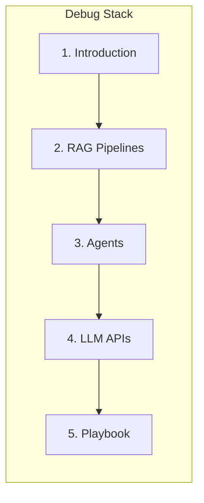

# Debugging

> Engineering handbook for diagnosing non-deterministic failures in LLM apps, RAG pipelines, agents, and provider APIs.
> **Related:** [RAG](../rag/README.md) · [AI Agents](../ai-agents/README.md) · [Common Mistakes](../common-mistakes/README.md) · [AI Deployment](../ai-deployment/README.md)

---

## Module Overview

Debugging AI systems is different from debugging deterministic backends: the same input can yield different outputs, failures hide inside prompts and retrieval, and “correct code” can still produce wrong answers.

**Unlocks:** Faster incident response, better eval loops, and fewer silent quality regressions in production AI.

---

## Documents

| # | Document | Status | Description |
|---|----------|--------|-------------|
| 1 | [Introduction to AI Debugging](introduction-to-ai-debugging.md) | Published | How debugging AI apps differs — non-determinism, prompts, retrieval, tools |
| 2 | [Debugging RAG Pipelines](debugging-rag-pipelines.md) | Published | Empty retrieval, wrong chunks, hallucinations, citation failures |
| 3 | [Debugging Agents](debugging-agents.md) | Published | Loop detection, tool failures, bad plans |
| 4 | [Debugging LLM APIs](debugging-llm-apis.md) | Published | Timeouts, rate limits, schema failures, streaming issues |
| 5 | [AI Debugging Playbook](ai-debugging-playbook.md) | Published | Step-by-step triage flowchart and checklist |

---

## Learning Path

1. Read [Introduction to AI Debugging](introduction-to-ai-debugging.md) for the mental model and instrumentation baseline.
2. Specialize by failure mode: [RAG](debugging-rag-pipelines.md), [Agents](debugging-agents.md), or [LLM APIs](debugging-llm-apis.md).
3. Use the [AI Debugging Playbook](ai-debugging-playbook.md) during incidents and on-call.

---

## Related Domains

| Domain | Why it matters |
|--------|----------------|
| [RAG](../rag/README.md) | Retrieval, citations, hallucination prevention |
| [AI Agents](../ai-agents/README.md) | Planning, tools, state, production agents |
| [Common Mistakes](../common-mistakes/README.md) | Recurring engineering failure patterns |
| [AI Deployment](../ai-deployment/README.md) | Observability, reliability, monitoring |
| [Logging](../logging/README.md) | Structured logs and correlation IDs |
| [AI Evaluation](../ai-evaluation/README.md) | Offline/online metrics that catch regressions |

## Templates

When adding content to this domain, use the appropriate [template](../../meta/templates/):

- Concept → `concept.md`
- Technology → `technology.md`
- Tutorial → `tutorial.md`
- Production Guide → `production-guide.md`
- Troubleshooting → `troubleshooting-guide.md`

## See Also

- [Master Index](../../meta/indexes/MASTER-INDEX.md)
- [Learning Roadmap](../../meta/roadmap.md)
- [Contributing Guide](../../CONTRIBUTING.md)
