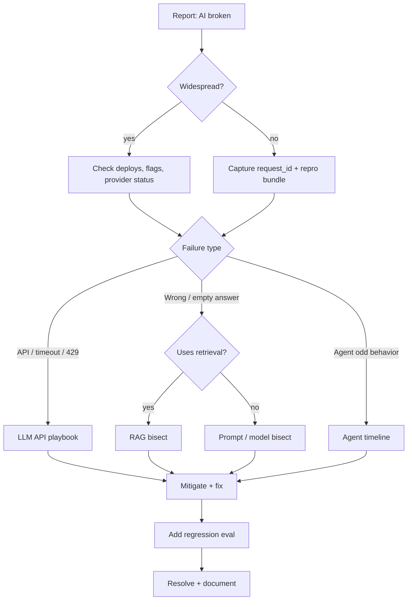

# AI Debugging Playbook

> On-call playbook: classify the failure, bisect the pipeline, stabilize, fix, and lock the lesson into evals. Use this doc during incidents; use the specialty guides for deep dives.

## Table of Contents

- [60-Second Triage](#60-second-triage)
- [Master Flowchart](#master-flowchart)
- [Step-by-Step Procedure](#step-by-step-procedure)
- [Incident Checklist](#incident-checklist)
- [Severity and Communication](#severity-and-communication)
- [After-Action](#after-action)
- [Practical Takeaways](#practical-takeaways)
- [Navigation](#navigation)

---

## 60-Second Triage

Answer these immediately:

1. **Blast radius** — one user, one tenant, or everyone?
2. **Hard vs soft** — HTTP/errors vs wrong answers?
3. **Started when** — deploy, model change, index rebuild, traffic spike?
4. **Path** — chat only, RAG, agent/tools, streaming?
5. **Provider health** — status page / elevated 429/5xx?

| If… | Jump to |
|-----|---------|
| 5xx / timeouts / 429 | [Debugging LLM APIs](debugging-llm-apis.md) |
| Nonsense with docs | [Debugging RAG](debugging-rag-pipelines.md) |
| Loops / bad tool use | [Debugging Agents](debugging-agents.md) |
| Format / instruction drift | Prompt dump + [Introduction](introduction-to-ai-debugging.md) |

---

## Master Flowchart



---

## Step-by-Step Procedure

### 1. Stabilize user impact

- Enable feature flag off or read-only mode if tools are unsafe
- Fail over model / region if provider is down
- Rate-limit abusive tenants causing 429 storms

### 2. Grab evidence

Collect for one failing `request_id`:

- [ ] Gateway logs and status
- [ ] Final prompt + params (redacted)
- [ ] Retrieval hits (IDs, scores, previews)
- [ ] Tool event timeline
- [ ] Raw completion / stream meta / `finish_reason`
- [ ] Guardrail decisions

### 3. Bisect

```text
auth/tenant → prompt assembly → retrieval → LLM API → tools/agent loop → filters → UI
```

Stop at the first stage that disagrees with expectation. Do not skip ahead to prompt poetry.

### 4. Hypothesize and test one change

Change **one** variable: filter, `top_k`, schema, timeout, tool description, temperature. Re-run the repro bundle.

### 5. Mitigate then root-cause

Ship the safe mitigation (flag, threshold, failover) before a perfect root-cause essay.

### 6. Permanently fix

Code/config/prompt/index change behind review; add monitoring if a blind spot caused delay.

### 7. Lock in

Add an offline eval or alert so the failure cannot return silently ([AI Evaluation](../ai-evaluation/README.md), [Common Mistakes](../common-mistakes/common-engineering-mistakes.md)).

---

## Incident Checklist

### Discovery

- [ ] Severity assigned; incident channel opened
- [ ] Recent changes listed (prompt, model, index, tools, infra)
- [ ] Provider status checked
- [ ] Error rate / latency / cost dashboards open

### Diagnosis

- [ ] Failure class labeled (API / RAG / agent / prompt / filter)
- [ ] Repro bundle stored
- [ ] Sampling stabilized for local repro (`temperature=0` if applicable)
- [ ] Specialty guide followed (RAG / agents / APIs)

### Mitigation

- [ ] User-facing mitigation applied
- [ ] Tool write paths disabled if abuse suspected
- [ ] Stakeholders updated

### Resolution

- [ ] Root cause written in 5–10 lines
- [ ] Fix merged / config rolled forward
- [ ] Eval or monitor added
- [ ] Incident closed with links to traces

---

## Severity and Communication

| Sev | Example | Comms |
|-----|---------|-------|
| SEV1 | All completions fail / data-mutating tool storm | Immediate page; status page |
| SEV2 | Elevated 429/timeouts or systematic wrong RAG | Incident channel; hourly updates |
| SEV3 | Single-tenant quality regression | Ticket; next business day fix OK |
| SEV4 | Cosmetic / rare edge | Backlog |

Never paste raw customer PII into public Slack; use redacted traces ([Observability for AI](../ai-deployment/observability-for-ai.md)).

---

## After-Action

1. Timeline of detection → mitigation → fix
2. Why detection was slow (missing metric?)
3. Preventive change owners + dates
4. Link related domain docs for the next on-call

Cross-links: [RAG](../rag/README.md) · [AI Agents](../ai-agents/README.md) · [AI Deployment](../ai-deployment/README.md) · [Reliability](../ai-deployment/reliability-for-ai.md).

---

## Practical Takeaways

1. **Classify before you tweak prompts.**
2. **One request_id end-to-end** beats vague screenshots.
3. **Mitigate first** when users are bleeding.
4. **Bisect stages** with the flowchart above.
5. **Every incident deserves an eval or alert.**

---

## Navigation

- Prev: [Debugging LLM APIs](debugging-llm-apis.md)
- Hub: [Debugging](README.md)
- Specialty: [RAG](debugging-rag-pipelines.md) · [Agents](debugging-agents.md) · [LLM APIs](debugging-llm-apis.md)
- Related: [Introduction](introduction-to-ai-debugging.md) · [Common Mistakes](../common-mistakes/README.md) · [AI Deployment](../ai-deployment/README.md)

---

## Changelog

| Version | Date | Changes |
|---------|------|---------|
| 1.0 | 2026-07-23 | Initial published handbook |
