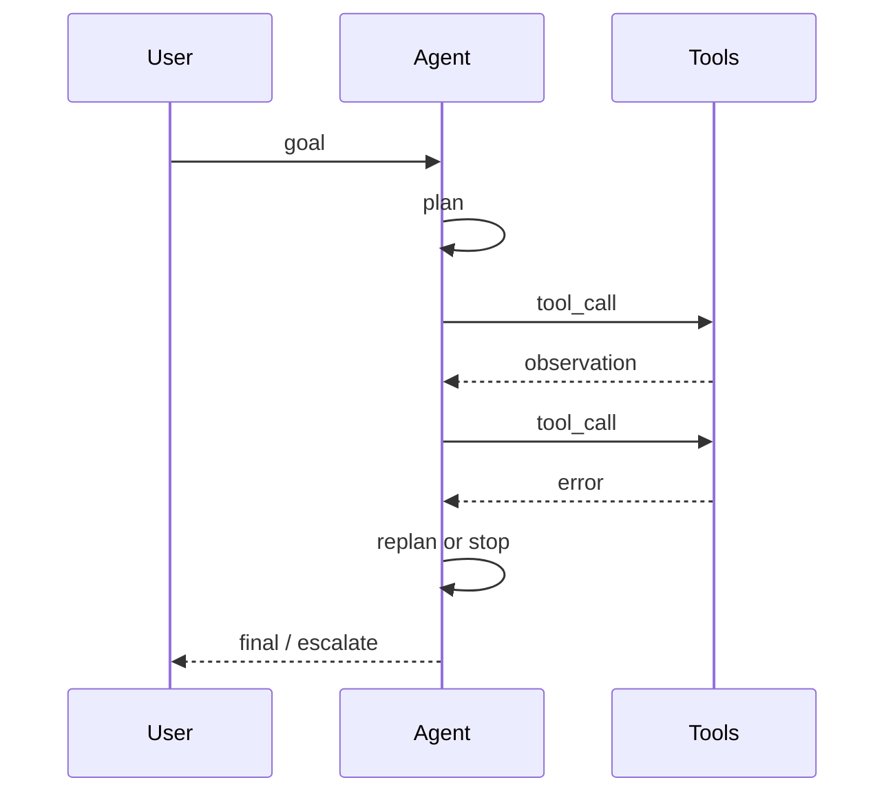
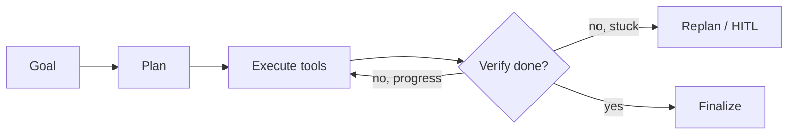
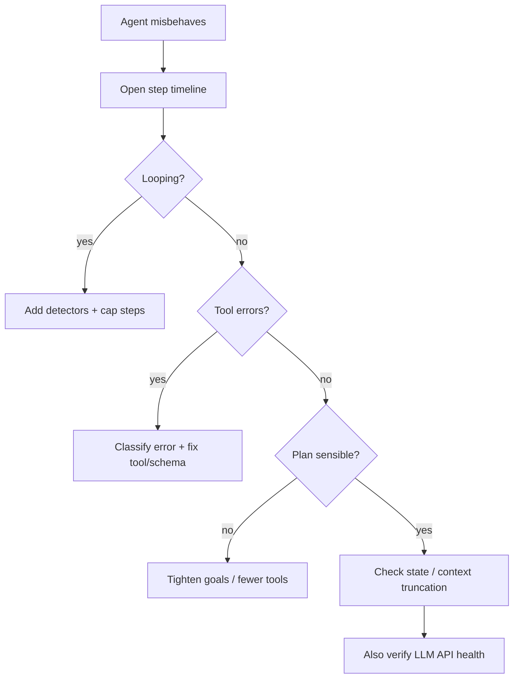

# Debugging Agents

> Agent bugs are usually **control-flow bugs**: loops, wrong tools, invalid args, or plans that never terminate. Debug the timeline of thoughts and tool events, not a single completion.

## Table of Contents

- [What Good Agent Traces Look Like](#what-good-agent-traces-look-like)
- [Loop Detection](#loop-detection)
- [Tool Failures](#tool-failures)
- [Bad Plans](#bad-plans)
- [State and Memory Issues](#state-and-memory-issues)
- [Triage Flow](#triage-flow)
- [Practical Takeaways](#practical-takeaways)
- [Common Mistakes](#common-mistakes)
- [Navigation](#navigation)

---

## What Good Agent Traces Look Like

Per run, persist an ordered event log:

| Event | Fields |
|-------|--------|
| `plan` | goals, steps (if explicit) |
| `llm_step` | messages summary, finish reason |
| `tool_call` | name, args, latency, ok/error |
| `observation` | truncated result |
| `decision` | continue / stop / HITL |
| `final` | answer or failure code |

Without this, [Tool Use](../ai-agents/tool-use.md) and planning issues are invisible. Align with [Observability for AI](../ai-deployment/observability-for-ai.md).

---

## Loop Detection

Symptoms: repeated identical tool calls, oscillating args, step count → max, huge bills.

| Detector | Signal |
|----------|--------|
| Exact repeat | Same tool + same args hash N times |
| Near repeat | Same tool, args edit distance low |
| No progress | Goal checklist unchanged for K steps |
| Token/step caps | Hard max steps / wall clock |

Mitigations:

1. Hard `max_steps` and `max_tool_calls`
2. Break on repeated failures with the same error
3. Force replan or HITL after N failures
4. Deduplicate tool results in context (context bloat → worse loops)

See [Agent Engineering Mistakes](../ai-agents/agent-engineering-mistakes.md).

---

## Tool Failures

Classify before retrying:

| Class | Examples | Action |
|-------|----------|--------|
| **Validation** | Schema fail, missing field | Fix planner/schema; do not blind retry |
| **AuthZ** | 403 | Stop; surface permission error |
| **Not found** | 404 | Replan with search; don’t thrash |
| **Transient** | 429, 503, timeout | Backoff + jitter; idempotency key |
| **Business** | “ticket closed” | Update state; change plan |
| **Sandbox** | OOM, egress blocked | Treat as environment bug |

Common root causes:

- Tool description lies (model picks wrong tool)
- Overlapping tools with similar names
- Unbounded tool output exploding context
- Retries on non-idempotent writes

Security angle when tools do surprising things: [Agent Security](../ai-agents/agent-security.md).

---

## Bad Plans

Symptoms: unnecessary tools, skipped prerequisites, premature final answer, infinite research.

Debug using [Agent Planning](../ai-agents/agent-planning.md) ideas:

1. Dump the plan (or inferred subgoals) at step 0
2. Check whether success criteria are explicit and measurable
3. Prefer smaller toolsets for the task (reduce choice overload)
4. Add structured plan → execute → verify phases
5. Evaluate with task success + step efficiency, not only final BLEU-like scores

---

## State and Memory Issues

| Bug | Symptom | Fix |
|-----|---------|-----|
| Lost state | Repeats work | Persist scratchpad / thread state |
| Stale state | Acts on old ticket status | Refresh before write tools |
| Poisoned memory | Bad fact reused | Memory TTL + source tags |
| Context overflow | Dropped instructions | Summarize old steps; keep tool schema |

---

## Triage Flow

Cross-check provider issues via [Debugging LLM APIs](debugging-llm-apis.md).

---

## Practical Takeaways

1. **Always capture a tool timeline.**
2. **Cap steps** — loops are a production inevitability.
3. **Classify tool errors** before retry.
4. **Shrink the tool surface** when plans are chaotic.
5. **Verify completion** against explicit success criteria.

---

## Common Mistakes

- Unlimited ReAct loops in production
- Retrying POST/DELETE on timeout without idempotency
- Dumping full HTML/JSON tool results back into context
- Debugging only the final message (“it said sorry”)
- Ignoring that injection can *cause* malicious tool plans

---

## Navigation

- Prev: [Debugging RAG Pipelines](debugging-rag-pipelines.md)
- Next: [Debugging LLM APIs](debugging-llm-apis.md)
- Related: [AI Agents](../ai-agents/README.md) · [Playbook](ai-debugging-playbook.md) · [Common Mistakes](../common-mistakes/README.md)

---

## Changelog

| Version | Date | Changes |
|---------|------|---------|
| 1.0 | 2026-07-23 | Initial published handbook |
