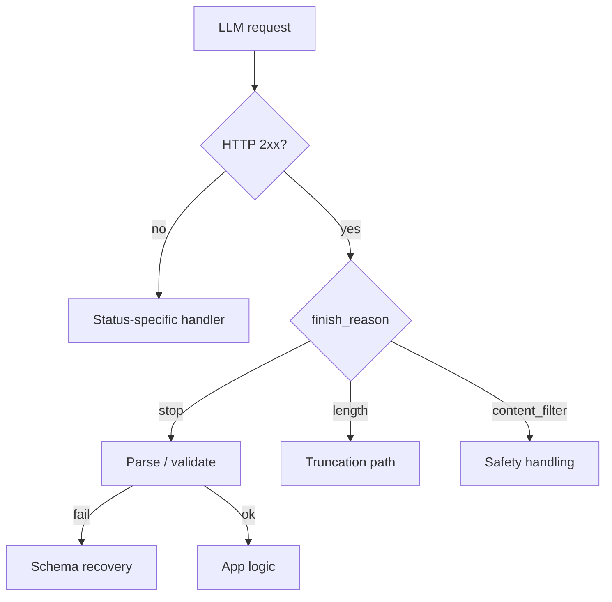
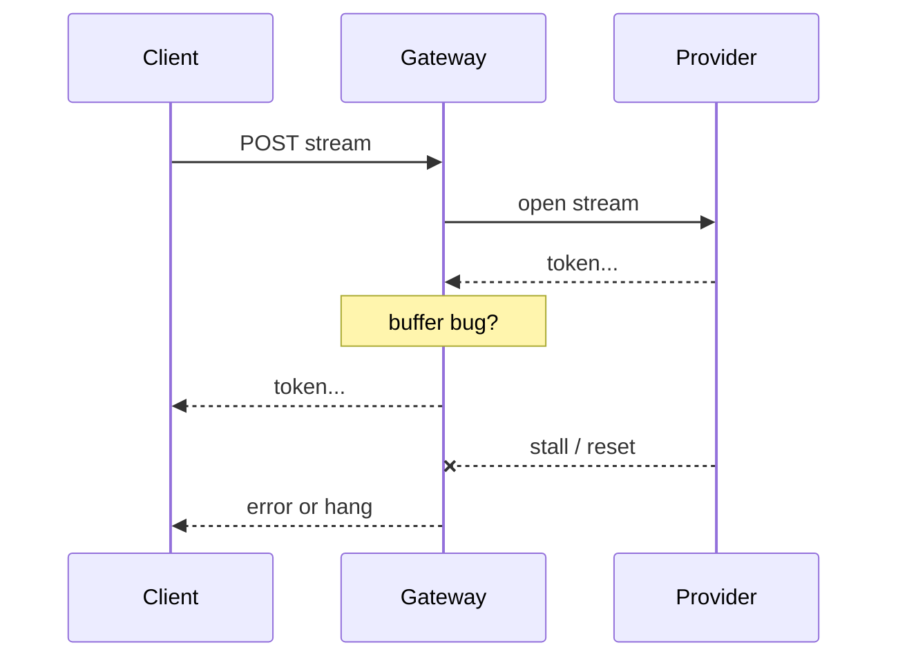

# Debugging LLM APIs

> Provider failures look like product bugs. Separate **transport/API errors** from **model quality**, and instrument status codes, finish reasons, and stream lifecycle.

## Table of Contents

- [Error Taxonomy](#error-taxonomy)
- [Timeouts](#timeouts)
- [Rate Limits](#rate-limits)
- [Schema and Structured Output Failures](#schema-and-structured-output-failures)
- [Streaming Issues](#streaming-issues)
- [Client Checklist](#client-checklist)
- [Practical Takeaways](#practical-takeaways)
- [Common Mistakes](#common-mistakes)
- [Navigation](#navigation)

---

## Error Taxonomy

| Class | Signals | First response |
|-------|---------|----------------|
| Auth | 401/403 | Key, org, project permissions |
| Rate limit | 429, `Retry-After` | Backoff, queues, lower concurrency |
| Overload | 503/529 | Retry with jitter; failover model |
| Timeout | client cancel / gateway 504 | Budgets, smaller prompts, streaming |
| Bad request | 400 | Payload size, illegal params |
| Content filter | finish / policy codes | Safety vs product expectation |
| Schema | parse errors | Constrained decoding / repair |
| Stream abort | incomplete SSE | Reconnect policy; partial UI |

Reliability patterns: [Reliability for AI](../ai-deployment/reliability-for-ai.md).

---

## Timeouts

### Layers that time out

1. Browser / mobile client
2. API gateway / load balancer
3. App server HTTP client
4. Provider

Misaligned budgets cause false failures: gateway kills at 30s while the model needs 45s.

### Debug steps

- Log `ttfb_ms` (time to first token) and `total_ms`
- Compare non-stream vs stream (streams often need longer total but healthier UX)
- Check prompt size / tool fan-out before blaming the provider
- Verify worker not blocked on sync SDK calls in an async server

Mitigations: streaming, smaller context, background jobs for long tasks, optimistic UI with progress.

---

## Rate Limits

Symptoms: intermittent 429s, rising latency, agent tool storms.

| Question | Why |
|----------|-----|
| Which quota? | RPM vs TPM vs organization |
| Whose key? | Shared key vs per-tenant |
| Burst vs sustained? | Need token bucket / queue |
| Retries amplifying? | Retry storms |

Practices:

- Honor `Retry-After`
- Exponential backoff + jitter
- Global and per-tenant concurrency caps
- Cache identical prompts where safe
- Separate batch workloads from interactive SLAs

---

## Schema and Structured Output Failures

Common when using tools or JSON modes:

| Failure | Cause | Fix |
|---------|-------|-----|
| Invalid JSON | Model drift / truncation | Constrained decoding; raise `max_tokens` |
| Missing fields | Weak schema / prompt | Stricter schema; examples |
| Wrong types | Loose coercion | Pydantic validation; reject |
| Hallucinated keys | Extra fields allowed | `additionalProperties: false` |
| Tool arg mismatch | Stale tool schema | Version schemas with deploys |

Recovery ladder:

1. Prefer provider structured outputs / JSON schema mode
2. One repair pass with validation errors as feedback
3. Fall back to safe default or HITL — do not infinite-repair

Log raw text (redacted) on schema failure for repro.

---

## Streaming Issues

See also [LLM Streaming](../llm-engineering/llm-streaming.md).

| Symptom | Likely cause |
|---------|--------------|
| No first token | Upstream queue / cold start / auth stall |
| Stalls mid-stream | Network; provider hiccup; proxy buffering |
| Duplicate tokens | Naive retry of partial stream |
| UI never finishes | Missing `done` handling; client disconnect |
| Tool calls mid-stream broken | Incomplete incremental argument parsing |
| Filter too late | Guardrails only at end → leaked partials |

Debug:

- Log chunk timestamps; detect gaps > N seconds
- Disable intermediary buffering (`X-Accel-Buffering`, reverse proxies)
- Test direct to provider vs through your gateway
- Define cancellation: client abort should cancel provider request

---

## Client Checklist

- [ ] Pin model IDs; log provider request IDs
- [ ] Timeouts set per attempt; overall deadline separate
- [ ] Retries only on idempotent / safe cases
- [ ] 429/5xx backoff with jitter and max attempts
- [ ] Validate structured outputs before side effects
- [ ] Surface `finish_reason` to metrics
- [ ] Circuit breaker + optional model failover
- [ ] Redact secrets in error payloads sent to clients

---

## Practical Takeaways

1. **Align timeout budgets** across every hop.
2. **Treat 429 as capacity design**, not a one-off retry.
3. **Validate schemas in code** after every structured call.
4. **Measure TTFB and stream gaps** for UX incidents.
5. **Keep provider request IDs** for support escalations.

---

## Common Mistakes

- Infinite retries on 400s
- One shared API key for all tenants without fair queuing
- Assuming stream success when the connection drops after partial tokens
- Ignoring `finish_reason=length` while parsing JSON
- Swallowing provider errors into generic “model failed”

---

## Navigation

- Prev: [Debugging Agents](debugging-agents.md)
- Next: [AI Debugging Playbook](ai-debugging-playbook.md)
- Related: [Reliability for AI](../ai-deployment/reliability-for-ai.md) · [Observability](../ai-deployment/observability-for-ai.md) · [Common Mistakes](../common-mistakes/README.md)

---

## Changelog

| Version | Date | Changes |
|---------|------|---------|
| 1.0 | 2026-07-23 | Initial published handbook |
