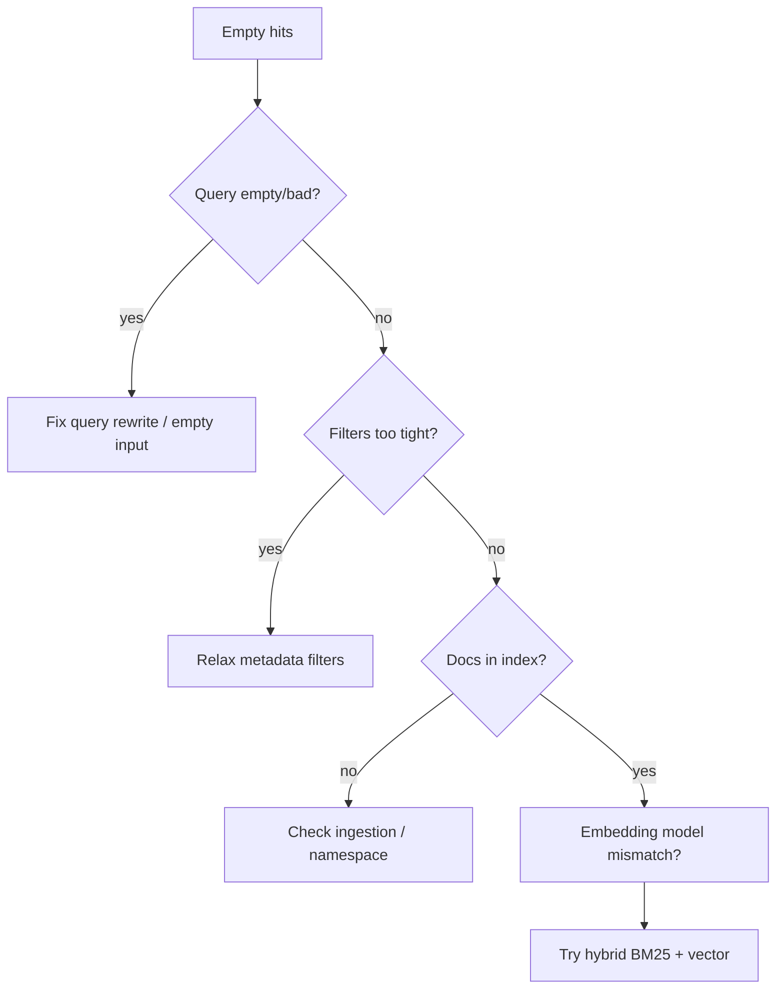
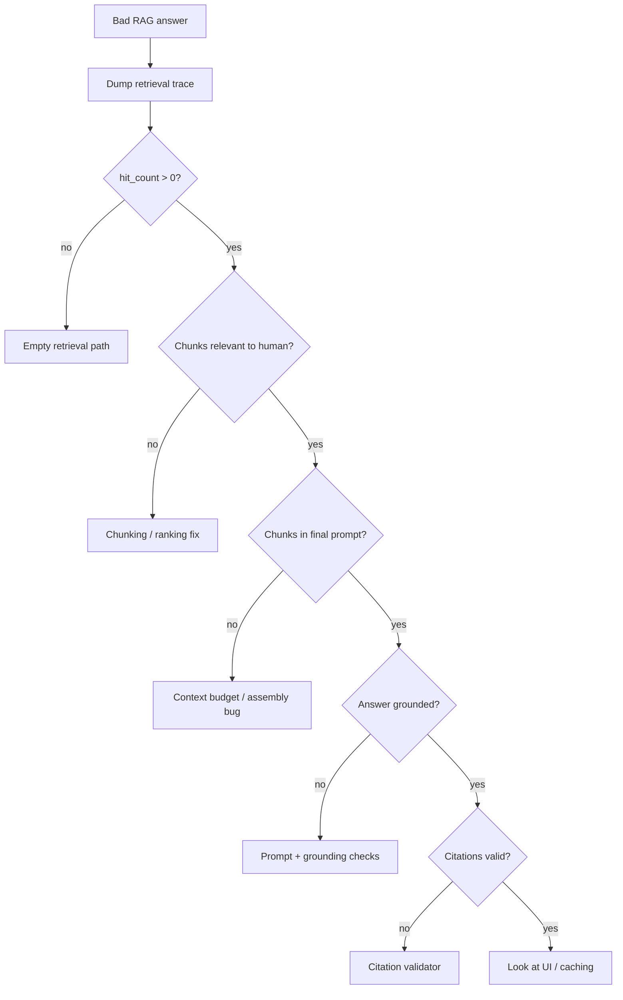

# Debugging RAG Pipelines

> Most “LLM hallucinations” in RAG products are **retrieval or grounding failures**. Debug the index and chunk path before rewriting the generator prompt.

## Table of Contents

- [Symptom → Likely Stage](#symptom--likely-stage)
- [Empty Retrieval](#empty-retrieval)
- [Wrong Chunks](#wrong-chunks)
- [Hallucinations with Context Present](#hallucinations-with-context-present)
- [Citation Failures](#citation-failures)
- [Diagnostic Flow](#diagnostic-flow)
- [Practical Takeaways](#practical-takeaways)
- [Common Mistakes](#common-mistakes)
- [Navigation](#navigation)

---

## Symptom → Likely Stage

| User symptom | Likely stage | First check |
|--------------|--------------|-------------|
| “I don’t know” / empty | Retrieval miss | Query, filters, index population |
| Confident wrong answer | Wrong chunks or ignore context | Top-k IDs + scores |
| Invented facts | Weak grounding / prompt | Groundedness eval |
| Broken or fake citations | Citation assembly | ID mapping, prompt instructions |
| Stale answers | Ingestion lag | Index freshness, versions |

Domain references: [Retrieval Strategies](../rag/retrieval-strategies.md) · [Hallucination Prevention](../rag/hallucination-prevention.md) · [Citations and Grounding](../rag/citations-and-grounding.md) · [RAG Mistakes](../rag/rag-mistakes.md).

---

## Empty Retrieval

### Checklist

- [ ] Correct collection / tenant namespace
- [ ] Ingestion job succeeded for the document
- [ ] Embedding model matches query model
- [ ] Metadata filters (`product`, `version`, ACL) not excluding everything
- [ ] Query rewrite not destroying keywords
- [ ] `top_k` and score threshold not zeroing results
- [ ] Hybrid search available for exact tokens (IDs, error codes)

Log `retrieval_hit_count`, filter payload, and rewritten query on every request.

---

## Wrong Chunks

Hits exist but are irrelevant or partial.

| Cause | Debug action |
|-------|--------------|
| Chunks too large | Mixed topics in one chunk → re-chunk |
| Chunks too small | Missing surrounding definitions |
| Bad metadata | Wrong doc type retrieved |
| Embedding drift | Re-embed after model change |
| Query-doc mismatch | HyDE / multi-query / rerank |
| Ranking only on vector | Add BM25 + reranker |

Inspect the actual chunk text shown to the model — not just IDs. If humans cannot answer from those chunks, the generator cannot either.

---

## Hallucinations with Context Present

Context is good; answer still invents.

1. Confirm chunks were **actually in the prompt** (truncation / budget bugs)
2. Check instruction: “answer only from context; say insufficient if missing”
3. Lower temperature; require citations
4. Add a grounding/post-check step (NLI or LLM-as-judge)
5. Prefer extractive spans for high-stakes fields (prices, dosages, SLAs)

See [Hallucination Prevention](../rag/hallucination-prevention.md).

---

## Citation Failures

| Failure | Cause | Fix |
|---------|-------|-----|
| Citation to missing ID | Model invents `[12]` | Constrain to provided IDs; validate |
| Citation ≠ claim | Weak linking | Force quote-then-cite pattern |
| Off-by-one / stale map | Prompt assembly bug | Stable chunk UIDs in assembly |
| UI 404 | Frontend maps wrong store | End-to-end ID contract test |

Validate citations in code: every cited ID ∈ retrieved set; optionally verify claim overlap.

---

## Diagnostic Flow

Promote each fixed failure into an offline eval case ([AI Evaluation](../ai-evaluation/README.md) / RAG eval docs).

---

## Practical Takeaways

1. **Read the chunks** before blaming the model.
2. **Separate miss vs wrong vs ignore-context** failures.
3. **Validate citations in software**, not by hope.
4. **Watch index freshness** after content updates.
5. **Hybrid + rerank** often beats another prompt revision.

---

## Common Mistakes

- Changing generator prompts when `hit_count == 0`
- Re-embedding with a new model but leaving old vectors
- Over-filtering by metadata in multi-tenant indexes
- Truncating context silently without metrics
- Showing citations that were never retrieved

---

## Navigation

- Prev: [Introduction to AI Debugging](introduction-to-ai-debugging.md)
- Next: [Debugging Agents](debugging-agents.md)
- Related: [RAG](../rag/README.md) · [Playbook](ai-debugging-playbook.md) · [Common Mistakes](../common-mistakes/README.md)

---

## Changelog

| Version | Date | Changes |
|---------|------|---------|
| 1.0 | 2026-07-23 | Initial published handbook |
