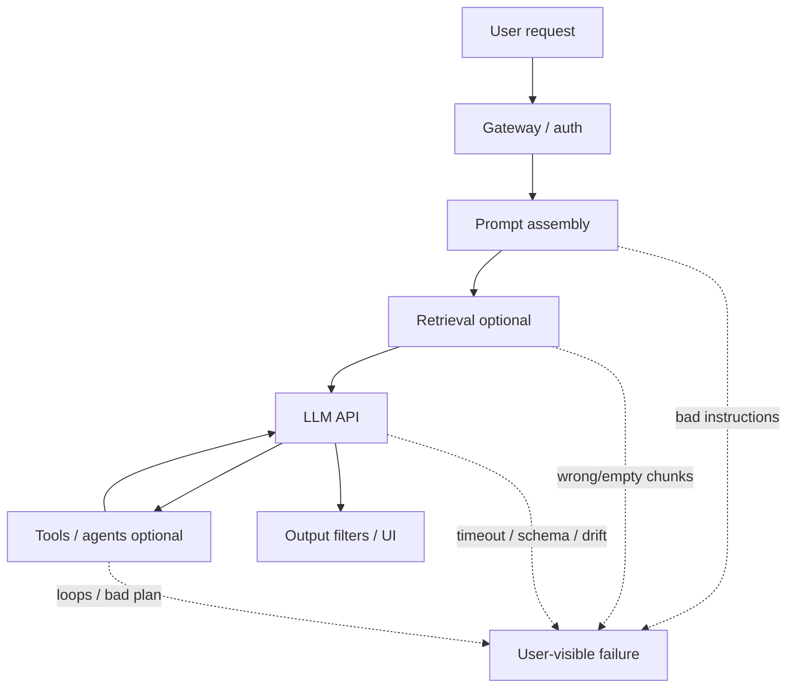
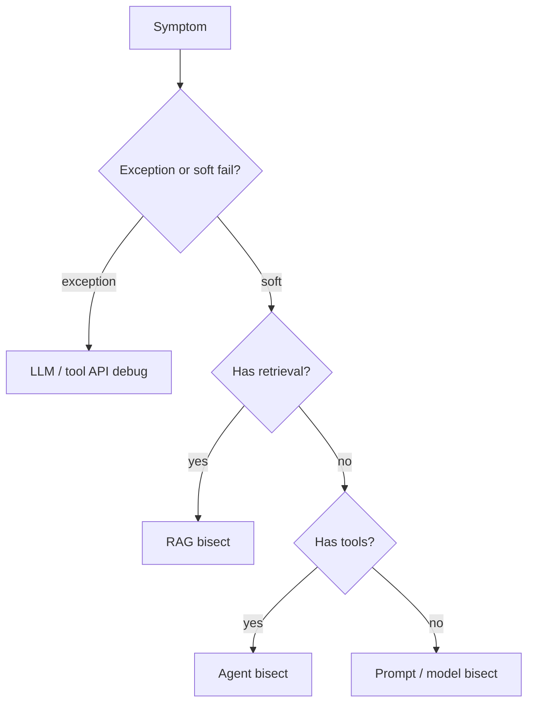

# Introduction to AI Debugging

> Debugging AI apps means explaining **behavior**, not only stack traces. The code path can be “correct” while the answer, retrieval, or tool plan is wrong.

## Table of Contents

- [How AI Debugging Differs](#how-ai-debugging-differs)
- [Failure Surfaces](#failure-surfaces)
- [Instrumentation Baseline](#instrumentation-baseline)
- [Reproduce Before You Tweak](#reproduce-before-you-tweak)
- [Bisect the Pipeline](#bisect-the-pipeline)
- [Practical Takeaways](#practical-takeaways)
- [Common Mistakes](#common-mistakes)
- [Navigation](#navigation)

---

## How AI Debugging Differs

| Classic backend | AI application |
|-----------------|----------------|
| Deterministic outputs | Sampling, model drift, provider variance |
| Failures throw exceptions | Soft failures: wrong answers, empty retrieval |
| Unit tests pin behavior | Need evals + golden sets |
| Logs show exact state | Must capture prompts, chunks, tool traces |
| Fix = code change | Fix may be prompt, index, chunking, or model |

Related patterns of what goes wrong: [Common Engineering Mistakes](../common-mistakes/common-engineering-mistakes.md).

---

## Failure Surfaces



| Surface | Typical symptoms | Deep dive |
|---------|------------------|-----------|
| Prompts | Ignoring format, weak refusals, leakage | Prompt + playbook |
| Retrieval | Irrelevant or empty context | [Debugging RAG](debugging-rag-pipelines.md) |
| Agents / tools | Loops, wrong tool, stuck plans | [Debugging Agents](debugging-agents.md) |
| Provider APIs | 429, timeouts, stream stalls | [Debugging LLM APIs](debugging-llm-apis.md) |

---

## Instrumentation Baseline

Without traces, you are guessing. Prefer [Observability for AI](../ai-deployment/observability-for-ai.md).

Capture per request (redact PII):

1. **Correlation ID** across gateway → worker → model → tools
2. **Final prompt** (or hashed + stored securely) and model params
3. **Retrieval**: query, top-k IDs, scores, chunk previews
4. **Tool timeline**: name, args hash, latency, error
5. **Token usage / cost** and finish reason
6. **User-visible output** and any guardrail decision

Minimum log fields:

```text
request_id, tenant_id, route, model, latency_ms,
prompt_tokens, completion_tokens, retrieval_hit_count,
tool_error_count, finish_reason, outcome
```

---

## Reproduce Before You Tweak

Non-determinism fights you. Stabilize:

| Knob | Debug setting |
|------|---------------|
| Temperature | `0` when isolating bugs |
| Seed | If provider supports it |
| Model version | Pin exact snapshot |
| Time | Freeze indexes / feature flags |
| Parallelism | Single-flight the failing path |

Save a **repro bundle**: input, retrieved IDs, prompt, raw completion, tool events. Re-run offline before changing production prompts.

---

## Bisect the Pipeline

Ask in order:

1. Did the request reach the handler with expected auth/tenant?
2. Was the prompt what you think (system + history + tools)?
3. If RAG: were chunks present and relevant?
4. Did the provider return an error, empty, or partial stream?
5. If agent: did the plan/tools match the task?
6. Did post-filters alter or drop the answer?



Use the [AI Debugging Playbook](ai-debugging-playbook.md) during incidents.

---

## Practical Takeaways

1. **Instrument prompts and retrieval** — code debuggers alone are not enough.
2. **Stabilize sampling** when reproducing.
3. **Bisect stages** instead of rewriting the whole prompt first.
4. **Separate outages from quality** — 500s vs “plausible nonsense.”
5. **Keep a failing case in evals** so the bug cannot silently return.

---

## Common Mistakes

- Tweaking prompts without looking at retrieved context
- Comparing different models/params while “reproducing”
- Logging only final answers (no tool/retrieval trail)
- Ignoring finish reasons (`length`, `content_filter`)
- Treating one lucky good answer as a fix

---

## Navigation

- Next: [Debugging RAG Pipelines](debugging-rag-pipelines.md)
- Hub: [Debugging](README.md)
- Related: [RAG](../rag/README.md) · [AI Agents](../ai-agents/README.md) · [Common Mistakes](../common-mistakes/README.md) · [AI Deployment](../ai-deployment/README.md)

---

## Changelog

| Version | Date | Changes |
|---------|------|---------|
| 1.0 | 2026-07-23 | Initial published handbook |
