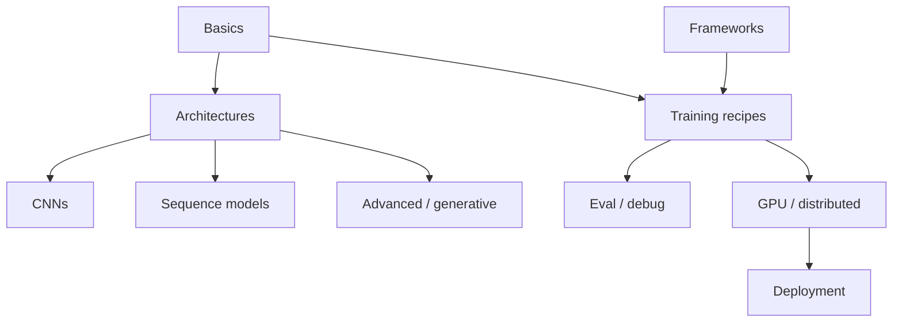

# Deep Learning

> Neural networks curriculum — basics through CNNs, sequence models, training practice, frameworks, and deployment.

**Prerequisites:** [Machine Learning](../machine-learning/README.md) · [Mathematics & Statistics](../mathematics-statistics/README.md)  
**Unlocks:** [Natural Language Processing](../natural-language-processing/README.md) · [Transformers](../transformers/README.md) · [Large Language Models](../llm-engineering/README.md)

Start with a section hub below (or expand **5. Deep Learning** in the left sidebar). Each topic has definitions, key ideas, diagrams, and PyTorch-style examples.

---

## Sections

| # | Section | What you will learn | Hub |
|---|---------|---------------------|-----|
| 1 | **Deep Learning Basics** | Nets, backprop, activations, loss, optimizers, init, regularization | [dl-basics/](dl-basics/README.md) |
| 2 | **Neural Network Architectures** | FFNN, MLP, DNNs, ResNets, dense connectivity | [neural-network-architectures/](neural-network-architectures/README.md) |
| 3 | **Convolutional Neural Networks** | Conv, pool, stride/padding, CNN families, transfer | [convolutional-neural-networks/](convolutional-neural-networks/README.md) |
| 4 | **Sequence Models** | RNN, LSTM, GRU, bidirectional, seq2seq | [sequence-models/](sequence-models/README.md) |
| 5 | **Deep Learning Training** | BatchNorm, dropout, schedules, clipping, aug, fine-tuning | [deep-learning-training/](deep-learning-training/README.md) |
| 6 | **Deep Learning Frameworks** | PyTorch, TensorFlow, Keras | [deep-learning-frameworks/](deep-learning-frameworks/README.md) |
| 7 | **Model Evaluation & Debugging** | Val loops, checkpoints, tracking, error analysis | [model-evaluation-debugging/](model-evaluation-debugging/README.md) |
| 8 | **Advanced Deep Learning** | AEs, VAEs, GANs, attention, SSL, multitask | [advanced-deep-learning/](advanced-deep-learning/README.md) |
| 9 | **Deep Learning Optimization** | GPU, AMP, distributed, compression, quant, prune | [deep-learning-optimization/](deep-learning-optimization/README.md) |
| 10 | **Deep Learning Deployment** | Serving, inference opts, ONNX, TensorRT, edge | [deep-learning-deployment/](deep-learning-deployment/README.md) |

---

## Hierarchy

### 1. Deep Learning Basics

| # | Topic |
|---|-------|
| 1 | [Neural Networks](dl-basics/01-neural-networks.md) |
| 2 | [Perceptron](dl-basics/02-perceptron.md) |
| 3 | [Forward Propagation](dl-basics/03-forward-propagation.md) |
| 4 | [Backpropagation](dl-basics/04-backpropagation.md) |
| 5 | [Activation Functions](dl-basics/05-activation-functions.md) |
| 6 | [Loss Functions](dl-basics/06-loss-functions.md) |
| 7 | [Gradient Descent](dl-basics/07-gradient-descent.md) |
| 8 | [Learning Rate](dl-basics/08-learning-rate.md) |
| 9 | [Epochs & Batches](dl-basics/09-epochs-and-batches.md) |
| 10 | [Optimizers](dl-basics/10-optimizers.md) |
| 11 | [Weight Initialization](dl-basics/11-weight-initialization.md) |
| 12 | [Regularization](dl-basics/12-regularization.md) |

### 2. Neural Network Architectures

| # | Topic |
|---|-------|
| 1 | [Feedforward Neural Networks](neural-network-architectures/01-feedforward-neural-networks.md) |
| 2 | [Multilayer Perceptrons](neural-network-architectures/02-multilayer-perceptrons.md) |
| 3 | [Deep Neural Networks](neural-network-architectures/03-deep-neural-networks.md) |
| 4 | [Residual Networks](neural-network-architectures/04-residual-networks.md) |
| 5 | [Dense Networks](neural-network-architectures/05-dense-networks.md) |

### 3. Convolutional Neural Networks

| # | Topic |
|---|-------|
| 1 | [CNN Basics](convolutional-neural-networks/01-cnn-basics.md) |
| 2 | [Convolution](convolutional-neural-networks/02-convolution.md) |
| 3 | [Pooling](convolutional-neural-networks/03-pooling.md) |
| 4 | [Padding & Stride](convolutional-neural-networks/04-padding-and-stride.md) |
| 5 | [CNN Architectures](convolutional-neural-networks/05-cnn-architectures.md) |
| 6 | [Transfer Learning](convolutional-neural-networks/06-transfer-learning.md) |

### 4. Sequence Models

| # | Topic |
|---|-------|
| 1 | [Recurrent Neural Networks](sequence-models/01-recurrent-neural-networks.md) |
| 2 | [LSTM](sequence-models/02-lstm.md) |
| 3 | [GRU](sequence-models/03-gru.md) |
| 4 | [Bidirectional RNNs](sequence-models/04-bidirectional-rnns.md) |
| 5 | [Sequence-to-Sequence Models](sequence-models/05-sequence-to-sequence-models.md) |

### 5. Deep Learning Training

| # | Topic |
|---|-------|
| 1 | [Batch Normalization](deep-learning-training/01-batch-normalization.md) |
| 2 | [Dropout](deep-learning-training/02-dropout.md) |
| 3 | [Weight Decay](deep-learning-training/03-weight-decay.md) |
| 4 | [Learning Rate Scheduling](deep-learning-training/04-learning-rate-scheduling.md) |
| 5 | [Gradient Clipping](deep-learning-training/05-gradient-clipping.md) |
| 6 | [Data Augmentation](deep-learning-training/06-data-augmentation.md) |
| 7 | [Transfer Learning](deep-learning-training/07-transfer-learning.md) |
| 8 | [Fine-Tuning](deep-learning-training/08-fine-tuning.md) |

### 6. Deep Learning Frameworks

| # | Topic |
|---|-------|
| 1 | [PyTorch](deep-learning-frameworks/01-pytorch.md) |
| 2 | [TensorFlow](deep-learning-frameworks/02-tensorflow.md) |
| 3 | [Keras](deep-learning-frameworks/03-keras.md) |

### 7. Model Evaluation & Debugging

| # | Topic |
|---|-------|
| 1 | [Training & Validation](model-evaluation-debugging/01-training-and-validation.md) |
| 2 | [Overfitting & Underfitting](model-evaluation-debugging/02-overfitting-and-underfitting.md) |
| 3 | [Model Checkpointing](model-evaluation-debugging/03-model-checkpointing.md) |
| 4 | [Experiment Tracking](model-evaluation-debugging/04-experiment-tracking.md) |
| 5 | [Error Analysis](model-evaluation-debugging/05-error-analysis.md) |
| 6 | [Hyperparameter Tuning](model-evaluation-debugging/06-hyperparameter-tuning.md) |

### 8. Advanced Deep Learning

| # | Topic |
|---|-------|
| 1 | [Autoencoders](advanced-deep-learning/01-autoencoders.md) |
| 2 | [Variational Autoencoders](advanced-deep-learning/02-variational-autoencoders.md) |
| 3 | [Generative Adversarial Networks](advanced-deep-learning/03-generative-adversarial-networks.md) |
| 4 | [Attention Mechanism](advanced-deep-learning/04-attention-mechanism.md) |
| 5 | [Representation Learning](advanced-deep-learning/05-representation-learning.md) |
| 6 | [Self-Supervised Learning](advanced-deep-learning/06-self-supervised-learning.md) |
| 7 | [Multitask Learning](advanced-deep-learning/07-multitask-learning.md) |

### 9. Deep Learning Optimization

| # | Topic |
|---|-------|
| 1 | [GPU Computing](deep-learning-optimization/01-gpu-computing.md) |
| 2 | [Mixed Precision Training](deep-learning-optimization/02-mixed-precision-training.md) |
| 3 | [Distributed Training](deep-learning-optimization/03-distributed-training.md) |
| 4 | [Model Compression](deep-learning-optimization/04-model-compression.md) |
| 5 | [Quantization](deep-learning-optimization/05-quantization.md) |
| 6 | [Pruning](deep-learning-optimization/06-pruning.md) |

### 10. Deep Learning Deployment

| # | Topic |
|---|-------|
| 1 | [Model Serving](deep-learning-deployment/01-model-serving.md) |
| 2 | [Inference Optimization](deep-learning-deployment/02-inference-optimization.md) |
| 3 | [ONNX](deep-learning-deployment/03-onnx.md) |
| 4 | [TensorRT](deep-learning-deployment/04-tensorrt.md) |
| 5 | [Edge Deployment](deep-learning-deployment/05-edge-deployment.md) |

---

## Definition

**Deep learning (DL)** trains multi-layer neural networks to learn hierarchical representations from data (pixels, tokens, audio, tables). This handbook covers the core training loop, major architectures, practical training recipes, frameworks, and how models reach production.

---

## Learning path

| Stage | Sections | Focus |
|-------|----------|-------|
| Foundations | 1–2 | Backprop, layers, architectures |
| Modalities | 3–4 | Vision CNNs + sequence models |
| Practice | 5–7 | Train stably, evaluate, use frameworks |
| Scale & ship | 8–10 | Advanced models, speed, deployment |

---

## Reference notes (shorter overviews)

| Note | Document |
|------|----------|
| Neural network basics | [neural-network-basics.md](neural-network-basics.md) |
| Training loop & optimization | [training-loop-and-optimization.md](training-loop-and-optimization.md) |
| From DL to language models | [from-dl-to-language-models.md](from-dl-to-language-models.md) |

---

## Related topics

- [Machine Learning](../machine-learning/README.md)
- [Transformers](../transformers/README.md)
- [Large Language Models](../llm-engineering/README.md)
- [LLM Fine-Tuning](../llm-fine-tuning/README.md)
- [AI Deployment](../ai-deployment/README.md)

---

## See also

- [Domains overview](../README.md)
- [Learning Roadmap](../../meta/roadmap.md)
- [Master Index](../../meta/indexes/MASTER-INDEX.md)
