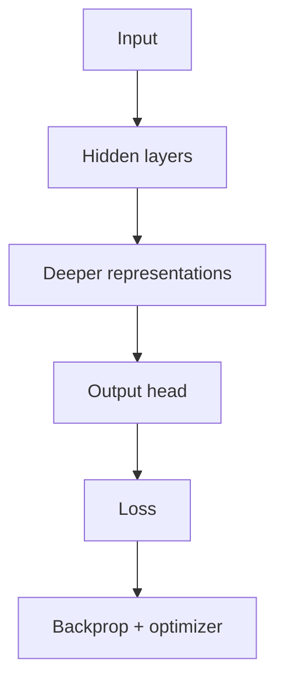

# Deep Learning

> Neural networks, backpropagation, and representation learning — the bridge from classical ML to transformers and LLMs.

**Prerequisites:** [Machine Learning](../machine-learning/README.md) · [Mathematics & Statistics](../mathematics-statistics/README.md)  
**Unlocks:** [Natural Language Processing](../natural-language-processing/README.md) · [Transformers](../transformers/README.md)

---

## Definition

**Deep learning (DL)** trains multi-layer neural networks to learn hierarchical representations from raw-ish inputs (pixels, tokens, audio). Core ideas: layers, activation functions, loss, backpropagation, SGD/Adam, regularization, and generalization.

---

## Learning path

---

## Documents

| # | Topic | Document |
|---|-------|----------|
| 1 | Neural network basics | [neural-network-basics.md](neural-network-basics.md) |
| 2 | Training loop & optimization | [training-loop-and-optimization.md](training-loop-and-optimization.md) |
| 3 | From DL to language models | [from-dl-to-language-models.md](from-dl-to-language-models.md) |

---

## Related topics

- [Transformers](../transformers/README.md)
- [Large Language Models](../llm-engineering/README.md)
- [LLM Fine-Tuning](../llm-fine-tuning/README.md)

---

## See also

- [Domains overview](../README.md)
- [Learning Roadmap](../../meta/roadmap.md)
- [Master Index](../../meta/indexes/MASTER-INDEX.md)
