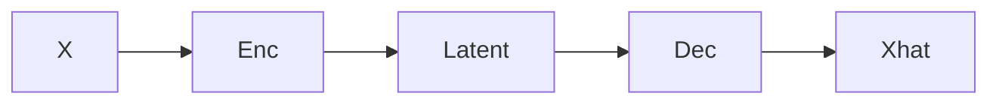

# 1. Autoencoders

> Compress and reconstruct — unsupervised representation learning baseline.

## Definition

An **autoencoder** encodes inputs to a bottleneck then decodes to reconstruction. Useful for compression, denoising, and anomaly scores.

---

## Continue

- **Section hub:** [Advanced Deep Learning](README.md)
- **DL overview:** [Deep Learning](../README.md)
