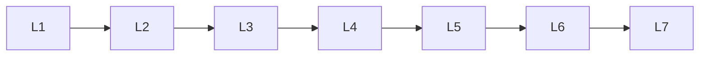

# Advanced Deep Learning

> Deep lessons for **Advanced Deep Learning** in the Deep Learning handbook.

## Lessons

| # | Lesson |
|---|--------|
| 1 | [Autoencoders](01-autoencoders.md) |
| 2 | [Variational Autoencoders](02-variational-autoencoders.md) |
| 3 | [Generative Adversarial Networks](03-generative-adversarial-networks.md) |
| 4 | [Attention Mechanism](04-attention-mechanism.md) |
| 5 | [Representation Learning](05-representation-learning.md) |
| 6 | [Self-Supervised Learning](06-self-supervised-learning.md) |
| 7 | [Multitask Learning](07-multitask-learning.md) |

**Topic hub:** [../README.md](../README.md)
