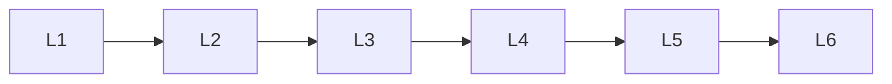

# Convolutional Neural Networks

> Deep lessons for **Convolutional Neural Networks** in the Deep Learning handbook.

## Lessons

| # | Lesson |
|---|--------|
| 1 | [CNN Basics](01-cnn-basics.md) |
| 2 | [Convolution](02-convolution.md) |
| 3 | [Pooling](03-pooling.md) |
| 4 | [Padding & Stride](04-padding-and-stride.md) |
| 5 | [CNN Architectures](05-cnn-architectures.md) |
| 6 | [Transfer Learning](06-transfer-learning.md) |

**Topic hub:** [../README.md](../README.md)
