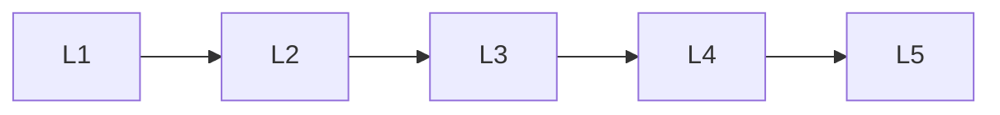

# Deep Learning Deployment

> Deep lessons for **Deep Learning Deployment** in the Deep Learning handbook.

## Lessons

| # | Lesson |
|---|--------|
| 1 | [Model Serving](01-model-serving.md) |
| 2 | [Inference Optimization](02-inference-optimization.md) |
| 3 | [ONNX](03-onnx.md) |
| 4 | [TensorRT](04-tensorrt.md) |
| 5 | [Edge Deployment](05-edge-deployment.md) |

**Topic hub:** [../README.md](../README.md)
