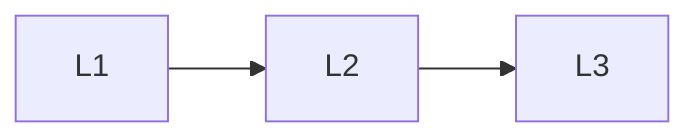

# Deep Learning Frameworks

> Deep lessons for **Deep Learning Frameworks** in the Deep Learning handbook.

## Lessons

| # | Lesson |
|---|--------|
| 1 | [PyTorch](01-pytorch.md) |
| 2 | [TensorFlow](02-tensorflow.md) |
| 3 | [Keras](03-keras.md) |

**Topic hub:** [../README.md](../README.md)
