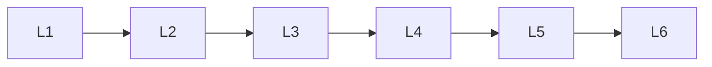

# Deep Learning Optimization

> Deep lessons for **Deep Learning Optimization** in the Deep Learning handbook.

## Lessons

| # | Lesson |
|---|--------|
| 1 | [GPU Computing](01-gpu-computing.md) |
| 2 | [Mixed Precision Training](02-mixed-precision-training.md) |
| 3 | [Distributed Training](03-distributed-training.md) |
| 4 | [Model Compression](04-model-compression.md) |
| 5 | [Quantization](05-quantization.md) |
| 6 | [Pruning](06-pruning.md) |

**Topic hub:** [../README.md](../README.md)
