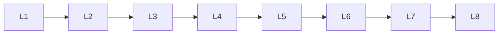

# Deep Learning Training

> Deep lessons for **Deep Learning Training** in the Deep Learning handbook.

## Lessons

| # | Lesson |
|---|--------|
| 1 | [Batch Normalization](01-batch-normalization.md) |
| 2 | [Dropout](02-dropout.md) |
| 3 | [Weight Decay](03-weight-decay.md) |
| 4 | [Learning Rate Scheduling](04-learning-rate-scheduling.md) |
| 5 | [Gradient Clipping](05-gradient-clipping.md) |
| 6 | [Data Augmentation](06-data-augmentation.md) |
| 7 | [Transfer Learning](07-transfer-learning.md) |
| 8 | [Fine-Tuning](08-fine-tuning.md) |

**Topic hub:** [../README.md](../README.md)
